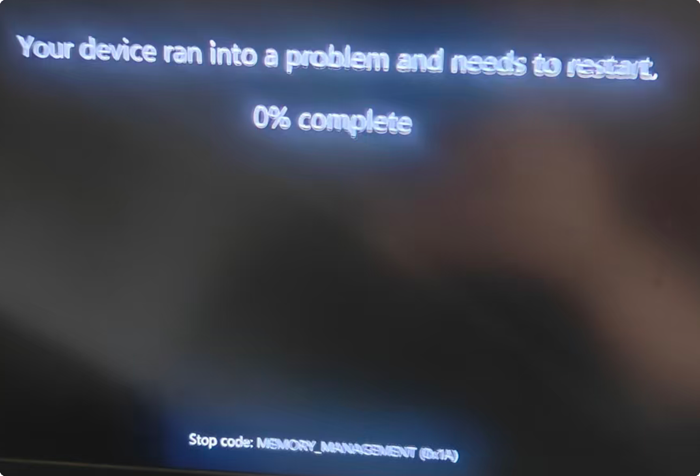

# ask-BlackScreen

## 目的

本 skill 是 **BlackScreen（Win11 稳定性 / 黑屏重启）** 域的默认入口，用于：

- 在作答前读取 **全局 ask 模板**（若存在），遵守 ultrathink、文件保护与输出约定
- 以 **最少必要上下文** 恢复机器与已采取措施的事实，避免臆测硬件批次或单一根因
- 将 **排障、日志解读、文档更新** 串成可复查工作流，优先 **不重装、不抹除 C: 盘** 前提下收敛风险
- 把可长期复用的结论写回工作区 **`win11黑屏解决方案.md`**（中文），不把长篇结论只留在对话里

## 何时使用

满足以下任一情况时启用本 skill：

- 用户显式带上本 skill（例如 **`@ask-BlackScreen`**）
- 对话围绕 **Win11 黑屏/蓝屏、自动重启、STOP 代码（如 0x1A MEMORY_MANAGEMENT）、WHEA、事件查看器、可靠性历史**
- 涉及 **Acer Predator Helios / PH18-72、Insyde BIOS、PredatorSense、电源方案、PROCTHROTTLEMAX、Turbo、XTU**
- 已定位为 **游戏负载诱发**（例如《战锤40K：星际战士2》）需要游戏侧与会话侧分工时
- 工作区为 **`D:\work\BlackScreen`** 且需要更新 **`win11黑屏解决方案.md`**

## 工作区与主文档

| 项目 | Windows 路径 |
|------|----------------|
| 工作区 | `D:\work\BlackScreen` |
| 主结论文档（中文） | `D:\work\BlackScreen\win11黑屏解决方案.md` |
| 典型维修日志（若存在） | `D:\work\BlackScreen\dism-sfc.log` 等 |

**文档语言**：写入 **`win11黑屏解决方案.md`** 的总结使用 **纯中文**。

## 本 skill 文件路径

| 平台 | 路径 |
|------|------|
| Windows | `C:\Users\Stark8964911\.cursor\skills\ask-BlackScreen\SKILL.md` |
| Mac | `~/.cursor/skills/ask-BlackScreen/SKILL.md`（若已同步） |

## 附图与截图（必要上下文）

- 任务若依赖 **STOP 画面、设置项、复现步骤** 等截图：优先使用 **用户随消息提供的路径**，其次 **`D:\work\BlackScreen`** 内附件，再次用户给出的 **绝对路径**。
- 若 **本文件** `SKILL.md` 中出现 **``** 相对引用，则与 **本 skill 目录** `...\ask-BlackScreen\` 拼接后按精确路径读取。
- 凡结论直接依赖附图，须 **先读图再判断**；区分「按精确路径读取失败」与「搜索未命中」。

## 稳定背景（摘要锚点；事实以文档与日志为准）

本节仅作记忆锚点，**细节与版本以 `win11黑屏解决方案.md`、BIOS 页面、事件日志、`Get-ComputerInfo`、微码/驱动现状为准**：

- 历史语境包含 **Intel 13/14 代高负载与电压/稳定性** 相关讨论；STOP **0x1A** 多与 **内存子系统/错误处理** 相关，需结合 **WHEA、内核转储、可靠性历史** 综合判断，避免单条日志定谳。
- 已实践过的缓解方向包括：Windows **平衡**、PredatorSense **平衡**、限制 **`PROCTHROTTLEMAX`**、关闭或禁用 **`XtuService`**、BIOS 升级（如 **V1.10**）等；执行后应在文档中记录 **前后对比** 与 **复现条件**。

若本 skill 与 **`win11黑屏解决方案.md`** 冲突，**以工作区文档为准**，并择机收敛 skill 中的易过期数字。

## 最小上下文来源（按需读取）

| 优先级 | 来源 | 用途 |
|--------|------|------|
| 1 | `D:\work\BlackScreen\win11黑屏解决方案.md` | 已确认步骤、时间线、待办 |
| 2 | `dism-sfc.log`、**`C:\Windows\Logs\CBS\CBS.log`**（若讨论组件存储修复） | DISM/SFC 结论 |
| 3 | 事件查看器摘要、`.evtx` 导出、**内存转储**说明（若用户已提供路径） | 重启原因链 |
| 4 | `powercfg`、电源方案 GUID、PredatorSense 相关服务状态 | 功耗与限频是否生效 |

不要默认通读整盘日志；先根据 STOP 码与时间戳定位 1～3 个证据源。

## 路由规则（关联 skills）

| 场景 | 推荐 skill |
|------|------------|
| 《星际战士2》画质/卡顿/游戏设置与体验 | `ask-星际战士2` |
| 通用 Cursor / Rules / Skills / MCP 迁移与 IDE 规范 | `ask-cursor` |
| 与本域无关的 RN/医疗/其它项目 | 对应 **`ask-*`** 专项 skill，**不**混入 BlackScreen 假设 |

BlackScreen 任务默认 **不** 调用 `init-project`，除非用户要在该工作区新建 `.cursor/rules/project-context.mdc`。

## 执行工作流

1. 根据 **用户本轮问题** 与（可选）**`ask.md`** 约定对齐风格；若有截图依赖，先完成读图。
2. 读取 **`win11黑屏解决方案.md`** 相关章节，对齐「已做 / 待验证 / 禁止项（如重装）」。
3. 分类：**一次性重启 / 可复现负载 / 硬件疑似**；收集 STOP 码、参数、Bugcheck、WHEA、`MC` 记录等。
4. 给出 **下一步**：可复制的 PowerShell/CMD 片段、预期输出、成功判据；高风险步骤（BIOS、注册表、BitLocker）单独列出回滚与前提检查。
5. **将本轮对用户有价值的结论** 合并进 **`win11黑屏解决方案.md`**（修正过时表述、补充日期与验证状态），避免仅 chat 输出。

## 输出约定

- 对用户说明：**简体中文**
- **代码与命令注释**：英文（若附带脚本）
- 引用工作区文件时使用带路径的说明；引用仓库代码时遵循工作区「代码引用块」规范
- 不确定处明确写 **不确定**，不捏造微码版本、批次缺陷结论或「唯一根因」

## 边界

- **非医疗、非保修代理**：不替用户承诺 RMA 结果；硬件故障可能需厂商检测。
- **不擅自扩大范围**：无关项目的重构、额外新建文档（用户未要求时）默认不做。
- **系统变更**：BIOS 刷写、盘片操作、`diskpart` 等须用户知情；涉及 BitLocker 先确认保护状态。
- **游戏与系统分工**：纯游戏内画质/帧生成问题优先 `ask-星际战士2`；内核重启与电源/驱动/微码仍归本 skill。
- 不要修改 当前文件里的 `当前活跃需求`下的内容

## 当前活跃需求
- 当前Win11系统之前因为经常玩<战锤40K 星际战士2> 游戏导致黑屏重启，黑屏时如图  ,提示 `Your device ran into a problem and needs to restart,0% complete;  Stop code: MEMORY MAANAGEMENT (0x1A)`;
  - 现在这个游戏更新了,感觉游戏优化了CPU, 没有以前那么卡了, 把 `D:\work\BlackScreen\win11黑屏解决方案.md`里你之前的优化改回来,比如把 PROCTHROTTLEMAX 改回 100,不禁用 Turbo Boost,不停止 XTU 服务等, 让电脑变回最高性能, 我想测下还是否会黑屏重启
  - 刚才又开游戏测了下,又黑屏重启了, 你现在查看下系统日志, 判断重启原因, 帮我再次优化系统状态
<!-- - 当前电脑刚刚又因为玩<战锤40K 星际战士2> 游戏而黑屏重启了, 现在你帮我查看下日志, 判断重启原因, 帮我解决重启问题,但要避免系统重装,C盘不要抹除 -->
  <!-- - 刚才我的电脑又因为启动了 <战锤40K 星际战士2> 游戏,黑屏重启了, 你看下系统日志,分析原因,帮我解决 -->
- 把以上你执行过的所有任务的执行结果都总结更新到 
  - win:`D:\work\BlackScreen\win11黑屏解决方案.md`
  - mac : 