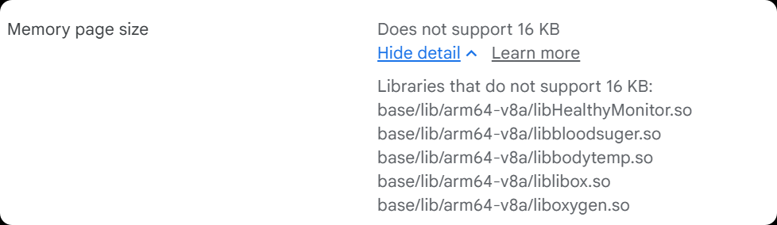
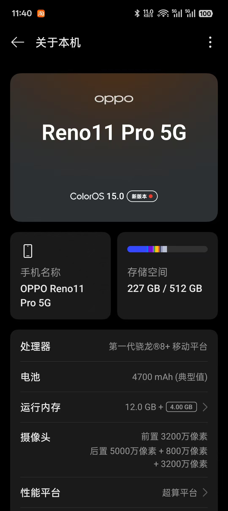

# ask-CircleAppNew（Cursor）

## 与 Codex 入口（分别维护）

| 客户端 | `SKILL.md` | `name` | 口令 |
|--------|------------|--------|------|
| Cursor（本文件） | **Windows** `%USERPROFILE%\.cursor\skills\ask-CircleAppNew\SKILL.md`（本机示例：`C:\Users\Stark8964911\.cursor\skills\ask-CircleAppNew\SKILL.md`） / **macOS** `/Users/<你的用户名>/.cursor/skills/ask-CircleAppNew/SKILL.md`（当前 Mac：`/Users/stark/.cursor/skills/ask-CircleAppNew/SKILL.md`） | `ask-CircleAppNew` | `/ask-CircleAppNew` |
| Codex（对口入口） | **Windows** `%USERPROFILE%\.codex\skills\CircleAppNew\SKILL.md` / **macOS** `/Users/<你的用户名>/.codex/skills/CircleAppNew/SKILL.md`（当前 Mac：`/Users/stark/.codex/skills/CircleAppNew/SKILL.md`） | `CircleAppNew` | `/CircleAppNew` |

两份文件分别维护，但入口、必读顺序、上下文门禁、路由规则与任务验收口径必须保持一致。通过 Cursor 输入框执行 `/ask-CircleAppNew`，或在 Codex / Cursor 内 Codex 插件输入 `/CircleAppNew`，应获得同一任务执行效果。

## 目的

本 skill 是 **CircleApp**（`package.json` 中 `name: circleapp`；Windows 上常见克隆目录名为 **CircleAppNew**）的默认分析入口，用于在新会话或跨工具切换时把任务拉回项目事实与最小必要上下文。

- **恢复项目事实**：先读项目规则、依赖与直接相关源码，避免只凭历史记忆或旧摘要行动。
- **收敛任务范围**：区分「需求澄清 / 架构讨论 / 实现 / 排障 / 审查 / i18n / 原生构建与上架」，按任务读取最小文件集合。
- **路由专项能力**：将 React Native、TypeScript、API、导航、Figma、BMAD、代码审查等任务指向对应 skills 或项目规则。
- **保证上下文完整**：若入口 skill 又指向其它 skill、BMAD 工作流或同目录资源，须先按门禁补读其依赖文件，再执行。
- **合并待办来源**：除用户输入框外，本文件「当前活跃需求」及用户一并指定的其它入口 skill（例如并行维护的 `ask-heals-app-rn`）中未注释的「当前活跃需求」条目，均视为本轮须覆盖的验收范围；不得只做输入框字面问题而漏掉 skill 内活跃项（除非用户明确裁剪范围）。
- **沉淀项目结论**：需要长期保留的事实优先更新仓库内规则或既有文档，不把结论只留在对话里。

## 何时使用

- 用户显式 `@ask-CircleAppNew`、`/ask-CircleAppNew` 或自然语言提及本 name。
- 用户提到 CircleApp、CircleAppNew、circleapp、本仓库健康应用相关任务。
- 当前工作区根目录为 **Windows** `D:\work\RN\CircleAppNew` 或 **macOS** `/Users/<你的用户名>/Desktop/work/RN/circleapp`（当前 Mac：`/Users/stark/Desktop/work/RN/circleapp`），且需要项目级引导。
- 任务涉及导航、登录、API、i18n、Agora、健康数据、Firebase/Sentry、Android/iOS 构建、**Google Play 16KB 页面大小**、AAB 等。
- 用户未指定文件，但明显在本仓库内工作时，优先按本 skill 的加载顺序取上下文。

## 工作区与本 skill 路径

| 用途 | Windows | macOS |
|------|---------|--------|
| 工作区根（默认） | `D:\work\RN\CircleAppNew` | `/Users/<你的用户名>/Desktop/work/RN/circleapp`（当前 Mac：`/Users/stark/Desktop/work/RN/circleapp`） |
| 本 skill 文件 | `%USERPROFILE%\.cursor\skills\ask-CircleAppNew\SKILL.md` | `/Users/<你的用户名>/.cursor/skills/ask-CircleAppNew/SKILL.md` |
| Codex 对照 skill 文件 | `%USERPROFILE%\.codex\skills\CircleAppNew\SKILL.md` | `/Users/<你的用户名>/.codex/skills/CircleAppNew/SKILL.md` |
| Cursor skills 根 | `%USERPROFILE%\.cursor\skills` | `/Users/<你的用户名>/.cursor/skills`（当前 Mac：`/Users/stark/.cursor/skills`） |
| Cursor 应用数据 | `%APPDATA%\Cursor` | `~/Library/Application Support/Cursor` |
| Codex 全局规则 | `%USERPROFILE%\.codex\AGENTS.md` | `/Users/<你的用户名>/.codex/AGENTS.md`（当前 Mac：`/Users/stark/.codex/AGENTS.md`） |

若用户明确给出 fork、分支工作区或临时路径，**以用户指定路径为准**；否则按上表定位。

正文与文档中需要双平台表达业务仓库根时，统一写作：

- **Windows** `D:\work\RN\CircleAppNew`
- **macOS** `/Users/<你的用户名>/Desktop/work/RN/circleapp`（当前 Mac：`/Users/stark/Desktop/work/RN/circleapp`）

下文 `{workspace}` 均指**当前 IDE 实际打开的工作区根**；不要把用户目录下的 skill 路径误当成业务仓库根。

## Cursor / Codex 用户目录分工（Win / Mac）

| 用途 | Windows | macOS |
|------|---------|--------|
| **Cursor**：Agent Skills（含本文件） | `%USERPROFILE%\.cursor\skills\...` | `/Users/<你的用户名>/.cursor/skills/...`（当前 Mac：`/Users/stark/.cursor/skills/...`） |
| **Cursor**：应用用户数据、扩展与部分缓存 | 常见 `%APPDATA%\Cursor\` | `~/Library/Application Support/Cursor/` |
| **Codex**：`AGENTS.md`、`skills/`、`config.toml` 等 | `%USERPROFILE%\.codex\...` | `/Users/<你的用户名>/.codex/...`（当前 Mac：`/Users/stark/.codex/...`） |

## 图片资源路径

本文中的 `` 视为与本文件同目录：**Windows** `C:\Users\Stark8964911\.cursor\skills\ask-CircleAppNew\`；**macOS** `/Users/<你的用户名>/.cursor/skills/ask-CircleAppNew/`（当前 Mac：`/Users/stark/.cursor/skills/ask-CircleAppNew/`）。读取图片时须按引用源 `.md` 所在目录精确拼接文件名（见全局 Rules 图片规则）。

## 与 Claude Command 的兼容入口（可选）

若通过 **`~/.claude/commands/ask_CircleAppNew.md`** 进入，可先执行其中步骤（例如读取全局 ask 模板）：

- **Windows** `C:\Users\Stark8964911\.claude\ask\ask.md`
- **macOS** `/Users/stark/.claude/ask/ask.md`

**主维护入口**：本 `SKILL.md`；长期事实以仓库内规则与源码为准。

## 新会话必读顺序（恢复上下文）

新 chat 或首次进入本仓库任务时，按以下顺序读取；已在当前 chat **实际 Read 成功**的文件可不重复读，但不能只凭文件名、打开标签页或历史摘要假设已加载。

1. **本 skill**：入口目标、路径规则、路由、**当前活跃需求**（含 `# win` / `# mac` 下未注释条目）。
2. **Codex 对照 skill（存在则读）**：**Windows** `%USERPROFILE%\.codex\skills\CircleAppNew\SKILL.md` / **macOS** `/Users/<你的用户名>/.codex/skills/CircleAppNew/SKILL.md`，用于核对 `/CircleAppNew` 与 `/ask-CircleAppNew` 的必读顺序、上下文门禁与活跃需求解释是否一致。
3. **项目规则与锚点**（存在则读）
   - `{workspace}/.cursor/rules/project-context.mdc`
   - `{workspace}/.cursorrules`（若存在）
   - `{workspace}/package.json`
   - `{workspace}/README.md`、`{workspace}/CLAUDE.md`（与任务相关时；**版本信息与 `project-context.mdc` / `package.json` 冲突时以后两者及仓库现状为准**）
4. **任务直接相关文件**：仅与用户问题或「当前活跃需求」对应的 `src/`、`android/`、`ios/`、根目录指南类 `.md` 等。

| 优先级 | 来源 | 用途 |
|--------|------|------|
| 1 | 本 skill + `{workspace}/.cursor/rules/project-context.mdc` | 入口、长期事实、加载门禁 |
| 2 | `package.json`、README、CLAUDE | 脚本、依赖、环境说明 |
| 3 | 具体代码与配置 | 实现、排障、审查 |

不要默认通读整棵 `src/`；先定位 1～3 个高价值文件，再决定是否扩大范围。

## 当前 chat 上下文加载门禁（必读）

设计对齐 `ask-MyStartupProject1` / `ask-heals-app-rn` / `ask-csx-mobile-upgrade`：**磁盘上存在或上轮读过，不等于当前 chat 已加载。**

- **入口恢复自检**：通过 `/ask-CircleAppNew` 进入后，执行任务前须已实际读取本 `SKILL.md`、Codex 对照 `SKILL.md`（若存在）、`{workspace}/package.json`，以及与任务相关的 `{workspace}/.cursor/rules/project-context.mdc` 或确认缺失后的替代来源。用户粘贴片段不能替代对原文件的精确路径读取（除非读取失败且用户已 `@` 全文）。
- **双入口一致性自检**：若 `/ask-CircleAppNew` 与 `/CircleAppNew` 的路径表、必读顺序、路由或活跃需求解释出现冲突，以更具体、更新且更贴近当前工作区的条目为准，并在最终回复说明取舍。
- **任务相关文件自检**：列出本步必须依赖的文件（story / 设计 / API / 目标 screen / Gradle / 环境说明等），逐项判断是否已在当前 chat 读取；未读则先 `ReadFile`。
- **子 skill 自检**：下一步若执行任意其它 skill（含 `bmad-*`、`react-native-patterns`、`code-review` 等），须判断当前 chat 是否已读取该 skill 的 `SKILL.md` 及其要求的 `workflow.md` / `checklist.md` / `reference.md` 等；缺一则按 **Windows** `%USERPROFILE%\.cursor\skills\<id>\` / **macOS** `/Users/<你的用户名>/.cursor/skills/<id>/` 补读后再执行。
- **BMAD 硬门禁**：执行任意 `bmad-<identifier>` 前，必须先 `ReadFile` 对应 `SKILL.md` 及同目录依赖文件（与全局 Rules「BMAD 工作流与 `.cursor/skills` 磁盘路径」一致）。
- **图片门禁**：任务引用 skill 或文档同目录图片时，先精确路径读图，再推理。
- **双 skill 待办**：若用户同时挂载或点名多个入口 skill，各文件中「当前活跃需求」未注释项均须纳入本轮完成标准（除非用户明确排除）。
- **执行前说明**：进入改代码、改配置、按模板产出前，简短列出本轮已加载的关键文件及本步新增的读取；无新增则写「无新增」。
- **任务结束汇报**：最终回复须列出「当前 chat 已加载的关键文件」与「本轮新增读取/加载的文件」；只列对判断、修改或验证有实际影响的项。

## 稳定项目事实（摘要）

本节为**记忆锚点**；**以仓库内 `project-context.mdc`、源码与 `package.json` 为准**。

- **产品**：CircleApp（`package.json` 中 `name: circleapp`，`v0.0.1`）是 Heals 系衍生的 React Native 医疗健康应用，包含预约、视频问诊、健康监测、Health Pass / profile、用药与患者侧功能。
- **技术栈**：React `19.1.0` + React Native `0.81.0` + TypeScript strict、React Navigation 6.x、Hermes、`react-native-extended-stylesheet`、axios、`i18n-js`。
- **状态与架构**：`App.tsx` 组合 Toast / App / Auth / `LinktopHealthProvider` 等根 Provider；全局状态在 `src/store/AppContext.tsx`，通过 Context API 与 `useAppState()` 使用，无 Redux。
- **环境**：`react-native-config` `1.6.1`（已 patch）+ `ENVFILE=.env.development` / `.env.production`；仓库也存在 `.env.staging`；`package.json` 中 Unix / macOS 与 Windows cmd 脚本分开维护。
- **原生与构建**：Android Gradle wrapper `8.13`；flavor 为 `dev` / `prod`，dev 使用 `applicationIdSuffix=.dev`；Android `applicationId` / namespace 为 `com.circleapp.cdv`；release ABI 以 `arm64-v8a` 为主并关闭 legacy JNI packaging 以配合 16 KB page size。
- **集成与补丁**：Firebase app/messaging、Sentry、Agora `react-native-agora` `4.5.3`、Linktop health SDK context（`src/contexts/LinktopHealth/`）；`patch-package` 维护 `react-native-snap-carousel`、`react-native-reanimated`、`react-native-config`、`react-native-document-picker` 等补丁。
- **文档取舍**：`CLAUDE.md` 可能仍含旧 RN 版本（如 `0.76.3`）；版本与架构事实以 `project-context.mdc`、`package.json`、`android/` 和源码现状为准。

若本 skill 与仓库文件冲突，**以仓库为准**。医疗健康类用户可见文案避免**确诊式**、**替代医嘱式**措辞。

## 常用命令锚点

| 场景 | 命令 |
|------|------|
| Metro | `npm run start` |
| Android dev（Unix / macOS） | `npm run android:dev` |
| Android prod run（Unix / macOS） | `npm run android:prod` |
| Android dev（Windows cmd） | `npm run android:dev_win` |
| Android prod run（Windows cmd） | `npm run android:prod_win` |
| iOS dev / prod | `npm run ios:dev` / `npm run ios:prod` |
| Lint / Test | `npm run lint` / `npm run test` |
| Post-install patches | `npm run postinstall` |

## 最小上下文来源（按主题）

| 主题 | 常见位置 |
|------|----------|
| 根入口 / Provider | `App.tsx`、`index.js` |
| 导航与路由名 | `src/navigation/`、`route-names` |
| API / DTO | `src/api/` |
| 全局状态 | `src/store/AppContext.tsx`、`useAppState()` |
| 页面 | `src/screens/` |
| 组件与样式 | `src/components/`、`src/style/` |
| i18n | `src/i18n/`、`src/i18n/locale/` |
| 常量 | `src/constants/` |
| 健康设备 / Linktop | `src/contexts/LinktopHealth/`、`doc/` |
| Deep linking | `src/helper/linking-helper`、`src/utils/links`、`App.tsx` |
| 缓存 / 持久化 | `src/cache-module/`、`@cache` |
| 补丁 | `patches/` |
| 原生构建 / Play / 16 KB | `android/`、`ios/`、`README.md`、`16KB_PAGE_SIZE_SOLUTION_GUIDE.md`（若存在） |

## 路由规则（关联 skills）

名称与 **Windows** `%USERPROFILE%\.cursor\skills` / **macOS** `/Users/<你的用户名>/.cursor/skills` 下目录一致。**路由到某 skill 后，必须按上文「子 skill 自检」补读该 skill 全文及依赖后再执行。**

| 场景 | Skill |
|------|--------|
| 规则缺失或刷新 `project-context.mdc` | `init-project` |
| RN 实现与体验 | `react-native-patterns` |
| 类型安全 | `typescript-strict` |
| 代码审查 | `code-review` / `bmad-code-review` |
| 国际化与文案 | `chinese-english-translation` |
| Figma → RN | `ask-figma-to-rn-toolkit`；写入 Figma 配合 `figma-use` |
| 快速交付 | `bmad-quick-dev`；有 story 时 `bmad-dev-story` |
| 架构 | `architecture-review` / `bmad-agent-architect` |
| Cursor / MCP / Rules | `ask-cursor` |

**默认优先级**：澄清事实 → 读最小相关代码切片 → 再实现。需求仍模糊时，不要盲目使用 `bmad-quick-dev`。

## 执行工作流

1. 确认工作区为本仓库（或用户声明的 fork），并确认双平台路径表中哪一侧对应当前机器。
2. 按「新会话必读顺序」与「上下文加载门禁」拉取最小有用上下文；核对 `project-context.mdc` 与 `package.json` 是否一致。
3. 识别请求形态，并合并用户输入与「当前活跃需求」中未注释条目为验收清单。
4. 扩大范围前，先指向最相关的文件或 skill；需子 skill 时先补读子 skill。
5. 实现类任务可提示可能改动区域：`src/screens/`、`src/components/`、`src/api/`、`src/navigation/`、`android/`、`ios/`。
6. 需长期保留的结论优先更新仓库文档或 `.cursor/rules`，而非仅留在对话中。

## 输出约定

- 对用户：**简体中文**（除非用户要求其他语言）。
- **代码与注释**：英文。
- 引用仓库代码：使用路径 + 起止行的代码引用块。
- 不向 skill 或对话写入真实密钥；敏感配置用占位符。
- **任务结束**：必须包含「当前 chat 已加载的关键文件」「本轮新增读取/加载的文件」。

## 边界

- 不把医学表述写成确诊或处方替代。
- 不擅自扩大范围（无关重构、用户未要求的文档）。
- 不假设其他 Heals / CS Mobile 仓库与本仓库路径、模块、约定相同。
- 除非用户明确要求，默认不替用户运行应用或真机测试。
- 不以陈旧笔记或单独的 `CLAUDE.md` 片段覆盖当前仓库文件。

## 当前活跃需求(不要修改这部分的子内容)

<!-- - **Android / Google Play — 16KB 内存页大小**  
  - 场景：在 `android` 下构建 **prodRelease** AAB 并上传 Play Console 后出现 **Does not support 16 KB** / 原生库未对齐 16KB 页面等提示。  
    - 之前的具体报错是 Libraries that do not support 16 KB:
      base/lib/arm64-v8a/libHealthyMonitor.so
      base/lib/arm64-v8a/libabsl.cr.so
      base/lib/arm64-v8a/libbloodsuger.so
      base/lib/arm64-v8a/libbodytemp.so
      base/lib/arm64-v8a/libc++_chrome.cr.so
      base/lib/arm64-v8a/libc++_shared.so
      base/lib/arm64-v8a/libchrome_zlib.cr.so
      base/lib/arm64-v8a/libfbjni.so
      base/lib/arm64-v8a/libhermes.so
      base/lib/arm64-v8a/libhermestooling.so
      base/lib/arm64-v8a/libicuuc.cr.so
      base/lib/arm64-v8a/libimagepipeline.so
      base/lib/arm64-v8a/libjsi.so
      base/lib/arm64-v8a/liblibox.so
      base/lib/arm64-v8a/libnative-filters.so
      base/lib/arm64-v8a/libnative-imagetranscoder.so
      base/lib/arm64-v8a/liboxygen.so
      base/lib/arm64-v8a/libpartition_alloc.cr.so
      base/lib/arm64-v8a/libpdfium.cr.so
      base/lib/arm64-v8a/libpdfiumandroid.so
      base/lib/arm64-v8a/libreactnative.so
      base/lib/arm64-v8a/libreanimated.so
      base/lib/arm64-v8a/librnscreens.so
      base/lib/arm64-v8a/libworklets.so
      base/lib/x86_64/libHealthyMonitor.so
      base/lib/x86_64/libNskAlgo.so
      base/lib/x86_64/libabsl.cr.so
      base/lib/x86_64/libbloodsuger.so
      base/lib/x86_64/libbodytemp.so
      base/lib/x86_64/libc++_chrome.cr.so
      base/lib/x86_64/libc++_shared.so
      base/lib/x86_64/libchrome_zlib.cr.so
      base/lib/x86_64/libconceal.so
      base/lib/x86_64/libfbjni.so
      base/lib/x86_64/libhermes.so
      base/lib/x86_64/libhermestooling.so
      base/lib/x86_64/libicuuc.cr.so
      base/lib/x86_64/libimagepipeline.so
      base/lib/x86_64/libjsi.so
      base/lib/x86_64/liblibox.so
      base/lib/x86_64/libnative-filters.so
      base/lib/x86_64/libnative-imagetranscoder.so
      base/lib/x86_64/libneuroskybpi.so
      base/lib/x86_64/liboxygen.so
      base/lib/x86_64/libpartition_alloc.cr.so
      base/lib/x86_64/libpdfium.cr.so
      base/lib/x86_64/libpdfiumandroid.so
      base/lib/x86_64/libreactnative.so
      base/lib/x86_64/libreanimated.so
      base/lib/x86_64/librnscreens.so
      base/lib/x86_64/libworklets.so
      Libraries that do not support 16 KB:
      base/lib/arm64-v8a/libHealthyMonitor.so
      base/lib/arm64-v8a/libbloodsuger.so
      base/lib/arm64-v8a/libbodytemp.so
      base/lib/arm64-v8a/libc++_shared.so
      base/lib/arm64-v8a/libfbjni.so
      base/lib/arm64-v8a/libhermes.so
      base/lib/arm64-v8a/libhermestooling.so
      base/lib/arm64-v8a/libimagepipeline.so
      base/lib/arm64-v8a/libjsi.so
      base/lib/arm64-v8a/liblibox.so
      base/lib/arm64-v8a/libnative-filters.so
      base/lib/arm64-v8a/libnative-imagetranscoder.so
      base/lib/arm64-v8a/liboxygen.so
      base/lib/arm64-v8a/libpdfiumandroid.so
      base/lib/arm64-v8a/libreactnative.so
      base/lib/arm64-v8a/libreanimated.so
      base/lib/arm64-v8a/librnscreens.so
      base/lib/arm64-v8a/libworklets.so
      base/lib/x86_64/libHealthyMonitor.so
      base/lib/x86_64/libNskAlgo.so
      base/lib/x86_64/libbloodsuger.so
      base/lib/x86_64/libbodytemp.so
      base/lib/x86_64/libc++_shared.so
      base/lib/x86_64/libconceal.so
      base/lib/x86_64/libfbjni.so
      base/lib/x86_64/libhermes.so
      base/lib/x86_64/libhermestooling.so
      base/lib/x86_64/libimagepipeline.so
      base/lib/x86_64/libjsi.so
      base/lib/x86_64/liblibox.so
      base/lib/x86_64/libnative-filters.so
      base/lib/x86_64/libnative-imagetranscoder.so
      base/lib/x86_64/libneuroskybpi.so
      base/lib/x86_64/liboxygen.so
      base/lib/x86_64/libpdfiumandroid.so
      base/lib/x86_64/libreactnative.so
      base/lib/x86_64/libreanimated.so
      base/lib/x86_64/librnscreens.so
      base/lib/x86_64/libworklets.so
      ,经过我之前修改之后,目前只剩下如图里的 `Linktop SDK` 相关的问题,
  - **本仓库事实源**：优先阅读并维护 `{workspace}/16KB_PAGE_SIZE_SOLUTION_GUIDE.md`（若已存在则以其为流程与结论主文档）。  
  - **可参考先例**：`D:\work\RN\amber-medical-app-rn\16KB_PAGE_SIZE_SOLUTION_GUIDE.md` 中的解决思路（迁移到本仓库时需按当前 Gradle、NDK、依赖版本调整）。  
  - 具体涉及的 `.so` 列表以 **Play 报错或本地分析结果** 为准，不必在 skill 内重复冗长清单。
  - 把你每轮的回答都用最精简的内容更新到 `{workspace}/16KB_PAGE_SIZE_SOLUTION_GUIDE.md`（业务仓库根：**Windows** `D:\work\RN\CircleAppNew`；**macOS** `/Users/<你的用户名>/Desktop/work/RN/circleapp`，当前 Mac：`/Users/stark/Desktop/work/RN/circleapp`）,保证每次开启新的chat后,都可以借助 这个文档 恢复这个项目的最小必要上下文;不要修改 **Windows** `%USERPROFILE%\.cursor\skills\ask-CircleAppNew\SKILL.md` / **macOS** `/Users/<你的用户名>/.cursor/skills/ask-CircleAppNew/SKILL.md` 的 `当前活跃需求` 里的内容 -->

# win
<!-- - 在业务仓库根目录执行（**Windows** `D:\work\RN\CircleAppNew`；**macOS** `/Users/<你的用户名>/Desktop/work/RN/circleapp`，当前 Mac：`/Users/stark/Desktop/work/RN/circleapp`）
  - `cd android; .\gradlew assembleRelease`
    -  `npm run android:dev_win` 把当前项目的debug模式 -->
  <!-- - 的app运行到了如图型号的真机上,真机所在的时区是 `东八区` -->
<!-- - 我现在想 构建 这个项目的 prod 环境的 `.aab` 文件 ; 是否需要先 copy `.env.production` to `.env`,再 执行 `./gradlew bundleProdRelease `; 还是直接执行  `./gradlew bundleProdRelease `? -->

# mac
  - 需要你在 Mac 系统的当前项目根目录执行一条命令(`npm run android:dev`),把当前项目dev环境的debug模式的apk运行到如图型号的真机上,真机所在的时区是 `东八区`真机上
  - 之前在win系统执行的是`npm run android:dev_win`
