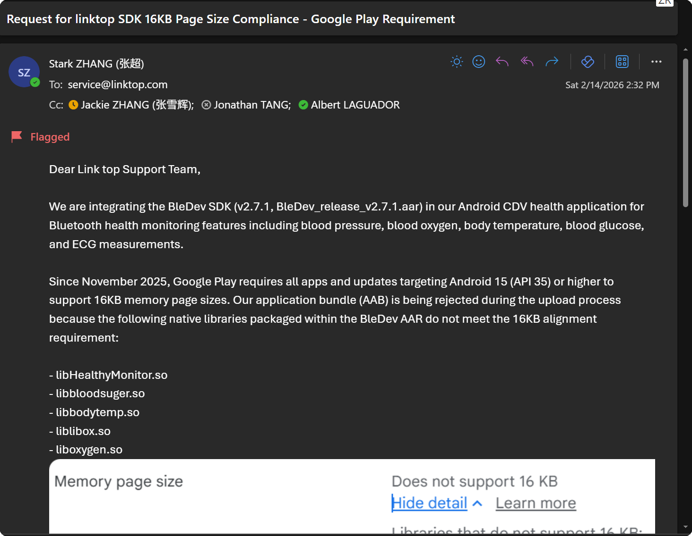

# ask-CircleAppNew

## 目的

本 skill 是 **CircleApp**（仓库路径 `CircleAppNew`）的默认入口，用于：

- 在作答前恢复**最少必要**的项目事实与约束（技术栈、目录、构建、架构）
- 区分**需求澄清**与**实现 / 排障 / 审查**，避免一上来整仓扫描
- 将任务路由到合适的仓库规则或专项 skill
- 在 1～3 个聚焦文件足够时，避免整仓大范围浏览

## 何时使用

满足以下任一情况时启用本 skill：

- 用户显式输入 `/ask-CircleAppNew` 或 @ 本 skill
- 对话明确围绕 **CircleApp / CircleAppNew / circleapp**（`package.json` 包名）
- 工作区为 **`D:\work\RN\CircleAppNew`**（Mac 上以用户本机实际路径为准）且需要**项目级**引导
- 任务涉及导航、登录、API、i18n、Agora、健康数据、Firebase/Sentry、Android/iOS 构建、**Google Play 16KB 页面大小**、AAB 上传等

默认不要一次性加载过大范围代码；从最小有用上下文开始。

## 与 Claude Command 的关系（可选）

若你仍通过 **`~/.claude/commands/ask_CircleAppNew.md`** 进入会话，可先执行其中步骤：

1. 读取全局 ask 模板以遵循 ultrathink / 文件保护等规范（若该流程对你适用）  
   - Windows: `C:\Users\Stark8964911\.claude\ask\ask.md`  
   - Mac: `/Users/stark/.claude/ask/ask.md`

**主维护入口**：本文件 `SKILL.md`；Command 文件可作为兼容入口，长期事实以仓库内规则为准。

## 快速开始

1. 确认任务针对本仓库（或用户声明的 fork），而非其他 RN 项目。
2. 按顺序读取最小上下文：
   - `{workspace}/.cursor/rules/project-context.mdc`
   - `{workspace}/package.json`
   - `{workspace}/README.md`（若存在且与任务相关）
   - `{workspace}/CLAUDE.md`（补充命令与架构说明；**版本号等与 `project-context.mdc` / `package.json` 冲突时，以后两者为准**）
   - 仅与问题直接相关的代码文件
3. 归类请求类型：需求澄清 / 实现 / 排障 / 审查 / i18n / 原生构建与上架 / 架构讨论。
4. 给出可执行的下一步，或调用对应专项 skill。
5. 需要长期保留的结论优先写入项目文档或规则，而非仅留在对话里。

## 工作区路径

| 平台 | 路径 |
|------|------|
| Windows | `D:\work\RN\CircleAppNew` |
| Mac | 以用户本机为准（示例：`~/work/RN/CircleAppNew`） |

## 本 skill 文件路径

| 平台 | 路径 |
|------|------|
| Windows | `C:\Users\Stark8964911\.cursor\skills\ask-CircleAppNew\SKILL.md` |
| Mac | `~/.cursor/skills/ask-CircleAppNew/SKILL.md` |

## 稳定项目事实（摘要）

本节仅作**记忆锚点**；**以仓库内 `project-context.mdc`、源码与 `package.json` 为准**。

- **产品**：由 Heals 系代码衍生之 React Native 应用；业务涵盖登录注册、资料、用药、健康记录、设备/健康数据（如 Linktop）、Agora、Firebase、Sentry 等（详见 `project-context.mdc`）。
- **技术栈**：React Native + TypeScript（strict）、React Navigation v6、Context（如 `AppContext`）、Extended StyleSheet、axios、i18n-js、Hermes 等。
- **环境**：`react-native-config` + `ENVFILE`；`patch-package` 维护 `patches/`。
- **原生**：`android/` / `ios/` 多 flavor；发布与签名以团队流程为准。

若本 skill 与仓库文件冲突，**以仓库为准**。

医疗健康类用户可见文案须避免**确诊式**、**替代医嘱式**措辞；除非用户明确要求且语境恰当。

## 最小上下文来源

| 优先级 | 来源 | 用途 |
|--------|------|------|
| 1 | `{workspace}/.cursor/rules/project-context.mdc` | 技术栈、脚本、目录、架构、构建要点 |
| 2 | `{workspace}/package.json` | scripts、engines、依赖核对 |
| 3 | `{workspace}/README.md` | 环境、发布与集成说明（若存在） |
| 4 | `{workspace}/CLAUDE.md` | 命令别名与架构补充（注意与 1、2 冲突时以仓库最新事实为准） |
| 5 | 具体代码文件 | 仅与用户任务直接相关的文件 |

按主题的默认切入位置（**按需**打开，勿默认通读 `src/`）：

| 主题 | 常见位置 |
|------|----------|
| 根入口 / Provider | `App.tsx`、`index.js` |
| 导航与路由名 | `src/navigation/`、`route-names` 等 |
| API / DTO | `src/api/` |
| 全局状态 | `src/store/`、`AppContext` |
| 页面 | `src/screens/` |
| 组件与样式 | `src/components/`、`src/style/` |
| i18n | `src/i18n/` |
| 常量 | `src/constants/` |
| 原生构建 / Play | `android/`、`ios/`、根目录 `16KB_PAGE_SIZE_SOLUTION_GUIDE.md`（若存在） |

## 路由规则（关联 skills）

按任务类型选择专项能力（名称与 `~/.cursor/skills` 下目录一致）：

### 规则缺失或过期

- 生成或刷新 `{workspace}/.cursor/rules/project-context.mdc`：`init-project`

### React Native 实现与体验

- Hooks、跨端差异、列表性能、键盘与图片：`react-native-patterns`

### 类型安全

- 收紧接口、减少 `any`、理顺 DTO 与 API 边界：`typescript-strict`

### 代码审查

- 常规审查：`code-review`
- 更对抗或更深入的审查：`bmad-code-review`

### 国际化与文案

- 翻译、术语、命名旁注：`chinese-english-translation`  
- 代码中新增文案需同步各必需 locale 文件（以项目约定为准）

### Figma 到 RN

- 工具链与流程入口：`ask-figma-to-rn-toolkit`
- 按设计实现 UI：`figma-implement-design`（插件 skills）；写入 Figma 画布需配合 `figma-use`

### 以交付为目标的执行

- 规格已清、偏执行：`bmad-quick-dev`
- 已有 story 文件：`bmad-dev-story`

### 架构讨论

- 模块边界与技术演进：`architecture-review` 或 `bmad-agent-architect`

### Cursor / 工作流迁移（与本仓库并行时）

- Rules、Skills、MCP 与 IDE 配置：`ask-cursor`

**默认优先级**：澄清事实 → 读最小相关代码切片 → 再实现或给出建议。需求仍模糊时，不要盲目使用 `bmad-quick-dev`。

## 执行工作流

1. 确认仓库身份，以及用户问的是本应用还是关联后端/控制台。
2. 只拉取最小有用上下文；核对 `project-context.mdc` 与当前 `package.json` 是否一致。
3. 识别请求形态：产品/需求、实现、缺陷/运行时问题、代码审查、翻译/措辞、构建/环境/上架、架构。
4. 在扩大范围前，先指向最相关的文件或 skill。
5. 实现类任务可提示可能改动的区域，例如 `src/screens/`、`src/components/`、`src/api/`、`src/navigation/` 或 `android/` / `ios/`。
6. 若产生需长期保留的项目知识，优先更新已有文档（如根目录指南类 markdown）或规则，而非仅留在对话中。

## 输出约定

- 对用户说明使用**简体中文**（除非用户要求其他语言）
- **代码与代码注释**使用英文
- 引用仓库代码时使用 Cursor 兼容的代码引用块（路径 + 起止行）
- 不向 skill 或对话写入真实密钥；环境变量、keystore、签名、token、证书、API 密钥等用占位符并指向安全配置

## 边界

- 不把医学表述写成确诊或处方替代
- 不擅自扩大范围（无关重构、用户未要求的文档）
- 不假设其他 Heals / CS Mobile 仓库与本仓库路径、模块、约定相同
- 除非用户明确要求，默认不替用户运行应用或真机测试
- 不以陈旧笔记或单独的 `CLAUDE.md` 片段覆盖当前仓库文件

## 当前活跃需求

- **Android / Google Play — 16KB 内存页大小**  
  - 场景：在 `android` 下构建 **prodRelease** AAB 并上传 Play Console 后出现 **Does not support 16 KB** / 原生库未对齐 16KB 页面等提示。  
    - 之前的具体报错是 Libraries that do not support 16 KB:
      base/lib/arm64-v8a/libHealthyMonitor.so
      base/lib/arm64-v8a/libabsl.cr.so
      base/lib/arm64-v8a/libbloodsuger.so
      base/lib/arm64-v8a/libbodytemp.so
      base/lib/arm64-v8a/libc++_chrome.cr.so
      base/lib/arm64-v8a/libc++_shared.so
      base/lib/arm64-v8a/libchrome_zlib.cr.so
      base/lib/arm64-v8a/libfbjni.so
      base/lib/arm64-v8a/libhermes.so
      base/lib/arm64-v8a/libhermestooling.so
      base/lib/arm64-v8a/libicuuc.cr.so
      base/lib/arm64-v8a/libimagepipeline.so
      base/lib/arm64-v8a/libjsi.so
      base/lib/arm64-v8a/liblibox.so
      base/lib/arm64-v8a/libnative-filters.so
      base/lib/arm64-v8a/libnative-imagetranscoder.so
      base/lib/arm64-v8a/liboxygen.so
      base/lib/arm64-v8a/libpartition_alloc.cr.so
      base/lib/arm64-v8a/libpdfium.cr.so
      base/lib/arm64-v8a/libpdfiumandroid.so
      base/lib/arm64-v8a/libreactnative.so
      base/lib/arm64-v8a/libreanimated.so
      base/lib/arm64-v8a/librnscreens.so
      base/lib/arm64-v8a/libworklets.so
      base/lib/x86_64/libHealthyMonitor.so
      base/lib/x86_64/libNskAlgo.so
      base/lib/x86_64/libabsl.cr.so
      base/lib/x86_64/libbloodsuger.so
      base/lib/x86_64/libbodytemp.so
      base/lib/x86_64/libc++_chrome.cr.so
      base/lib/x86_64/libc++_shared.so
      base/lib/x86_64/libchrome_zlib.cr.so
      base/lib/x86_64/libconceal.so
      base/lib/x86_64/libfbjni.so
      base/lib/x86_64/libhermes.so
      base/lib/x86_64/libhermestooling.so
      base/lib/x86_64/libicuuc.cr.so
      base/lib/x86_64/libimagepipeline.so
      base/lib/x86_64/libjsi.so
      base/lib/x86_64/liblibox.so
      base/lib/x86_64/libnative-filters.so
      base/lib/x86_64/libnative-imagetranscoder.so
      base/lib/x86_64/libneuroskybpi.so
      base/lib/x86_64/liboxygen.so
      base/lib/x86_64/libpartition_alloc.cr.so
      base/lib/x86_64/libpdfium.cr.so
      base/lib/x86_64/libpdfiumandroid.so
      base/lib/x86_64/libreactnative.so
      base/lib/x86_64/libreanimated.so
      base/lib/x86_64/librnscreens.so
      base/lib/x86_64/libworklets.so
      Libraries that do not support 16 KB:
      base/lib/arm64-v8a/libHealthyMonitor.so
      base/lib/arm64-v8a/libbloodsuger.so
      base/lib/arm64-v8a/libbodytemp.so
      base/lib/arm64-v8a/libc++_shared.so
      base/lib/arm64-v8a/libfbjni.so
      base/lib/arm64-v8a/libhermes.so
      base/lib/arm64-v8a/libhermestooling.so
      base/lib/arm64-v8a/libimagepipeline.so
      base/lib/arm64-v8a/libjsi.so
      base/lib/arm64-v8a/liblibox.so
      base/lib/arm64-v8a/libnative-filters.so
      base/lib/arm64-v8a/libnative-imagetranscoder.so
      base/lib/arm64-v8a/liboxygen.so
      base/lib/arm64-v8a/libpdfiumandroid.so
      base/lib/arm64-v8a/libreactnative.so
      base/lib/arm64-v8a/libreanimated.so
      base/lib/arm64-v8a/librnscreens.so
      base/lib/arm64-v8a/libworklets.so
      base/lib/x86_64/libHealthyMonitor.so
      base/lib/x86_64/libNskAlgo.so
      base/lib/x86_64/libbloodsuger.so
      base/lib/x86_64/libbodytemp.so
      base/lib/x86_64/libc++_shared.so
      base/lib/x86_64/libconceal.so
      base/lib/x86_64/libfbjni.so
      base/lib/x86_64/libhermes.so
      base/lib/x86_64/libhermestooling.so
      base/lib/x86_64/libimagepipeline.so
      base/lib/x86_64/libjsi.so
      base/lib/x86_64/liblibox.so
      base/lib/x86_64/libnative-filters.so
      base/lib/x86_64/libnative-imagetranscoder.so
      base/lib/x86_64/libneuroskybpi.so
      base/lib/x86_64/liboxygen.so
      base/lib/x86_64/libpdfiumandroid.so
      base/lib/x86_64/libreactnative.so
      base/lib/x86_64/libreanimated.so
      base/lib/x86_64/librnscreens.so
      base/lib/x86_64/libworklets.so
      ,经过我之前修改之后,目前只剩下如图里的 `Linktop SDK` 相关的问题,
  - **本仓库事实源**：优先阅读并维护 `{workspace}/16KB_PAGE_SIZE_SOLUTION_GUIDE.md`（若已存在则以其为流程与结论主文档）。  
  - **可参考先例**：`D:\work\RN\amber-medical-app-rn\16KB_PAGE_SIZE_SOLUTION_GUIDE.md` 中的解决思路（迁移到本仓库时需按当前 Gradle、NDK、依赖版本调整）。  
  - 具体涉及的 `.so` 列表以 **Play 报错或本地分析结果** 为准，不必在 skill 内重复冗长清单。
  - 我现在需要升级这个 `Linktop SDK` , 是不是在 `https://linktop.com/contact-with-us/`里 发送邮件到 `service@linktop.com`?
    - 如图,但我已经在2026-02-14发过邮件了,为什么他们没回复? 还有没有其它渠道可以联系他们获取最新SDK?
  - 把你每轮的回答都用最精简的内容更新到 `D:\work\RN\CircleAppNew\16KB_PAGE_SIZE_SOLUTION_GUIDE.md`,保证每次开启新的chat后,都可以借助 这个文档 恢复这个项目的最小必要上下文;不要修改 `C:\Users\Stark8964911\.cursor\skills\ask-CircleAppNew\SKILL.md`的 `当前活跃需求` 里的内容

<!-- 以下留作短期任务勾选；完成后可清空或改为一句指针到仓库 Issue/文档 -->

- （待补充）
