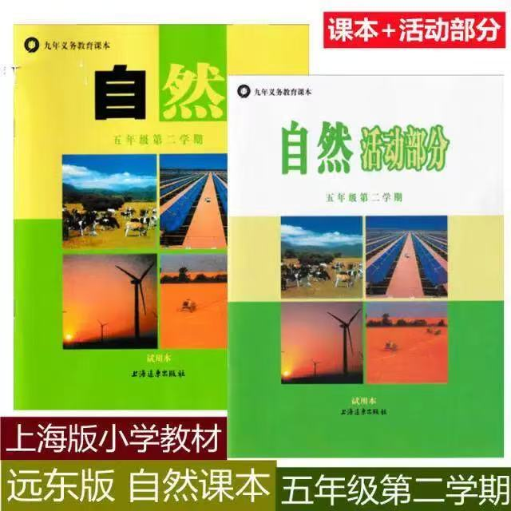

## 当前 ask-HomeWork 场景的推荐主入口

- Windows: `C:/Users/Stark8964911/.cursor/skills/ask-HomeWork/SKILL.md`
- Mac: `~/.cursor/skills/ask-HomeWork/SKILL.md`

# 宝宝作业模块

## 学生信息
- 年级: 上海小学5年级
- 教材: 沪教版
- 项目目录: `D:\work\HomeWork\`

---

## 当前活跃需求
- 用上海小学5年级沪教版的知识点解决以下问题:(如果是数学题:`请给出详细的解题步骤和每一步需要复习的知识点,难以理解的步骤请配图,优先使用沪教版5年级教材里学过的方程式知识点来解决`;其它学科的问题的解答也要给出每道题的知识点和解题思路)
  - 语文: 
  - 数学:
  - 自然: 帮我找  这个教材的电子版

<!--
### 历史需求1: 解答问题
我是上海小学5年级学生,用上海小学5年级沪教版教材学过的知识点,
给我解答以下问题(如图 "C:\Users\Stark8964911\Downloads\微信图片_20251229183011_286_125.jpg"),
解答的内容里要包含知识点
-->

<!--
### 历史需求2: 生成综合练习题HTML
给我出 1道 语文 考试经常考到的 阅读理解题(包含单选,多选,填空)和1道作文题;
1道数学考试经常会考到的应用题;
1道英语考试经常会考到的阅读理解题 (包含单选,多选,填空);
借鉴 `D:\work\HomeWork\english_comprehensive_test.html`, 生成1个HTML,包含题目和答案,
选择题要可以手动选择, 填空题需要可以输入内容(还要保证有足够的输入空间);
一开始不显示答案, 只在 `成绩查看` 栏目里保留 `提交答案` 按钮,
点击这个按钮后, 显示每道题的正确答案以及每道题详细的答案解析,
错题还需要你提示出对应的知识点和公式
-->

<!--
### 历史需求3: 更新练习题
把`D:\work\HomeWork\grade5_comprehensive_test_advanced.html`里的所有题目都更新成新的题,
保证每道题的难度都很高,并且都符合上海小学5年级沪教版教材学过的知识点;
数学题的题目下边可以给出解题思路和知识点, 但是不要给出太明显的解法,
解题思路里最好包含知识点的介绍,解题思路也不要用方程式的解法,
比如 假设一个数为X,因为我们没学方程式
-->

<!--
### 历史需求4: 批改作业
我把 `D:\work\HomeWork\grade5_comprehensive_test_advanced.html` 里填写的答案
导出到了 `D:\work\HomeWork\五年级练习答案_全新版_1762352991355.json`;
你帮我批改, 错题需要你指出题目涉及的知识点和详细的答案解析,
帮助我理解错误的原因,避免以后遇到类似知识点的题目后不会出错;
把你批改的内容生成到一个单独的文件里
-->

---

### 注意事项
- 所有题目和解答都基于沪教版5年级教材
- 数学题可使用沪教版5年级教材里的方程式知识点来解决
- 解答需包含知识点说明
