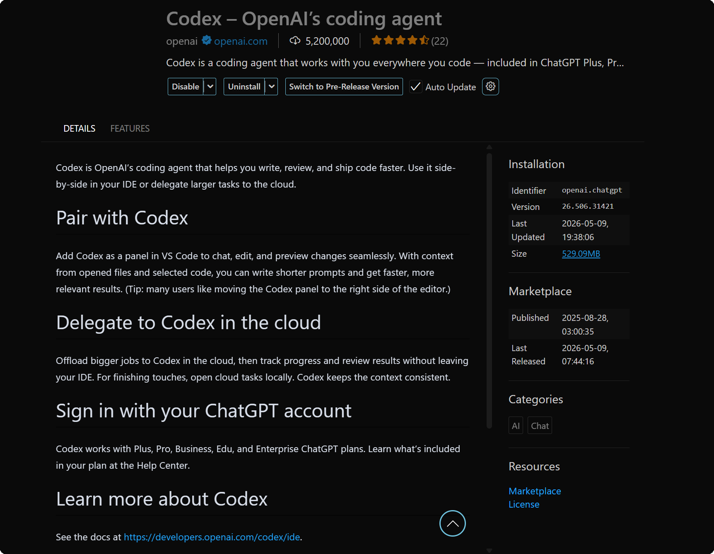
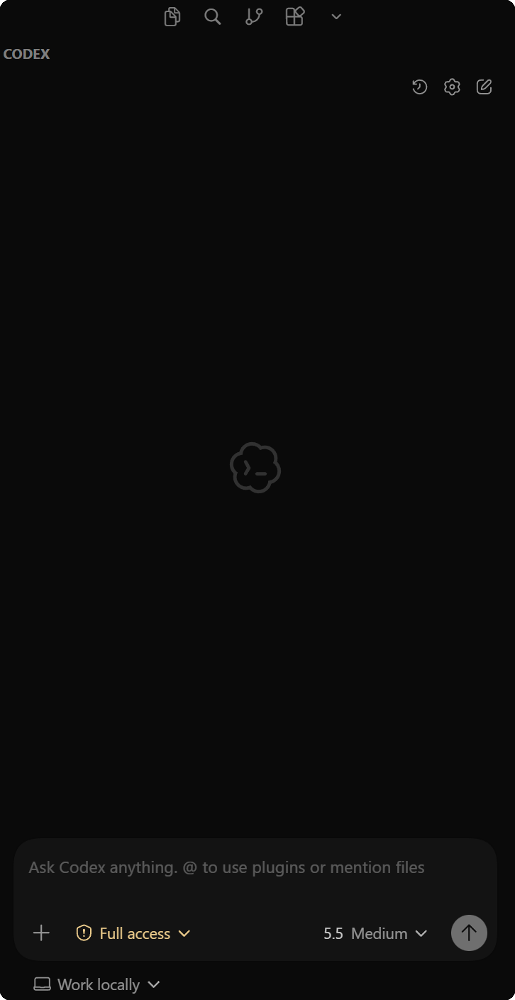
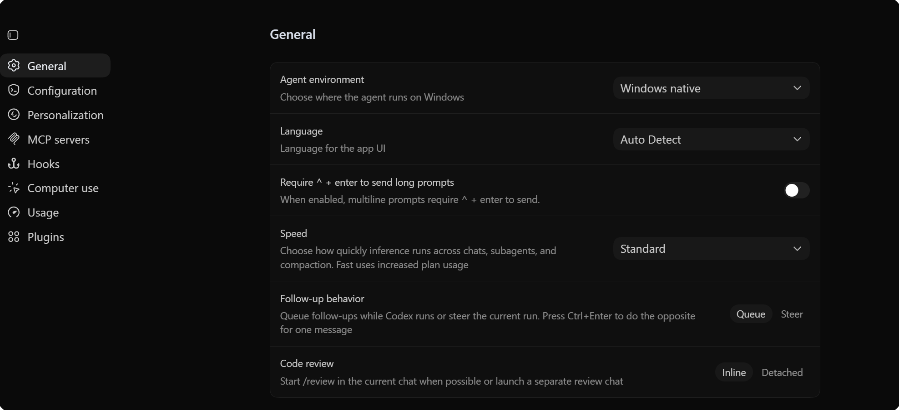

# ask-codex（Cursor）

## 与 Codex 入口的区别（分别维护）

| 客户端 | `SKILL.md` | `name` | 口令 |
|--------|------------|--------|------|
| Cursor（本文件） | `~/.cursor/skills/ask-codex/SKILL.md` | `ask-codex` | `/ask-codex` |
| Codex（OpenAI） | `~/.codex/skills/codex/SKILL.md` | `codex` | `/codex` |

两处不要求逐句同步；归档与共读仍以 **`~/.codex/context.md`** 为准。

**关于 `~/.codex/AGENTS.md`（Codex 全局规则，含 Cursor 内嵌 Codex 扩展）**：`~` 表示**当前用户的主目录**。它与 **`C:\Users\Stark8964911\.codex\AGENTS.md`** 是同一类路径在不同 OS 上的写法：**Windows** 即 **`%USERPROFILE%\.codex\AGENTS.md`**（本机示例如此）；**macOS** 即 **`/Users/<你的用户名>/.codex/AGENTS.md`**，与 shell 中的 **`~/...`** 指向同一文件。下文路径表中有一行速查。

## 目的

本 skill 是 **`C:\Users\Stark8964911\.codex`** 工作区的默认分析入口，用于：

- **跨会话恢复**：新 chat 载入本 skill 后，**优先**读取 `C:\Users\Stark8964911\.codex\context.md`，恢复与本工作区相关的历史任务与结论（避免仅依赖对话记忆）
- **收敛范围**：区分「对齐背景 / 需求澄清」与「实现 / 排障 / 审查」，按**最小必要上下文**读文件，避免无目标整仓扫描
- **路由专项能力**：代码、规则、架构、审查等任务指向既有 Cursor skills 或项目内规则，不在本入口堆长程实现细节
- **持久化摘要**：在**本轮与 `C:\Users\Stark8964911\.codex` 相关的任务已交付或明确结束时**，将执行内容**精简追加**到 `context.md`（见下文「会话归档」），供下次会话恢复

**非目标**：与本工作区无关的通用 Win11/Cursor IDE 问答（除非直接影响本目录工作流）——该类问题优先用 **`ask-cursor`**；其它业务仓库用各自 **`ask-*`**。

## 何时使用

满足以下**任一**情况时启用本 skill：

- 用户显式 **`@ask-codex`**、**`/ask-codex`** 或自然语言提及 **ask-codex**（若在纯 Codex 客户端对齐归档逻辑，改用 **`/codex`** 与 `~/.codex/skills/codex/SKILL.md`）
- **工作区根目录**为 **`C:\Users\Stark8964911\.codex`**（Mac 上以用户本机实际路径为准，可记为 `~/.codex` 等），且需要**项目级**引导或延续历史上下文
- 用户希望在 **Cursor 与 Codex 插件/CLI** 之间切换时，仍能保持**同一工作区的任务记忆**（事实以 `context.md` + 仓库文件为准）

## 新会话必读顺序（恢复上下文）

1. **`C:\Users\Stark8964911\.codex\context.md`**  
   - 若文件为空或仅有说明头：在答复中注明「暂无历史归档」，不虚构过往任务。  
   - 若已有条目：**先概括**与用户当前问题最相关的近期条目，再展开新工作。  
   - 文件变长时：优先阅读**底部最近若干条**（本 skill 约定新条目追加在旧条目之后，最新在文件尾部）。
2. **`{workspace}/.cursor/rules/project-context.mdc`**（若存在）  
   - 技术栈、目录、约定、长期决策；与 `context.md` 冲突时以**仓库内最新文件**为准。
3. 与用户任务直接相关的 **`README*`**、**`package.json`**、少量源码文件（**不要**默认通读全仓）。

| 优先级 | 来源 | 用途 |
|--------|------|------|
| 1 | `C:\Users\Stark8964911\.codex\context.md` | 跨 chat 任务摘要、结论、遗留项 |
| 2 | `{workspace}/.cursor/rules/project-context.mdc` | 项目稳定事实 |
| 3 | 根目录 `README*`、`package.json` 等 | 环境与依赖锚点 |
| 4 | 任务直接相关的源码/配置 | 实现与排障 |

## 工作区与本 skill 路径

| 用途 | Windows | macOS（示例） |
|------|---------|----------------|
| 工作区根 | `C:\Users\Stark8964911\.codex` | `~/.codex`（以本机为准；与 Codex 用户目录一致） |
| 会话归档文件 | `C:\Users\Stark8964911\.codex\context.md` | `~/.codex/context.md` |
| 本 skill 文件 | `C:\Users\Stark8964911\.cursor\skills\ask-codex\SKILL.md` | `~/.cursor/skills/ask-codex/SKILL.md` |
| Codex 对口 skill（分别维护） | `C:\Users\Stark8964911\.codex\skills\codex\SKILL.md` | `~/.codex/skills/codex/SKILL.md` |
| **`AGENTS.md`（Codex / Cursor 内 Codex 插件）** | `%USERPROFILE%\.codex\AGENTS.md`（本机示例：`C:\Users\Stark8964911\.codex\AGENTS.md`） | `~/.codex/AGENTS.md`（绝对路径形如 `/Users/<用户名>/.codex/AGENTS.md`） |

## 会话归档（`context.md`）——强制执行

在**本轮对话**中，只要同时满足：

1. 用户通过本 skill 或明确在 **`C:\Users\Stark8964911\.codex`** 上下文中推进任务，且  
2. 该任务已达到**可交付、可复述的结束点**（完成实现、明确拒绝、或形成书面结论），

则必须在结束回复**之前**，将以下内容**追加**到 `C:\Users\Stark8964911\.codex\context.md`：

- **一段一条目**，使用统一分隔与字段（便于检索与 diff）
- **只写可复查事实**：做了什么、关键结论、改了哪些路径（如有）、待办与风险（如有）
- **禁止**粘贴大段日志、完整 diff、或冗长对话原文；控制在约 **十几行至几十行内**

### 推荐条目格式（追加用）

```markdown
---

### YYYY-MM-DD — 简述标题

- **触发**：用户诉求一句（或 `/ask-codex`）
- **结论/交付**：分点列出，可执行、可复查
- **涉及路径**：`path/one`、`path/two`（无则写「无」）
- **后续**：可选；无则写「无」或删除本行

```

- **时间**：以用户消息中的 **Today's date** 或本机当日日期为准（**2026** 年起）。  
- **排序**：默认**新条目在旧条目之后**（文件顶部可保留简短《文件说明》，不动历史条目正文）。  
- **冲突处理**：若需更正历史结论，**新起一条**说明「更正：……」，避免静默删改旧条目。

## 路由规则（关联 skills）

按任务类型选用（名称以 `~/.cursor/skills` 下目录为准）：

| 场景 | 推荐 skill |
|------|------------|
| 初次打开仓库、缺少 `project-context.mdc` | `init-project` |
| TypeScript 类型与接口收紧 | `typescript-strict` |
| 常规代码审查 | `code-review` |
| 对抗性 / BMad 审查 | `bmad-code-review` 等 |
| 架构与设计讨论 | `architecture-review` 或 `bmad-create-architecture` |
| Cursor 编辑器、MCP、`mcp.json`、设置 | `ask-cursor` 及 `skills-cursor/*` |
| 中英文案与命名旁注 | `chinese-english-translation` |

## 输出约定

- **语言**：面向用户使用 **简体中文**；路径与标识符保持 **原文**。
- **准确优先**：涉及订阅、定价、工具链能力时，不确定则 **联网或查官方文档**，并标明日期；不编造。
- **附图**：若用户或本文件引用同目录图片，遵循全局规则：**先 Read 再结论**。

## 边界

- 不在本 skill 中维护易过期的**第三方账单、额度截图结论**；需要时以用户当次材料与官网为准。
- **`context.md` 不是密钥库**：禁止写入 token、密码、Cookie、私钥；仅写任务级摘要与公开路径。
- 任务属于**其他工作区**时，不强行写入本 `context.md`；若用户需要跨项目索引，单独说明或另建归档文件。

## 当前活跃需求(不要修改这部分的子内容)
- 当前系统的Cursor 月额度不足时,我会在 Cursor 内建的 Codex 扩展中 继续对话；Codex 扩展中的模型行为以 **`~/.codex/AGENTS.md`** 为准——即用户目录下 Codex 配置树中的全局规则（**Windows**：`%USERPROFILE%\.codex\AGENTS.md`；**macOS**：`/Users/<用户名>/.codex/AGENTS.md`，见上文路径表）。Codex 侧无 Composer 命令列表属产品差异。
- 如图,时`codex settings`里的General配置,目前这些配置是否还有优化的地方,可以在优化后, 更强大的发挥cursor的codex插件使用AI大模型时调用全局规则,skill或者MCP的能力
<!-- - Cursor 与 Codex 使用方式的对齐问题
  -根据`C:\Users\Stark8964911\.cursor\skills\ask-MyStartupProject1\SKILL.md`和 `C:\Users\Stark8964911\.cursor\skills\ask-MyStartupProject1\reference.md`,借鉴`C:\Users\Stark8964911\.codex\skills\codex\SKILL.md`,在codex侧生成对应的name为`MyStartupProject1`的skill文件,当我在cursor的codex插件的输入框里输入`/MyStartupProject1`时,保证任务执行的文件顺序和任务的功能完整性和在cursor的输入框里执行`/ask-MyStartupProject1`任务的流程一致
  -之前我执行 当前项目的下一步任务,是在 cursor 的输入框里输入图1 的 `/ask-MyStartupProject1` 来启动的;现在 在 cursor的 codexIDE的输入框里,输入`/MyStartupProject1`,如图2,来同样启动当前项目的下一步任务, 此时任务的执行流程和执行效果是否和在 cursor 的输入框里输入图1 的 `/ask-MyStartupProject1` 一样?  -->