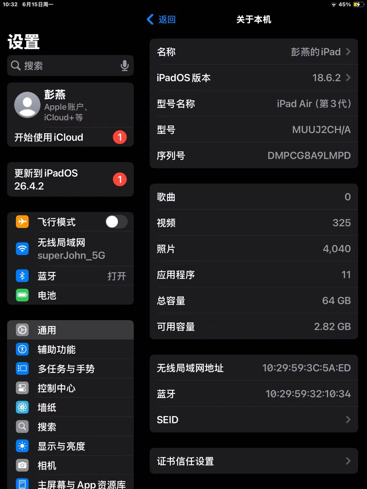
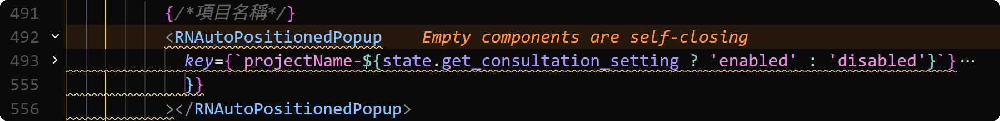
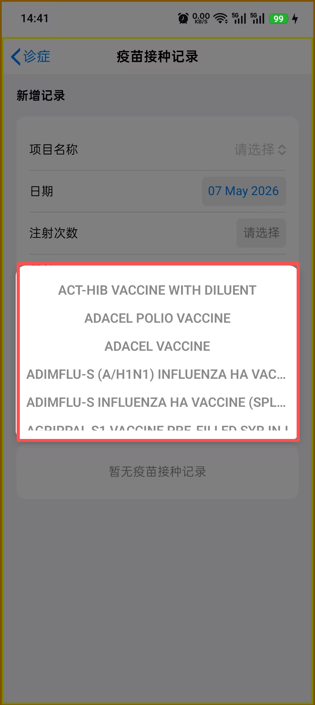
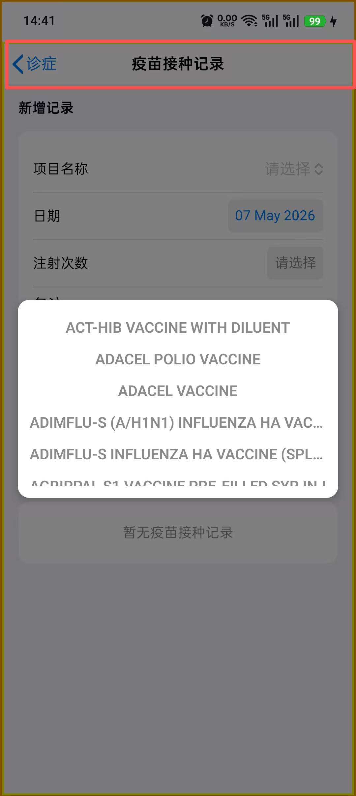

# ask-csx-mobile-upgrade

## 调用策略

- 激活本 Skill 后，先完整读取本 `SKILL.md`，再立即完整读取 `$HOME/.codex/skills/csx-mobile-upgrade/AGENTS.md`（Windows：`%USERPROFILE%\.codex\skills\csx-mobile-upgrade\AGENTS.md`）；读取失败时停止项目实现并报告精确路径，不得跳过。
- 每个新 chat 先显式调用本入口，再从共享 `AGENTS.md` 与当前源码开始普通实现、排障、审查和测试；项目根不维护第二份 `AGENTS.md`。
- 本 chat 首次激活时，在主任务前执行共享 `AGENTS.md` 的 “First-chat structural drift gate”；发现重大冲突时立即完整读取并执行 macOS `$HOME/.cursor/skills/init-project/SKILL.md` / Windows `%USERPROFILE%\.cursor\skills\init-project\SKILL.md`，刷新后重新读取共享 `AGENTS.md` 并继续原任务，不要求用户再次输入 `/init-project`。
- 本 Skill 只处理私有恢复快照、受保护待办、专项工作流路由和外部构建/发布上下文。
- 用户给出具体任务时，该任务优先；只有仅调用入口或明确要求“继续”时，才解析未注释待办。

## 入口、路径与事实源

- Cursor 入口：Windows `%USERPROFILE%\.cursor\skills\ask-csx-mobile-upgrade\SKILL.md`；macOS `~/.cursor/skills/ask-csx-mobile-upgrade/SKILL.md`。
- Codex 对照入口：Windows `%USERPROFILE%\.codex\skills\csx-mobile-upgrade\SKILL.md`；macOS `~/.codex/skills/csx-mobile-upgrade/SKILL.md`。两端保持同一执行语义，不要求逐字同步。
- 项目根：Windows `D:\work\RN\csx-mobile-upgrade`；macOS `/Users/<用户名>/Desktop/work/RN/csx-mobile`。若实际路径不同，以当前机器为准。
- 业务行为、API 映射、组件交互和错误处理以当前源码、测试和真实运行证据为准。
- 稳定工程约束只维护在 Codex 对口目录的 `AGENTS.md`；技术栈、脚本、依赖、构建和发布方式以 `package.json`、项目配置和 `README.md` 为准。不创建仓库根 `AGENTS.md` 或 `.cursor/rules/project-context.mdc`。
- 当前阶段、无法从源码恢复的外部阻塞和最小下一步以本 Skill 的「项目状态恢复快照」为准。

发生冲突时，优先采用当前仓库文件、真实设备、Network、构建产物和外部平台的实时证据，不用旧快照覆盖事实。

## 新会话最小读取顺序

在实现、排障、审查、改配置或给出专项结论前，依次执行：

1. 完整读取本文件，包括未注释的「当前活跃需求」。
2. 确认 Codex 对口目录 `AGENTS.md` 已读取，再按任务读取 `{workspace}/README.md`、`{workspace}/package.json` 和相关配置；只提取与任务相关的规则、命令与依赖，不复述其中的敏感信息。
3. 读取任务直接相关的 1～3 个源码、配置或测试文件；范围不足时再扩大，不默认扫描整棵 `src/`。
4. 若入口、项目文档或当前任务路由到其它 Skill，先完整读取对应 `SKILL.md` 及其明确要求的 `workflow.md`、`checklist.md` 或 `reference.md`。
5. 若引用 ``，先按引用该 Markdown 文件的同目录精确路径读取所有直接相关图片；精确路径失败后才搜索。

任一必读文件读取失败时，明确报告精确路径和降级范围，再决定继续或请求用户补充。

## 项目约束与默认切入位置

- 当前基线是 React Native、TypeScript strict、React Navigation、Redux Toolkit、Metro、SVG 和多语言；精确版本与可用脚本以仓库为准。
- 非华为设备推送使用 FCM；华为 / 鸿蒙设备使用 HMS Push。修改共享推送逻辑前核对双端字段和平台限制。
- 第三方原生库字段、方法或参数在实现前核对当前类型定义或官方平台说明；平台专属 API 必须显式分支并提供另一端处理。
- 医疗健康文案避免确诊式、替代医嘱式表述。
- 不写入或输出账号、密码、token、证书、私钥、签名材料和环境密钥。

| 主题 | 默认切入位置 |
| --- | --- |
| 导航 | `src/csxRoutes/`、`src/csxRoutes/csxRouter.ts` |
| API / DTO | `src/api/`、`src/tools/` |
| i18n | `src/i18n/`、`src/i18n/locale/` |
| 推送 | `src/tools/pushManager.ts`、`src/tools/hmsPush.ts`、`src/firebase/` |
| 健康数据 | `src/pages/HealthDataPage/`、`src/pages/EditHealthDataPage/` 及相关 hooks / services |
| 通用 UI / 主题 | `src/components/`、`src/components/theme/`、`src/styles/` |
| 原生构建与发布 | `android/`、`ios/`、`global.ts`、项目脚本和原生配置 |

## 实施工作流

1. 确认仓库身份、目标平台、环境和交付物，区分本应用与关联系统。
2. 按最小读取顺序恢复上下文，并把请求归类为需求、实现、运行时缺陷、审查、i18n、Figma、构建 / 发布或架构任务。
3. 优先读取真实截图、设备状态、Network、构建设置和直接相关代码，再作判断。
4. 可由真实页面触发 API 时，先读取实际请求与响应；权限或流程阻塞后才退回 Swagger、OpenAPI 或源码，并明确证据边界。
5. 收到 Figma URL、节点或设计还原任务时，先用 Figma MCP 读取节点；未成功读取前暂停依赖设计事实的实现或验收。
6. 代码任务依次完成项目内业务实现、项目内定向测试，再更新项目外 Skill 或恢复文档。若验证要求再次改代码，先回到业务实现阶段。
7. 开发阶段优先运行单文件、单用例、单平台或单设备验证；阶段收尾时再按风险扩大范围。
8. 完成项目相关任务后，按「状态与文档维护规则」覆盖更新恢复快照和最小下一步。

## 专项 Skill 路由

按当前机器实际存在的目录选择并读取专项 Skill；不要只凭名称执行。

| 任务 | 默认路由 |
| --- | --- |
| 创建或刷新项目规则 | `init-project` |
| RN Hooks、跨端、列表、键盘与图片 | `react-native-patterns` |
| DTO、API 边界和严格类型 | `typescript-strict` |
| 代码审查 | `code-review`；需要 BMAD 对抗审查时用 `bmad-code-review` |
| 翻译、术语与多语言 | `chinese-english-translation`，并同步所有必需 locale |
| Figma 到 RN | `ask-figma-to-rn-toolkit`、`figma-implement-design`；写入画布时再用 `figma-use` |
| 已澄清规格的快速实现 | `bmad-quick-dev` |
| 已有 story 文件的开发 | `bmad-dev-story` |
| 模块边界与架构演进 | `architecture-review` 或 `bmad-agent-architect` |

默认顺序是澄清事实、读取最小代码切片、选择专项流程、实施和验证。需求模糊时不要直接进入 `bmad-quick-dev`。

### BMAD 执行门禁

任务、文档、恢复快照或上轮结论明确指向任一 `bmad-*` 且本轮要按其步骤产出时，先读取当前系统下 `~/.cursor/skills/<bmad-identifier>/SKILL.md`（Windows 为 `%USERPROFILE%\.cursor\skills\<bmad-identifier>\SKILL.md`），再读取它要求的同目录附属文件。读取失败时停止该专项步骤并报告精确路径，不依据历史经验代替。

## 状态与文档维护规则

- 本 Skill 只保存无法从源码快速恢复的当前阶段、外部阻塞、最近关键证据和最小下一步；不复制业务规则、API 字段、测试数量、完整日志或发布流水。
- 每次项目相关任务结束时，直接替换「项目状态恢复快照」中的过期事实，删除已完成下一步；不要按日期追加 chat 历史。
- 只有阶段、外部阻塞、关键产物或下一步发生实质变化时才更新快照。普通解释、未验证推测或可从代码恢复的改动不写入。
- 若本次任务改变稳定架构、命令工作流或仓库边界，在代码与定向验证稳定后自动最小更新 Codex 对口目录 `AGENTS.md`；否则不全仓扫描。外部合并造成的大规模变化使用 `/init-project` 刷新。
- 运行、构建、依赖和部署事实写入 `README.md`；临时状态不写入这些文件。
- 「当前活跃需求（不要修改这部分的子内容）」由用户维护。除非用户明确授权，否则保持其子内容逐字不变；未注释条目是新会话应优先继续的方向。
- 更新 Cursor 本 Skill 后，只在确有必要时同步 Codex 对照入口；不得为追求逐字一致复制平台专属说明或冗长参考。

## 项目状态恢复快照

### 当前阶段

- 最新已知发布基线来自 Codex 对照入口的 2026-06-21 快照：iOS `1.1.9 (20260621190308)` 已由 `{workspace}/ios-release-upload-testflight.sh` 完成 archive、IPA 校验和 TestFlight 上传。该外部平台状态可能已变化，相关任务开始时必须实时复核。
- 当前未完成范围以本文件未注释的「当前活跃需求」为准：在 macOS 项目根构建 release IPA，安装并运行到所示 iPad 真机，再交付以后可复用的命令。

### 外部阻塞与证据缺口

- 尚无本文件可证明的目标 iPad 安装和真实运行结果；archive、IPA 导出或 TestFlight 上传不能替代真机运行验收。
- TestFlight build 当前是否仍为 processing / valid 未在本轮核验；只有任务依赖该状态时才访问 App Store Connect 实时确认。

### 最小下一步

1. 执行未注释的 macOS / iOS 活跃需求，先核对 workspace、scheme、签名、连接设备和目标环境，再构建 release IPA。
2. 将产物安装并运行到截图所示 iPad，在东八区设备上验证应用可启动和目标环境正确，记录实际成功命令与必要前置条件。
3. 完成后覆盖更新本快照，删除已完成条目，仅保留新的阻塞和最小下一步。

## 输出与边界

- 使用简体中文说明；代码和代码注释使用英文。
- 只报告已验证、部分验证和外部阻塞，不把端口、环境变量、编译成功或上传成功冒充真实页面 / 真机验收。
- 不擅自扩大到无关重构、其它 Heals 仓库、生产发布或用户未授权的外部变更。
- 除非用户明确要求运行、构建、发布或真机验证，否则默认提供可执行步骤并由用户手动验证。
- 项目相关任务结束时说明恢复快照是已更新还是无需更新，并给出当前阻塞和最近可执行动作。

## 当前活跃需求(不要修改这部分的子内容)

路径对照：Windows 项目根为 `D:\work\RN\csx-mobile-upgrade`；Mac 项目根为 `/Users/<你的用户名>/Desktop/work/RN/csx-mobile`。下方涉及项目内文件时，Windows 与 Mac 仅根目录不同，后续相对路径保持一致。
  
- MAC
  - IOS: 需要你在 Mac 系统的项目目录 `/Users/<你的用户名>/Desktop/work/RN/csx-mobile`（例如 `/Users/stark/Desktop/work/RN/csx-mobile`）目录执行一条命令,构建出当前项目的release模式的ipa运行到如图型号的真机上,真机所在的时区是 `东八区`
    - 然后告诉我以后执行什么命令
  
- WIN:
  <!-- - 当前电脑已经在 Windows 项目根 `D:\work\RN\csx-mobile-upgrade`（Mac 对照：`/Users/<你的用户名>/Desktop/work/RN/csx-mobile`）目录执行 `npx react-native run-android` 把当前项目的debug模式的app运行到了如图型号的真机上,真机所在的时区是 `东八区` -->

<!-- - figma-to-rn-toolkit 相关:
  - 请根据 `https://www.figma.com/design/Wa0Oa4oeMTy5H2Tk32ooqb/CSM?node-id=17126-28544&m=dev` 这个 Figma URL, 在 Windows `D:\work\RN\csx-mobile-upgrade\src\pages\Diagnosis\DiagnosisPage.tsx` / Mac `/Users/<你的用户名>/Desktop/work/RN/csx-mobile/src/pages/Diagnosis/DiagnosisPage.tsx` 页面 的 2018行 ,根据页面的代码风格和项目结构,设计实现 `React Native` 组件代码
    - 要求：
      - 匹配当前项目的代码风格（命名规范、目录组织、import 顺序等）
      - 复用项目中已有的公共组件和工具函数
      - 使用项目一致的样式方案（StyleSheet.create / styled-components 等） -->

<!-- - react-native-auto-positioned-popup 相关
  - Windows `D:\work\RN\csx-mobile-upgrade\global.ts` / Mac `/Users/<你的用户名>/Desktop/work/RN/csx-mobile/global.ts` 的 `global.$fake`已经设为了 true
  - Windows `D:\work\RN\csx-mobile-upgrade\src\pages\ImmuneRecordPage\ImmuneRecordPage.tsx` / Mac `/Users/<你的用户名>/Desktop/work/RN/csx-mobile/src/pages/ImmuneRecordPage/ImmuneRecordPage.tsx` 里绘制的组件,显示在的红框处,传入的 `useTextInput`是false, 实际调用的源码是 Windows `D:\work\RN\csx-mobile-upgrade\node_modules\react-native-auto-positioned-popup\src\AutoPositionedPopup.tsx` / Mac `/Users/<你的用户名>/Desktop/work/RN/csx-mobile/node_modules/react-native-auto-positioned-popup/src/AutoPositionedPopup.tsx`;
  - 目前点击 Windows `D:\work\RN\csx-mobile-upgrade\node_modules\react-native-auto-positioned-popup\src\AutoPositionedPopup.tsx` / Mac `/Users/<你的用户名>/Desktop/work/RN/csx-mobile/node_modules/react-native-auto-positioned-popup/src/AutoPositionedPopup.tsx` 里 1215行的`TouchableOpacity`后,执行了1219行的`onPress`回调;然后`state.isFocus`变成了true;然后`AutoPositionedPopupList`组件显示在了红框处,也就是显示在了屏幕的中心;
  - 现在需要你在不改变原有代码逻辑的基础上修改这个逻辑,如果传入的 `internalSearch=true`,则点击后弹出的红框,也就是`AutoPositionedPopupList`组件,固定显示在如图红框处(屏幕顶部导航栏)的下边;
  - 你只能新增代码,不要修改已有代码
  - 现在需要给 Windows `D:\work\RN\csx-mobile-upgrade\node_modules\react-native-auto-positioned-popup\src\AutoPositionedPopup.tsx` / Mac `/Users/<你的用户名>/Desktop/work/RN/csx-mobile/node_modules/react-native-auto-positioned-popup/src/AutoPositionedPopup.tsx` 的887行的height的值加一个高度,这个高度用来显示如果原来useTextInput传入true时,显示的`memoizedTextInput`的高度;然后`AutoPositionedPopupList`的顶部需要显示`memoizedTextInput`,也就是把之前useTextInput传入true时显示的`memoizedTextInput`的操作逻辑,改到显示在`AutoPositionedPopupList`的顶部来操作 -->
