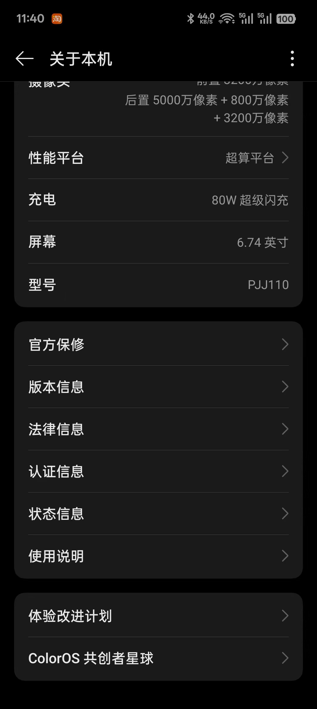

# ask-csx-mobile-upgrade

## 目的

本 skill 是 **CS Mobile**（`csx-mobile-upgrade`）的默认入口，用于：

- 在作答前恢复**最少必要**的项目事实与约束
- 区分**需求澄清**与**实现 / 排障 / 审查**
- 将任务路由到合适的仓库规则或专项 skill
- 在 1～3 个聚焦文件足够时，避免整仓大范围浏览

## 何时使用

满足以下任一情况时启用本 skill：

- 用户显式输入 `/ask-csx-mobile-upgrade`
- 对话明确围绕 **CS Mobile / csx-mobile / csx-mobile-upgrade**
- 工作区为本仓库且需要**项目级**引导
- 任务横跨导航、登录、API、i18n、Agora、健康数据、推送、Android/iOS 构建或医疗相关文案等

默认不要一次性加载过大范围代码；从最小有用上下文开始。

## 快速开始

1. 确认任务针对 `csx-mobile-upgrade` 或其 fork。
2. 按顺序读取最小上下文：
   - `{workspace}/.cursor/rules/project-context.mdc`
   - `{workspace}/README.md`
   - `{workspace}/package.json`
   - 仅与问题直接相关的代码文件
3. 归类请求类型：需求澄清 / 实现 / 排障 / 审查 / i18n 文案 / 原生构建与环境 / 架构讨论。
4. 给出可执行的下一步，或调用对应专项 skill。
5. 需要长期保留的结论优先写入项目文档或规则，而非仅留在对话里。

## 工作区路径

| 平台 | 路径 |
|------|------|
| Windows | `D:\work\RN\csx-mobile-upgrade` |
| Mac | `/Users/stark/Desktop/work/RN/csx-mobile`（若实际路径不同，以用户本机为准） |

## 本 skill 文件路径

| 平台 | 路径 |
|------|------|
| Windows | `C:\Users\Stark8964911\.cursor\skills\ask-csx-mobile-upgrade\SKILL.md` |
| Mac | `~/.cursor/skills/ask-csx-mobile-upgrade/SKILL.md` |

## 稳定项目事实（摘要）

本节仅作**记忆锚点**；**以仓库内规则与源码为准**。

- **业务域**：诊所流程、患者管理、诊断、预约、健康数据、Agora 视频，及与 clinic / health-passport 等相关后端的对接
- **技术栈**：React Native、TypeScript strict、React Navigation、Redux Toolkit、Metro、SVG 工作流、多语言
- **推送**：非华为设备 FCM（Firebase）；华为/鸿蒙 HMS Push
- **事实源**：`{workspace}/.cursor/rules/project-context.mdc`

若本 skill 与仓库文件冲突，**以仓库为准**。

医疗健康类表述须避免**确诊式**、**替代医嘱式**措辞；除非用户明确要求且语境恰当。

## 最小上下文来源

| 优先级 | 来源 | 用途 |
|--------|------|------|
| 1 | `{workspace}/.cursor/rules/project-context.mdc` | 技术栈、脚本、目录、架构、推送与构建要点 |
| 2 | `{workspace}/README.md` | 环境、内部流程、发布与集成说明 |
| 3 | `{workspace}/package.json` | scripts、engines、依赖核对 |
| 4 | 具体代码文件 | 仅与用户任务直接相关的文件 |

按主题的默认切入位置：

| 主题 | 常见位置 |
|------|----------|
| 导航 | `src/csxRoutes/`、`src/csxRoutes/csxRouter.ts` |
| API / DTO | `src/api/`、`src/tools/` |
| i18n | `src/i18n/`、`src/i18n/locale/` |
| 推送 | `src/tools/pushManager.ts`、`src/tools/hmsPush.ts`、`src/firebase/` |
| 健康数据 | `src/pages/HealthDataPage/`、`src/pages/EditHealthDataPage/` 及相关 hooks/services |
| 通用 UI / 主题 | `src/components/`、`src/components/theme/`、`src/styles/` |
| 原生构建 | `android/`、`ios/`、`global.ts`、配置文件 |

除非任务确有需要，否则不要扫描整棵 `src/` 目录树。

## 路由规则（关联 skills）

按任务类型选择专项能力（名称与 `~/.cursor/skills` 下目录一致）：

### 规则缺失或过期

- 生成或刷新 `{workspace}/.cursor/rules/project-context.mdc`：`init-project`

### React Native 实现与体验

- Hooks、跨端差异、列表性能、键盘与图片：`react-native-patterns`

### 类型安全

- 收紧接口、减少 `any`、理顺 DTO 与 API 边界：`typescript-strict`

### 代码审查

- 常规审查：`code-review`
- 更对抗或更深入的审查：`bmad-code-review`

### 国际化与文案

- 翻译、术语、命名旁注：`chinese-english-translation`
- 代码中新增文案需同步各必需 locale 文件

### Figma 到 RN

- 工具链与流程入口：`ask-figma-to-rn-toolkit`
- 按设计实现 UI：`figma-implement-design`
- 写入 Figma 画布需配合：`figma-use`

### 以交付为目标的执行

- 规格已清、偏执行：`bmad-quick-dev`
- 已有 story 文件：`bmad-dev-story`

### 架构讨论

- 模块边界与技术演进：`architecture-review` 或 `bmad-agent-architect`

**默认优先级**：澄清事实 → 读最小相关代码切片 → 再实现或给出建议。

需求仍模糊时，不要盲目使用 `bmad-quick-dev`。

## 执行工作流

1. 确认仓库身份，以及用户问的是本应用还是关联系统。
2. 只拉取最小有用上下文。
3. 识别请求形态：产品/需求、实现、缺陷/运行时问题、代码审查、翻译/措辞、构建/环境、架构。
4. 在扩大范围前，先指向最相关的文件或 skill。
5. 实现类任务可提示可能改动的区域，例如 `src/pages/`、`src/components/`、`src/tools/`、`src/api/` 或原生目录。
6. 若产生需长期保留的项目知识，优先更新已有文档或规则，而非仅留在对话中。

## 输出约定

- 对用户说明使用**简体中文**（除非用户要求其他语言）
- **代码与代码注释**使用英文
- 引用仓库代码时使用 Cursor 兼容的代码引用块
- 不向 skill 或对话写入真实密钥；环境变量、keystore、签名、token、证书、API 密钥等用占位符并指向安全配置

## 边界

- 不把医学表述写成确诊或处方替代
- 不擅自扩大范围（无关重构、用户未要求的文档）
- 不假设其他 Heals 仓库与本仓库路径、模块、约定相同
- 除非用户明确要求，默认不替用户运行应用或真机测试
- 不以陈旧笔记覆盖当前仓库文件

## 当前活跃需求
<!-- - figma-to-rn-toolkit 相关:
  - 请根据 `https://www.figma.com/design/Wa0Oa4oeMTy5H2Tk32ooqb/CSM?node-id=8042-53034&m=dev` 这个 Figma URL, 在 `D:\work\RN\csx-mobile-upgrade\src\pages\loginPage\loginPage.tsx`页面,根据其代码风格和项目结构,设计实现 `React Native` 组件
    - 要求：
      - 匹配当前项目的代码风格（命名规范、目录组织、import 顺序等）
      - 复用项目中已有的公共组件和工具函数
      - 使用项目一致的样式方案（StyleSheet.create / styled-components 等）
      - 组件放在 src/pages/paymentPage/ 目录
      - 组件名为 PaymentPage -->
<!-- - 执行 `npx react-native run-android`,把当前项目的debug模式的app运行到了如图型号的真机上,真机所在的时区是 东八区 -->
- MAC
  - 需要你在`/Users/stark/Desktop/work/RN/csx-mobile`目录执行 `react-native run-ios` 把当前项目的debug模式的app运行到IOS最新的模拟器里
<!-- - WIN:当前电脑已经在 `/Users/stark/Desktop/work/RN/csx-mobile` 目录执行 `npx react-native run-android` 把当前项目的debug模式的app运行到安卓真机 -->
