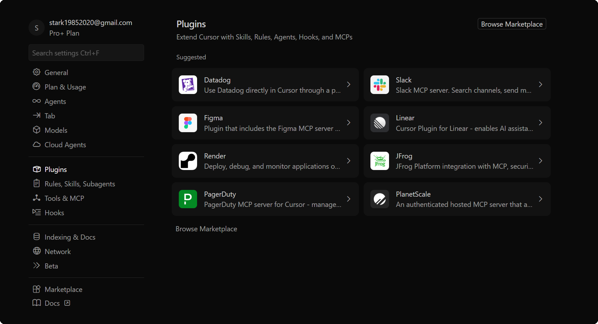

# Ask Cursor

## 目标

把旧的 `claude code` `ask_cursor` 工作流，收敛成一个可在 Cursor 中稳定复用的个人 Skill。

## 通用执行规范

<!-- Skill 执行规范已合并到 User Rules（`Cursor AI 规则.md` 第 9 条），每个会话自动生效，无需单独加载。 -->

## 配置信息
- Windows11系统全局配置数据目录(User 设置、工作区存储、UI 状态等，类似 VS Code):`C:\Users\Stark8964911\AppData\Roaming\Cursor`
- Cursor 用户级命令、技能、MCP 主目录: `C:\Users\Stark8964911\.cursor`（Win11）或 `~/.cursor`（Mac）: 
- cursor提问目录: `C:\Users\Stark8964911\.cursor`（Win11）或 `~/.cursor`（Mac）
- cursor 常打开的项目类型: React Native, React, Vue, iOS, Android, 微信小程序

## 默认迁移策略

- 常驻偏好放 `User Rules`
- 项目长期规则放 `.cursor/rules/*.mdc`
- 按需多步流程放 `~/.cursor/skills/`
- 显式 slash 命令兼容入口放 `~/.cursor/commands/`
- 本地 MCP 配置放 `~/.cursor/mcp.json`

## 当前 ask_cursor 场景的推荐主入口

- Windows: `C:/Users/Stark8964911/.cursor/skills/ask-cursor/SKILL.md`
- Mac: `~/.cursor/skills/ask-cursor/SKILL.md`

<!-- 这份 Skill 是主入口；旧的 `~/.claude/commands/ask_cursor.md` 只作为历史来源或兼容参考，不再作为长期主维护点。 -->

## 当前活跃需求
- 我当前是`cursor Pro+ Annual $48/mo.` 计划的用户
  <!-- - 目前有如图 2个计费池,一个是使用高级API的计费池,一个是`Auto + Composer`的计费池 -->
  <!-- - 当前Win11系统之前使用了`claude code`, 全局配置目录在`C:\Users\Stark8964911\.claude`,配置了 `"C:\Users\Stark8964911\.claude\CLAUDE.md"`和很多MCP,还有很多自定义的commands;现在我换成在 `cursor IDE`里使用`claude-4.6-sonnet-medium-thinking`模型,怎么在 `cursor IDE`里进行全面配置,以便达到和之前在`claude code`里同样的模型使用效果 -->
  - 当前Win11系统已经安装了`cursor IDE`
    - 我需要最大化发挥出  这几个模型的编码和架构能力, 还需要进行哪些全局配置优化或者创建哪些skills?
      - 比如 `cursor settings`里的 里的 Figma 是什么?  应该怎么配置?
- 把以上问题你的解答总结更新到 `C:\Users\Stark8964911\AppData\Roaming\Cursor\Cursor_使用指南与Token优化.md`
