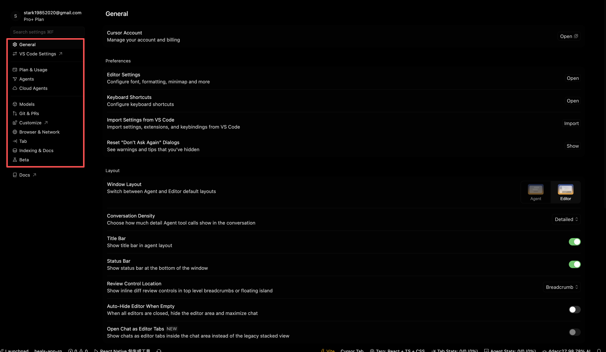
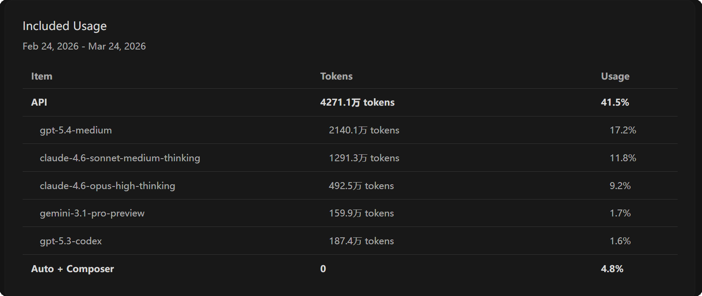
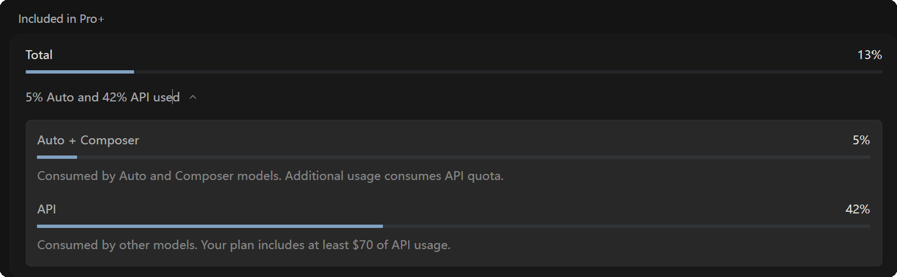
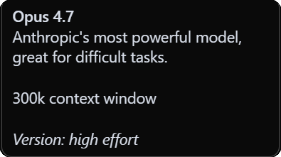
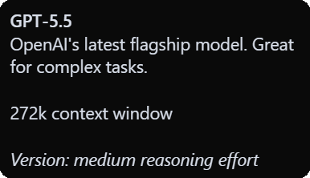

# ask-cursor

## 目的

本 skill 是 **在 Windows 11 与 macOS 上使用 Cursor IDE** 时的默认问答入口，用于：

- 用**最少必要上下文**回答与 **Cursor 客户端**相关的问题（配置、能力边界、双平台路径差异、排障线索）
- **区分**「IDE / 账号 / 本机环境」与「具体业务仓库实现」，避免把 RN/Vue/后端等问题误当作 Cursor 专属问题展开
- 在需要**改文件或专项工作流**时，**路由**到 `skills-cursor/*` 或其它专项 skill，而不是在本 skill 里堆长程迁移方案

**非目标（请用其它入口）**：具体语言/框架编码、项目架构、非 Cursor 的系统级问题（除非与启动 Cursor、权限、路径直接相关）。

## 何时使用

满足以下任一情况时启用本 skill：

- 用户显式带上 **`@ask-cursor`** 或输入 **`/ask-cursor`**、**`ask_cursor`**
- 问题明确落在 **Cursor 应用**：设置、`settings.json`、快捷键、同步、扩展、**Rules / Commands / Skills**、**MCP**、`mcp.json`、代理、更新通道、崩溃/无法启动、登录与订阅说明等
- 需要 **Win11 与 Mac 路径对照**（应用数据目录、用户级 `.cursor` 目录、日志位置）

以下情况**优先**项目内 **`ask-*`** 或 **`init-project`**，本 skill 只做一句路由，不展开业务实现：

- 某具体仓库的目录结构、API、业务需求（例如 `ask-CircleAppNew`、`ask-heals-app-rn`）
- 仅为「在 Cursor 里写代码」而问，与 IDE 配置无关

## 平台与范围说明

- **主平台**：**Windows 11**、**macOS**（Apple Silicon / Intel 路径一致处不重复展开）。
- **Linux**：若用户偶尔提及，可引用与 VS Code 相近的约定路径作**简短**说明；深排障不在本 skill 主范围。

## 双平台：关键路径速查

下列路径用于解释「设置写在哪里」「MCP 配在哪里」「缓存/日志去哪找」。必要时先 **Read** 用户本机真实文件，避免臆测。

### 1. Cursor 用户数据目录（User、全局存储、日志，类 VS Code）

| 作用                 | Windows 11                            | macOS                                                     |
| -------------------- | ------------------------------------- | --------------------------------------------------------- |
| 用户范围设置与状态   | `%APPDATA%\Cursor`                    | `~/Library/Application Support/Cursor`                    |
| 用户 `settings.json` | `%APPDATA%\Cursor\User\settings.json` | `~/Library/Application Support/Cursor/User/settings.json` |
| 工作区存储等         | 同上目录下子文件夹                    | 同上                                                      |

### 2. 用户级 Cursor 配置树（命令、技能、部分工具链约定）

| 作用                                 | Windows 11                       | macOS                |
| ------------------------------------ | -------------------------------- | -------------------- |
| 根目录（Skills、Commands、部分规则） | `%USERPROFILE%\.cursor`          | `~/.cursor`          |
| MCP 客户端配置（常见）               | `%USERPROFILE%\.cursor\mcp.json` | `~/.cursor/mcp.json` |

**本机示例（便于你直接定位；换机请按上表替换用户名）**

| 平台    | `.cursor` 示例                  |
| ------- | ------------------------------- |
| Windows | `C:\Users\Stark8964911\.cursor` |
| Mac     | `/Users/stark/.cursor`          |

### 3. 本 skill 文件位置

| 平台    | 路径                                                       |
| ------- | ---------------------------------------------------------- |
| Windows | `C:\Users\Stark8964911\.cursor\skills\ask-cursor\SKILL.md` |
| Mac     | `~/.cursor/skills/ask-cursor/SKILL.md`                     |

## 问题类型与处理顺序

1. **澄清平台与环境**：Win11 还是 Mac；Cursor 版本渠道（稳定/预览若用户提及）；是否多用户/公司策略限制。
2. **归类**  
   - **纯设置**：主题、字体、Format on Save、Cursor 特有项 → 配合 **`update-cursor-settings`** 读/改 `settings.json`。  
   - **Rules / Skills / Commands**：位置、加载顺序、与项目 `AGENTS.md` / `.cursor/rules` 关系 → 配合 **`create-rule`**、**`create-skill`**、项目规范。  
   - **MCP**：`mcp.json` 语法、进程启动失败、网络/代理 → 先读实际 `mcp.json` 与故障现象，必要时查官方/当前文档。  
   - **账号与用量**：以产品当前说明为准；不确定时 **联网**核对（以用户消息中的「今天」日期为准），避免编造价格与策略。  
   - **崩溃/空白窗/无法启动**：收集 **平台、最近是否更新、插件、防病毒/权限**；指向日志目录（在 `%APPDATA%\Cursor\logs` 或 Mac 对应用目录下 `logs`）作下一步，而非一次猜死原因。
3. **输出**：先给**可执行步骤**与**路径**；避免泛谈「优化模型能力」而无落地动作。

## 路由规则（关联 skills）

| 场景                                | 推荐                                              |
| ----------------------------------- | ------------------------------------------------- |
| 修改 `settings.json`、编辑器偏好    | `skills-cursor/update-cursor-settings`            |
| 新建/调整 `.cursor/rules`、RULE.md  | `skills-cursor/create-rule`                       |
| 新建 Agent Skill（`SKILL.md` 结构） | `skills-cursor/create-skill`                      |
| Cursor Hooks（`hooks.json` 等）     | `skills-cursor/create-hook`                       |
| 项目级长期事实、打开新仓库          | `init-project` + 项目 `project-context.mdc`       |
| 产品化研发流程（PRD、架构）         | BMad 系列 skills，与 IDE 无强绑定时不必经本 skill |

## 输出约定

- **语言**：面向用户用 **简体中文**；文件路径与标识符保持 **原文**。
- **准确优先**：涉及**订阅、定价、当前功能名**时，以 **联网检索或官方文档**为准，并标注大致日期；不凭记忆编造。
- **区分事实与推断**：无法在本机复现时，说明依据（文档/日志片段/设置项名）。
- **附图**：若用户或本文件引用同目录图片，按全局规则 **先 Read 再结论**。

## 可选：个人结论文档（不强制更新本 skill）

若用户希望把长期使用心得记在**用户数据区**（而非仓库内），可沿用例如：

- Win：`%APPDATA%\Cursor\Cursor_使用指南与Token优化.md`
- Mac：`~/Library/Application Support/Cursor/Cursor_使用指南与Token优化.md`

是否创建或更新由用户决定；**不要**在无人询问时自动新建大段文档。

## 边界

- 不把 **Claude Code 或其它工具链迁移** 当作本 skill 的默认主任务；仅当用户明确要做「从 X 到 Cursor 的对照表」时，再**按需、分步**回答。
- 不在本 skill 中维护易过期的**个人订阅状态、账单截图结论**；需要时以用户当次提供的信息与官方页为准。

## 当前活跃需求(不要修改这部分的子内容)
<!-- - 帮我检查下如图  的 cursor 里的 红框处的每个选项里的每个配置,如果有可优化的配置 直接帮我优化, 目的是 让 cursor 的 chat在使用  任何模型时, 都能最大化发挥出 cursor 和模型的 能力  -->
<!-- - 我当前是`cursor Pro+ Annual $48/mo.` 计划的用户, 目前有如图 2个计费池,一个是使用高级API的计费池,一个是`Auto + Composer`的计费池, 每月24日15:00点重置;API计费池每月大概能用2亿token,105美金额度 -->
<!-- - 当前Win11系统已经安装了`cursor IDE` -->
  <!-- - 但是`Pro+`每个月的额度不够用;我已经买了codex plus 账号;你觉得我应该在cursor里使用codex插件,还是 codex cli? 怎么可以把cursor里配置的 skill 和 MCP 无缝的同步到 codex 里直接使用?保证以后当cursor有余额时,优先继续用cursor;cursor的余额用完后,可以继续用codex,并且在使用codex时,保证也可以用和cursor一样的MCP和skill -->
  <!-- - 使用模型时, 执行一个任务消耗了762.1万token,API的Usage从3.3%上涨到了10.6%; 
    -  约 104.40 万 / 1%
  - 使用模型时,执行另一个任务消耗了280.9万token,API的Usage从12.1%上涨到了14%; 
    - 每 1% ≈ 102 万 token
  - 在cursor内置浏览器里我访问&&登录了 `https://supabase.com`, 怎么让这个内置浏览器 保持所有已经登录过的网站的登录状态,下次我再用 内置浏览器打开 `https://supabase.com` 时, 不想再次登录 -->
<!-- - 当前 `MacBook Pro` 电脑也下载安装了cursor,已经有了  `/Users/stark/.cursor` 和 `~/Library/Application Support/Cursor` 目录
  - 当前mac系统的 cursor 的eslint 是否已经全局打开? 是否用cursor打开任何项目后,都已经使用了 eslint  ? -->
<!-- - 把以上你执行过的所有任务的执行结果都总结更新到
  - win:`C:\Users\Stark8964911\AppData\Roaming\Cursor\Cursor_使用指南与Token优化.md`
  - mac : `/Users/stark/Library/Application Support/Cursor/Cursor_使用指南与Token优化.md` -->
<!-- - 不要修改 `/Users/stark/.cursor/skills/ask-cursor/SKILL.md`里的 `当前活跃需求`下的内容 -->
