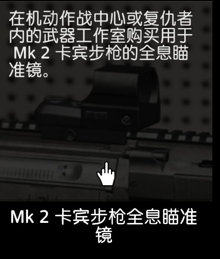
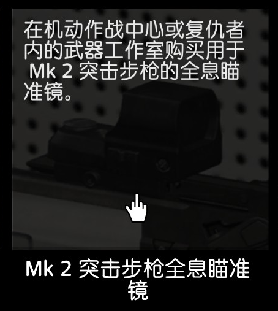
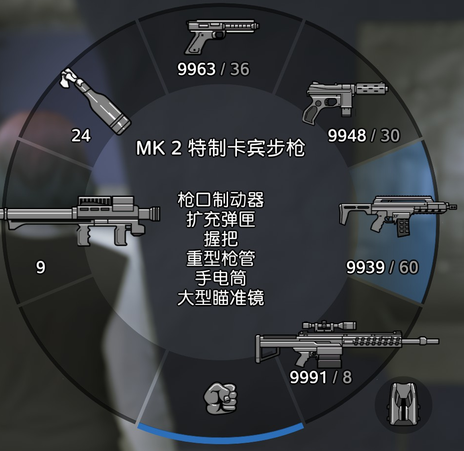
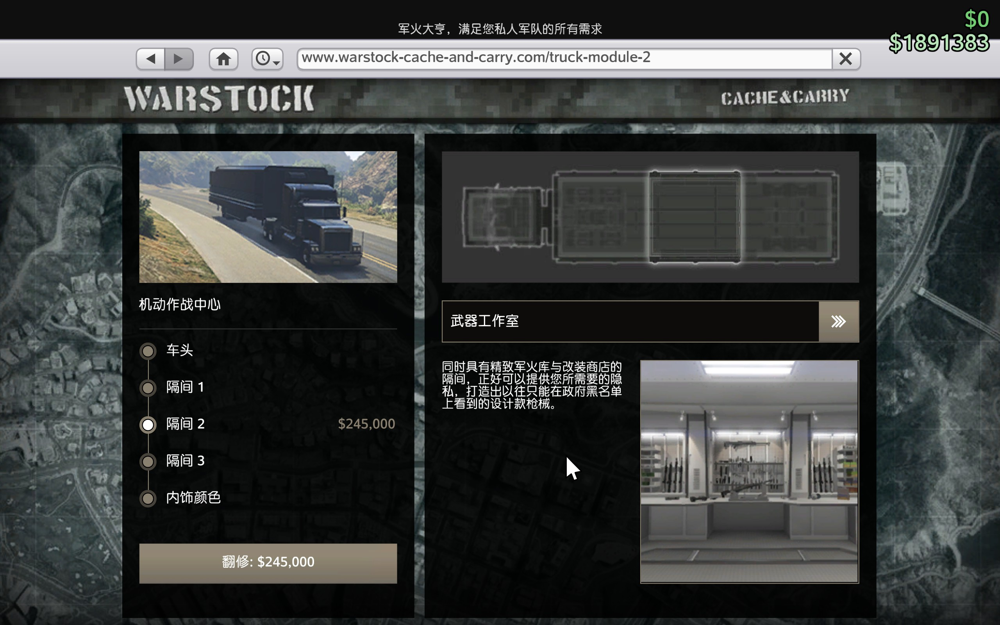
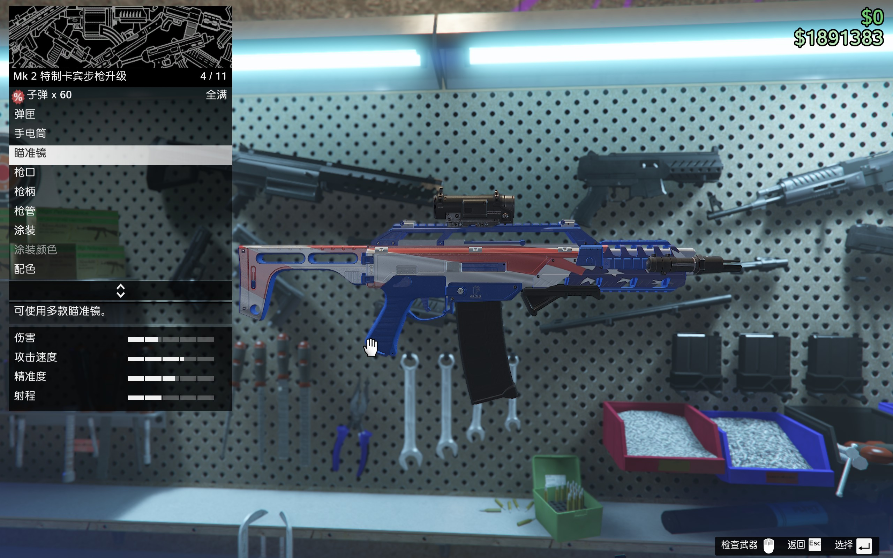
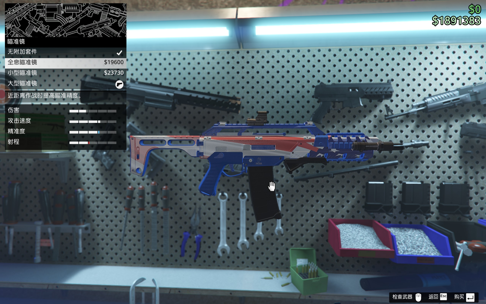

# Ask gta5

## 当前 ask-gta5 场景的推荐主入口

- Windows: `C:/Users/Stark8964911/.cursor/skills/ask-gta5/SKILL.md`
- Mac: `~/.cursor/skills/ask-gta5/SKILL.md`

## 当前活跃需求
- 根据 `C:\Users\Stark8964911\.cursor\skills\ask-gta5\gta5.md`,帮我解答 <GTA5 online> 增强版游戏里的以下问题
  <!-- - 我决定采取单人潜行模式进行佩里科岛任务,追求尽可能的快速完成任务 -->
  <!-- - 如图   ,是地堡的2个研究解锁项目, 这2个 哪个是给 如图  这个 `MK2特制卡宾步枪` 升级的?
      - 升级后的效果是什么? 我是不是还需要购买如图这个武器工作室?
      - 如图 ,我在 怪胎店 的 武器工作室 里 看到的 `全息瞄准镜` ,和 地堡里解锁的这个 一样吗?
      - 如图,,改的就是写着 `Mk2特制卡宾步枪升级` 的那把
      - 我是点击了 里的 `瞄准镜`选项后,才看到了 里的 `全息瞄准镜` 选项, 所以 这个 `全息瞄准镜` 选项是 地堡里的那个研究项目吗? -->
- 把你刚才的回答总结到 `C:\Users\Stark8964911\.cursor\skills\ask-gta5\gta5.md`里,并在 `C:\Users\Stark8964911\.cursor\skills\ask-gta5\gta5.md`关联 刚才问题里的图片
