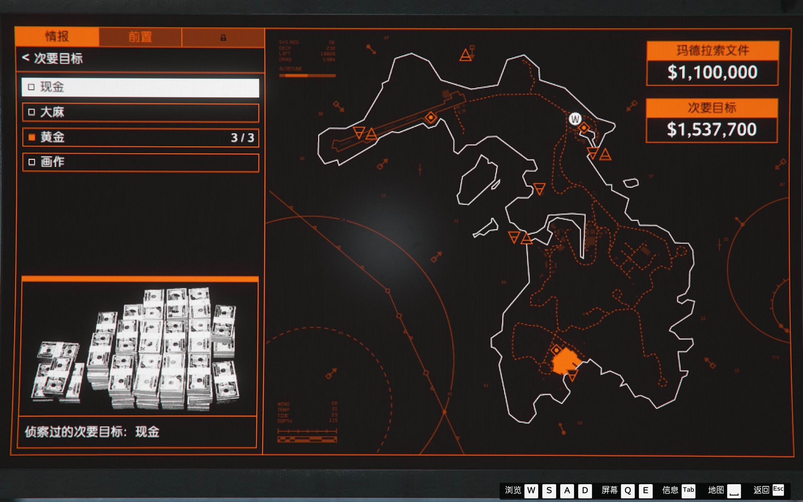
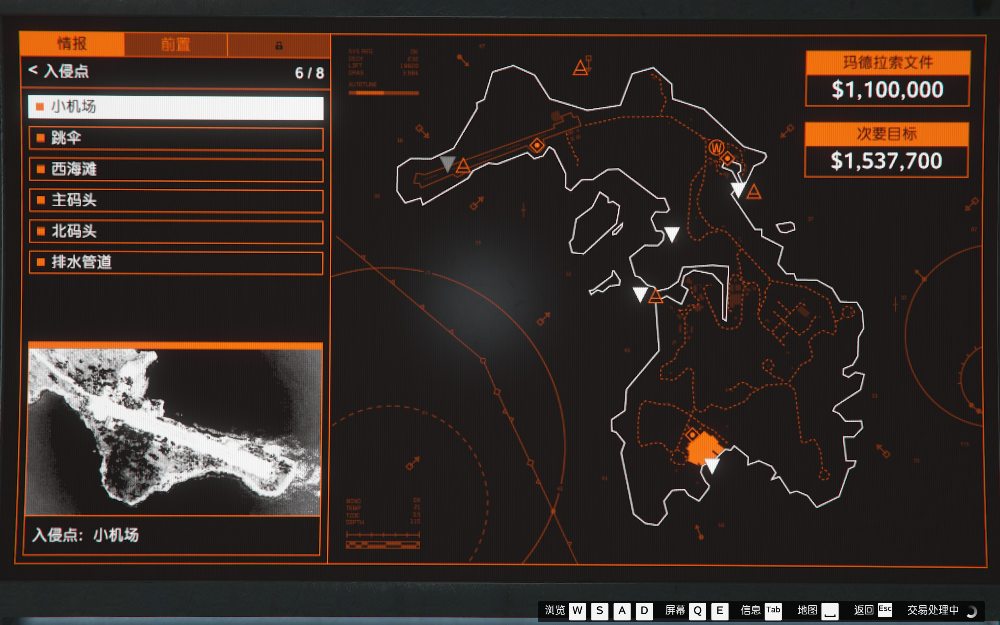
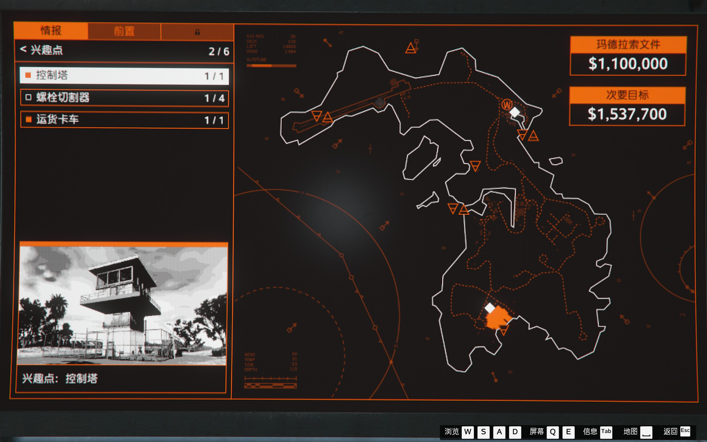
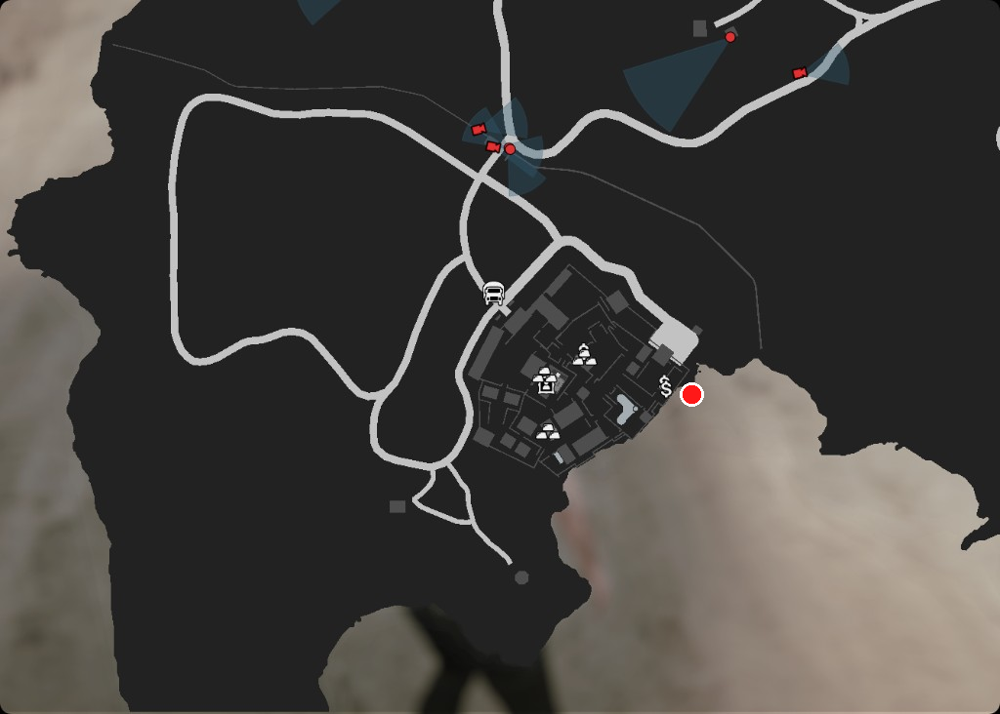

# GTA Online 增强版 — 当前资产与后续建议（总结）

更新时间参考：会话整理日 2026-03-23；佩里科岛条目持续补充至 2026-03-26；另含地堡研究与 Mk2 武器配件对照（2026-03-26）

---

## 1. 制造厂：还要不要买第二张图里的？

**结论：一般不需要。**

- 第一张图（您拥有的制造厂）：你已拥有摩托帮「The Open Road」下的 **五类各一间**——假钞、证件伪造、大麻、冰毒、可卡因，且库存/原材料都有积累。
- 第二张图（购买制造厂）：是 **同一类生意在不同地点的房源**，不是「第六种厂」。线上规则是 **每种类型同时只能持有一处**；再买同类型会先处理掉原有地点（换址），不会叠两间同类型厂一起产货。
- **只有在**你想换地点（例如缩短出货路程、个人偏好地图位置）时，才需要考虑从列表里另买一处并替换；**不为多赚钱而重复购买同类型**。

---

## 2. 服务载具 + 夜总会 + 地堡：要不要多买几间夜总会/地堡？

**夜总会、地堡：通常各一间即可，不必为多赚钱再各买第二间。**

- **夜总会**：一间即可同时跑人气收入、仓库挂机、与多种生意挂钩；第二间夜总会对多数玩家 **性价比很低**。
- **地堡**：制造与研究（或纯制造） **一间升满** 即可；第二间地堡很少有必要。
- **服务载具**（你提供的交互菜单截图）：列表含游艇、机动作战中心、复仇者、恐霸、虎鲸、致幻剂实验室等。截图说明里 **银河超级游艇当前显示为未持有**（需去 DockTease 另购才算拥有）。其余若已购买：**不必为效率重复买第二套同类**（例如第二辆恐霸、第二艘虎鲸），除非你有明确玩法或收藏需求。

---

## 3. 接下来怎么赚钱相对最快？（按常见效率与可 solo 程度）

以下为通用优先级思路，实际以当周活动加成、你是否有人组队为准。

1. **佩里科岛（虎鲸 + 上岛抢劫）**  
   仍是最稳的 **单人高时薪** 路线之一；已有虎鲸则优先熟练路线、主目标 + 次要目标。

2. **地堡 + 摩托帮五厂 + 夜总会仓库（挂机链）**  
   你已具备 MC 五厂与地堡、夜总会：  
   - 保持 **原材料**（偷或买）与 **出货** 节奏；  
   - 夜总会人气与仓库在 **挂机玩法** 里很省心，适合与上岛、小任务穿插。

3. **致幻剂实验室（酸厂）**  
   若已在 Freakshop 解锁并升级，可作为 **补充产线**，与出货轮次一起规划。

4. **事务所（若尚未买）**  
   安保合约、电话暗杀、德瑞合约等 **现金与经验** 都不错，且流程相对固定。

5. **限时活动**  
   每周查看 Rockstar 公告：**双倍/三倍** 的差事、抢劫或出货类型优先打，同样时间收益更高。

---

## 4. 一句话总览

| 问题 | 建议 |
|------|------|
| 第二张图制造厂 | 不必为「多一间同类型」而买；仅换地点时考虑替换 |
| 多间夜总会/地堡 | 不必；各一间升满、排好出货即可 |
| 最快赚钱 | 虎鲸上岛 + 地堡/MC/夜总会挂机链 + 酸厂与事务所（若有）+ 当周加成活动 |
| 佩里科岛情报 | 首通主目标固定玛德拉索文件；次要够不必扫满；兴趣点视是否潜行补侦察 |
| 佩里科岛前置（单人硬闯） | 接近选虎鲸；装备三项全做；重火力重甲；干扰三项尽量全做；双门黄金勿死磕 |
| 单人硬闯 vs 潜行 | 肯背板则潜行通常更稳更省事；硬闯心理上更直但报警后压力大，未必更简单 |
| 接近载具「潜水艇：虎鲸」 | 选虎鲸接近则该项为必要前置，需完成；五种载具只需做一种，不必全做 |
| 佩里科岛（单人潜行） | 情报确认排水隧道等；前置虎鲸+切割炬+消音套；干扰可选；终章选隧道入侵 |
| 情报「大地图」是哪里 | 即虎鲸里「情报」页中央佩里科岛总览图，用于看已侦察进度与标记 |
| 排水隧道去哪解锁 | 搜集情报任务中到豪宅外侧海面潜水找水下格栅侦察；非围墙陆地三角标 |
| 全岛情报小地图上的豪宅 | 岛图最南端、路网成环的红框/密集建筑区即鲁维奥豪宅大院 |
| 排水隧道示意红点图 | 见下文 `cayo_compound_drainage_tunnel_approx.png`（与本 md 同目录） |
| 情报里主目标是否做完 | 排水/码头侦察 ≠ 主目标；首通主目标多在通讯塔摄像头看地下室金库，以计划板与通知为准 |
| 仅对话列表能否证明主目标 | 不能；若列表里只有码头/次要/排水/切割炬等，没有金库类确认，通常仍缺主目标侦察 |
| 排水侦察完成能否直接离岛 | 单项完成不代表整次情报结束；主目标未侦察则应补完再撤（按任务指引） |
| 人在「红点附近」找不到格栅 | 东侧水陆交界 ≠ 入口；格栅在南/西南外海崖脚，须深潜贴崖根搜 |
| 单人潜行求快：还要不要继续侦查次要 | **不必。** 次要总额已约 150 万+（如图主+次）时情报足够；多跑情报只拖时间；豪宅内双门黄金单人本就搬不满，以主目标+能单拿的次要为准。插图：`img_005642.png`（§8.1） |
| 单人潜行求快：入侵点 6/8 要不要补侦查剩下 2 个 | **不必。** 已含 **排水管道** 及常用上岸点（如码头/机场等）即可；终章只选 **一种** 入侵点。凑满 8/8 多为收藏/多路线备胎，不缩短首通时间。插图：`img_010059.png`（§8.1） |
| 单人潜行求快：兴趣点未满（如 2/6、切割器 1/4）要不要补侦查 | **一般不必。** 只走 **排水管道** 进豪宅时兴趣点 **不强制满**；图里已有控制塔/卡车/至少一处螺栓切割器，够应付常见次要路线。**不必**为刷满 6/6 或切割器 4/4 再跑情报，除非你要全图标注刷新点或依赖 **抓钩** 等未解锁兴趣点。插图：`img_010427.png`（§8.1） |
| 前置「接近载具」里要不要做 **潜水艇：虎鲸** 任务 | **要做。** 界面 **0/5** 且标注 **必要任务** 时，须 **完成你所选的那一种** 接近前置；用虎鲸上岛就 **开始并完成** 这条，不必再做另外四种接近。插图：`img_010733.png`（§8.2） |
| 前置「装备」里应该做哪些 | **计划板上列出的全部做满**（常见 **0/4**：爆破弹、保险箱密码、指纹复制器、割炬）。凡标 **必要任务** 的都不能跳过；漏做易终章卡门/卡互动。**没有**为速通省掉的合法项。插图：`img_012932.png`（§8.2） |
| 地堡研究两个「全息瞄准镜」：哪个给 **MK2 特制卡宾步枪** | **`img_013533.png`** —— 道具说明写的是 **Mk 2 卡宾步枪** 全息瞄准镜。**`img_013550.png`** 是 **Mk 2 突击步枪** 的全息镜，对应另一把枪，不是特制卡宾。详见 §9。 |
| 研究解锁全息镜后的**效果**；还要不要买 **MOC 武器工作室**（`img_013950`） | 研究只**解锁**该瞄具的**购买/改装资格**，效果是多一种瞄具可选（全息与「大型瞄准镜」外观与瞄准手感不同，偏快瞄）。**买配件**必须在 **武器工作室**完成；若 MOC/复仇者**尚无**武器工作室，就需要装（如图 **隔间 2**）；**已有**任一载具上的武器工作室则**不必**为这条研究再买一个。见 §9。 |
| 怪胎店等处的「全息瞄准镜」与地堡解锁的**是否同一**（`img_014442` vs `img_014910`） | **`img_014442`**：**普通**特制卡宾、军火店价那条，**不是**地堡 Mk2 研究链。**`img_014910`**：标题 **「Mk 2 特制卡宾步枪升级」** 才是 Mk2；研究解锁后，此处 **瞄准镜 → 全息** 与 **`img_013533`** **同一件**（怪胎店/MOC/复仇者任一可改处以菜单为准）。见 §9.3～§9.4。 |
| 从 **Mk2 瞄准镜**（`img_015953`）点进去见 **全息**（`img_020026`）是否等于地堡研究 | **以子界面为准**：**`img_015953`** 是正确入口（**Mk 2 特制卡宾步枪升级 → 瞄准镜**）。**`img_020026`** 画面若仍只显示标题「瞄准镜」、全息 **$19,600**、底部 **购买**，则与 **普通特制卡宾** 军火店同类（**不是** `img_013533`）；若子页仍在 Mk2 工坊上下文且锁定/价格随研究变化，才是地堡那条。见 §9.5。 |

---

## 5. 佩里科岛（虎鲸）：情报阶段怎么选

**首通主目标**：第一次完成佩里科岛终章时，主目标固定为 **玛德拉索文件**（约 110 万级），无法改成黄金/项链等；打通后才会进入随机主目标循环。

**情报要不要扫满**：若已侦察到较丰厚的次要目标（例如总价一百多万），**不必为「满分情报」强行扫满**再开前置。入侵点/兴趣点未全满时：若你已确定走某条固定上岛或进豪宅路线，只要该路线在情报里已解锁即可；**兴趣点**影响螺栓切割器、抓钩等便利拾取是否在地图标出——想**少杀人、偏潜行**可多补几次侦察；接受**交火或硬闯**可直接进前置。

**准备开前置的条件**：在情报界面已能选到计划使用的**主要入侵方式**（如隧道、码头等对应项）即可结束情报；心里没底就再绕岛清一圈橙色标记。

**终章分红（首通）**：主目标只能是文件；次要尽量装包。精英挑战首通不必强求，**先稳定通关**。

---

## 6. 佩里科岛：前置界面怎么选（单人 + 硬闯）

**接近载具（0/5）**：优先 **虎鲸**。已有虎鲸时前置通常最省事，上岛后小艇/麻雀上岸即可；硬闯不绑定某一种船，关键是尽快上岛。

**装备（0/3 或 0/4 等）**：**装备栏里列出的前置全部做完**，不要省。项数随 **主目标 + 入侵方式** 等组合变化（首通玛德拉索文件 + 排水隧道常见为 **四项**：如爆破弹、保险箱密码、指纹复制器、割炬）。少做常在终章卡门或卡互动。

**武器装备（0/1）**：选 **火力猛、甲厚** 的套装（常见为类似「侵略者」等含重甲、霰弹/机枪或强突击配置的选项，以游戏内描述为准）。硬闯优先爆发与容错；终章补满零食与防弹衣。

**干扰（0/3）**：单人硬闯建议 **武器 / 装甲 / 空中支援 三项干扰尽量全清**，显著降低守卫硬度与直升机骚扰；时间紧至少做空中与武器，能全做则全做。

**单人次要目标提醒**：豪宅内 **黄金** 类双门库房通常需 **两人同时开门** 才能正规搬满；单人硬闯以 **主目标 + 画 / 现金 / 能单拿的次要** 为现实目标，勿在双门金库上死磕。

---

## 7. 单人：硬闯和潜行哪个更简单？要不要做「潜水艇：虎鲸」前置？

### 硬闯 vs 潜行（单人）

- **硬闯**：不必记复杂巡逻与摄像头节奏，玩法上「见敌就打」；一旦触发警报，岛上与豪宅内 **增援、重甲、火力密度** 会明显上升，**单人没有队友拉枪线**，血甲与弹药消耗大，**未必比潜行更容易稳过**，尤其首通。
- **潜行**：需要 **学习路线**（击倒顺序、避开视野、可选下水道入侵等），前几把有成本；熟练后往往 **交火少、节奏可控、复活少**，反复刷岛时多数玩家认为 **更稳、更省心**。
- **简要结论**：**论「长期最简单」**：通常更推荐 **潜行（配合排水隧道等）**。**论「当下不想背板」**：硬闯更直觉，但 **不要默认硬闯一定更简单**；若枪法与补给一般，可先试潜行攻略视频跟跑一两遍再决定。

### 接近载具里的「潜水艇：虎鲸」要不要做？

- 前置页 **接近载具 0/5** 表示五种里你 **尚未完成任何一种**；终章需要 **先选定并完成至少一种** 接近方式。
- 你当前选中 **「潜水艇：虎鲸」** 且界面标注 **「前置工作：必要任务」**：若确定用 **虎鲸** 上佩里科岛，就 **必须完成这一项** 对应任务，不能跳过。
- **不需要**把阿尔科诺斯特、梅杜莎、巡逻艇、长鳍 **全部** 各做一遍；**只做你选定的那一种** 即可。若改选其他载具接近，则去做 **那一项**，虎鲸这项可不选/不必做。

---

## 8. 佩里科岛：改成单人潜行时怎么选（对应「情报」页与后续前置）

你提供的截图是 **「情报」** 页而非「前置」页；潜行打法在 **情报里要确认路线已解锁**，再到 **前置** 做对应工具，最后在 **终章计划** 里选对入口。

### 8.1 情报页（如图）上应关注什么

- **入侵点 4/8、豪宅入口 5/6**：单人潜行最常用的是 **排水管 / 排水隧道**（从水下进入豪宅下水道）。请在 **大地图** 上确认是否已出现 **隧道类入侵点** 与 **从隧道进豪宅的入口**；若没有，再开 **「搜集情报」** 上岛，**潜水** 到豪宅附近水域找格栅入口并完成侦察，直到地图解锁。
- **兴趣点 2/6**：潜行若走 **码头剪网、抓钩翻墙** 等路线，兴趣点会标出 **螺栓切割器、抓钩** 等位置；若你坚持 **只走排水隧道**，兴趣点可 **不强制扫满**；想多一条备用潜行路则 **补 1～2 次情报** 把常用兴趣点找齐。
- **次要目标约 153 万**：对首通已足够，**不必为潜行再强行刷满全图**。
- **主目标玛德拉索文件**：首通不变，与潜行/硬闯无关。

**是否还要侦查次要目标**（`img_005642.png`，与本文同目录）

**（2026-03-26）** 界面为情报页：玛德拉索文件 $1,100,000，次要目标合计约 $1,537,700，黄金 3/3。**不必**再为「次要目标」补侦查以追求速通——背包与单人能开的库房本就卡上限，多扫次要只延长情报阶段；确认排水隧道等入侵/入口已齐即可进前置。

**入侵点 6/8 是否补侦查剩下 2 个**（`img_010059.png`，与本文同目录）

**（2026-03-26）** 列表含 **排水管道** 及小机场、跳伞、西海滩、主/北码头等。**不必**仅为「剩 2 个入侵点未解锁」再走搜集情报——速通只用到 **一个** 选定的入侵点（豪宅潜行首选排水管道）；其余两项纯属额外解锁，不决定分红。除非你想换一条完全不同的上岛打法或做全图鉴，否则可直接进前置。

**兴趣点未满是否还要侦查其它兴趣点**（`img_010427.png`，与本文同目录）

**（2026-03-26）** 界面显示兴趣点进度未拉满（如 **2/6** 类、**螺栓切割器 1/4**），另有 **控制塔**、**运货卡车**。**追求速通且终章用排水管道进豪宅** 时：**不必**为解锁剩余兴趣点再去搜集情报——兴趣点主要为了在地图上标出 **剪网工具、抓钩、卡车伪装** 等便利位置；隧道打法不依赖凑满 **6/6**。你已有 **至少一处** 螺栓切割器情报，若次要仍走码头铁网，通常够用；刷满 **4/4** 切割器只为看清全岛刷新点，**省时不强求**。若你计划走 **抓钩翻墙** 等路线而情报里尚无抓钩，再针对性补 1 次侦察即可。

情报满足「隧道已显示 + 次要目标清楚」后，即可切到 **「前置」** 开始做任务（不必在情报页强行 8/8、6/6，除非你要收藏全解锁）。

### 8.2 前置页（切到第二栏「前置」后）

- **接近载具**：仍优先 **潜水艇：虎鲸**，并完成该项 **必要前置**（与硬闯相同，选虎鲸就要做虎鲸那条）。
- **装备**：走排水隧道必须完成 **割炬 / 切割炬** 前置；列表里凡标 **必要任务** 的（如图 **爆破弹、保险箱密码、指纹复制器、割炬** 四项）**全部完成**。具体名称与数量以你当代计划板为准；**不要挑着做、不要为速通跳过**，否则终章易卡门、金库或骇入流程。
- **武器装备**：选 **带消音器** 的套装（常见名类似 **阴谋者** 等，以游戏内描述为准），便于室内 **爆头 / 近战** 而不轻易拉全图警报。
- **干扰（可选）**：纯潜行且追求省时可 **三项都不做** 以缩短准备时间；若担心失手触发警报、或首通求稳，**仍建议像硬闯一样三项全做**，一旦变混战压力会小很多。

**现在该不该做「潜水艇：虎鲸」接近前置**（`img_010733.png`，与本文同目录）

**（2026-03-26）** 你已在 **「前置」** 栏、**接近载具** 下列出 **0/5**，高亮 **潜水艇：虎鲸**，且写明 **前置工作：必要任务**。**是的，应该去做这条**——终章必须选定并完成 **一种** 接近载具前置；你沿用虎鲸作为基地与上岛方式，就做 **虎鲸** 这一项即可（回车开始任务）。**不必**再清阿尔科诺斯特、梅杜莎、巡逻艇、长鳍，除非你临时改选别的接近。

**装备前置应该做哪些**（`img_012932.png`，与本文同目录）

**（2026-03-26）** **四项全部要做：** **爆破弹**、**保险箱密码**、**指纹复制器**、**割炬**。界面为 **0/4** 且均属 **必要任务** 时没有「选做」——少任一都可能在终章缺工具或卡进度。**割炬**对应 **排水隧道** 入侵；**指纹复制器 / 保险箱密码** 对应拿 **玛德拉索文件** 的金库流程；**爆破弹** 随当前计划生成（如相关墙体/入口）。追求速通仍须 **按列表清完**，无法靠少做装备省出可靠捷径。

### 8.3 终章计划界面（前置做完、解锁分红关后）

- **主要目标**：玛德拉索文件（首通）。
- **入侵点**：选 **排水隧道**（若已侦察并已完成切割炬前置）。
- **逃离点**：选已侦察到的 **船只 / 任意已解锁** 的稳妥撤离（以你地图上已解锁为准）。
- **时段**：**白天** 视野好，首通潜行更友好。
- **豪宅内**：沿墙、清摄像头、按顺序处理落单守卫，拿文件后按路线撤离；**双门黄金** 单人仍通常 **无法正规搬满**，优先主目标 + 能单拿的画/现金等。

### 8.4 「大地图」是不是情报页这张？排水隧道要不要去围墙边的三角标？

**「在大地图上看隧道」指的是哪张图**：就是 **虎鲸内计划板 →「情报」** 页 **中央** 那张 **佩里科岛总览图**，与左侧 **入侵点 / 逃离点 / 豪宅入口 / 兴趣点** 进度、已解锁列表一起看。**真正解锁**排水隧道仍须在 **「搜集情报」任务** 里上岛完成水下侦察；总览图有时不会把隧道画得像陆地点那么显眼，以左侧 **「豪宅入口」** 是否出现 **「排水隧道」**（以及 x/6 是否满）为准。

**排水隧道是否要去「红色箭头」那种围墙旁的三角标记**：**不需要。** 围墙上/围墙外的 **小三角** 一般是 **正门、北墙、北大门、南墙、南大门** 等 **陆地类豪宅入口**，与 **排水隧道** 无关。**排水隧道** 在豪宅 **朝开阔海面一侧** 的 **水下**，需 **潜水** 找到 **排水格栅 / 洞口** 并完成侦察，才会在情报里解锁 **「排水隧道」**（例如从豪宅入口 5/6 补到 6/6）。

### 8.5 「搜集情报」任务里：豪宅在哪？排水隧道在哪？（含示意截图）

**全岛小地图上「鲁维奥的豪宅大院」**：即佩里科岛地图 **最底部（南端）**、白色路网成 **环形/多边形**、建筑与黄金/现金等标记最密集的那一片（你曾在全岛图上用红框标出的区域）。**不是**左上角机场附近。

**任务内地图为何不显示隧道名**：排水隧道是 **水下入口**，未侦察前 **不会像陆地点那样标字**；必须在 **「搜集情报」** 中亲自潜水触发侦察。

**怎么找（文字）**：

1. 从机场可先 **驾车/摩托** 沿主路往南到豪宅外围，再到 **临海一侧**（大院 **背对岛内、面向外海** 的悬崖/海岸）。
2. **下水向外海游**，在 **悬崖根部** **潜水**，沿岩壁寻找 **金属排水格栅**，直到出现 **拍照/侦察** 提示。

**与围墙陆地入口的区别**：隧道 **不在** 围墙上的陆地三角标处；**在墙外、海面以下的格栅**。

**示意图片（在玩家提供的「豪宅局部」地图截图上标注）**：本图 **下方大片浅色是外海**，**不是**排水口所在处。排水隧道在 **豪宅灰色建筑群南缘、悬崖下的近岸水域**；在地图上应对准 **宅子南边刚离开陆地的第一条水色带**（像素上约在建筑群下缘略偏下），**不要**标到屏幕最底部远离宅子的远海。此前两版误把「向南」理解成「往截图下方外海移」，已改为按 **陆海交界（约建筑群南侧 y 方向紧挨岸线）** 标注。仍以 **方位参考** 为准，游戏内以 **侦察提示** 与 **崖根潜水** 为准。

- 源工程目录中另有一份同名副本便于版本管理：`d:\work\GTA5\cayo_compound_drainage_tunnel_approx.png`（与上图内容相同）。

### 8.6 搜集情报：主目标侦察完成了吗？能回去了吗？（对话列表能说明什么）

**主目标侦察完成了吗（结合你提供的「信息 → 对话」截图）**：**仅凭该列表不能认定已完成。** 常见流程里，**主目标**（首通为 **玛德拉索文件**）需在 **通讯塔** 骇入监控后，用 **摄像头** 对准豪宅 **地下室/金库** 内主战利品才会触发对应确认与帕维尔台词。你截图中的对话集中在 **主码头、次要目标、排水管道、切割炬** 等，**未见** 典型的 **主目标/金库内容已识别** 一类表述，因此 **更可能仍缺主目标侦察**——最终以 **虎鲸计划板「情报」页右侧主目标是否已显示且数值正确**、以及 **通知** 里是否出现过主目标侦察完成 为准。

**排水管道 / 排水隧道侦察**：若游戏中出现 **「您完成了对一个豪宅入口点的侦察：排水管道」**（或通知中的等价文案），且水下已对 **金属格栅** 完成拍照，则 **该豪宅入口项已完成**。

**完成了排水能不能马上收工离岛**：**不一定。** 「搜集情报」整轮通常还要求 **主目标** 等必做侦察。若 **主目标尚未通过通讯塔流程完成**，建议 **补拍后再** 按任务指引 **离岛**（如前往机场等），避免回洛圣都后发现计划板仍缺项、需要再上岛。

**为什么「人在红点附近」仍找不到格栅**：暂停地图上的点若在 **豪宅东侧** 水陆交界，与 **南/西南外海崖脚** 的格栅 **不是同一位置**；需 **绕到宅子南端外海**，**深潜** 沿 **崖壁根部** 搜索，直至出现侦察提示。

---

## 9. 地堡研究：两项「全息瞄准镜」与 MK2 特制卡宾步枪

简体中文里 **特制卡宾步枪 Mk2** 与说明文案 **Mk 2 卡宾步枪** 是同一把枪（对应英文 **Special Carbine Mk II**）。**突击步枪 Mk2**（**Mk 2 突击步枪**）是 **Assault Rifle Mk II**，另一把武器，配件与研究条目 **不共用**。

**对应你武器轮盘里的 `MK 2 特制卡宾步枪`（`img_013655.png`）的研究解锁是：**

- **`img_013533.png`**：**Mk 2 卡宾步枪** 全息瞄准镜 → 用于 **特制卡宾步枪 Mk2**。研究完成后到 **机动作战中心** 或 **复仇者** 内的 **武器工作室** 购买安装（提示文仅列举常见地点；**怪胎店** 等若具备 **Mk2 升级** 工作台且能打开同一把枪的改装，研究解锁后一般也会出现 **同一「全息瞄准镜」** 购买项，以实际菜单为准）。

**另一项不是你的卡宾枪：**

- **`img_013550.png`**：**Mk 2 突击步枪** 全息瞄准镜 → 仅适用于 **突击步枪 Mk2**，**不**适用于特制卡宾 Mk2。

**当前持枪参考（`img_013655.png`）**

你已装 **大型瞄准镜**；若要用上 **全息镜**，须在完成 **`img_013533.png`** 对应研究后，到武器工作室 **花钱购买** 该配件并替换瞄具栏位。

### 9.1 研究解锁后的「效果」是什么？

- **地堡研究本身**不会让枪自动变强，只是让 **Mk2 特制卡宾** 在武器工作室里 **多出一个可买的「全息瞄准镜」改装项**。
- **实际手感**：与当前的 **大型瞄准镜** 相比，全息一般是 **另一套准星/贴脸与倍率体验**（更偏快速瞄准、观感不同）；不以「直接加伤害」为主，具体以游戏内试用为准。
- 你已装的枪口、弹匣、握把等 **不受这项研究影响**；只增加 **瞄具类** 选择。

### 9.2 还要不要购买 `img_013950.png` 里的「武器工作室」？

- **道具提示**（`img_013533`）写得很清楚：全息镜要在 **机动作战中心** 或 **复仇者** 里的 **武器工作室** 购买。研究走完 ≠ 在军火店能买满 Mk2 高级件。
- **若你已经有**：MOC 某一隔间 **已是** 武器工作室，**或** 复仇者 **已装** 武器工作室，则 **不必** 再按截图单独买一套；**任选一处**进去改装即可。
- **若你还没有** 上述任意一个武器工作室：就需要购买——截图即在 **Warstock** 给 MOC 选 **隔间 2 → 武器工作室**（价格以页面为准，图为 **$245,000** 翻修示例）。**没有工作台则无法把研究成果装到枪上。**

### 9.3 怪胎店 / 军火店里的「全息瞄准镜」和地堡解锁的一样吗？（`img_014442.png`）

- **不一样（不是同一条解锁链上的同一把枪）。** 地堡研究 **`img_013533.png`** 解锁的是 **Mk 2 卡宾步枪（Mk2 特制卡宾）** 在 **机动作战中心 / 复仇者武器工作室** 里购买的全息镜。
- 上图界面（你记在「怪胎店」亦可能；**画面与武装国度改枪墙、价格结构一致**）当前是 **普通「特制卡宾步枪」**（**非 Mk2**）的 **瞄准镜** 分类：`全息瞄准镜` 约 **$19,600**、`小型瞄准镜` 等——这类属于 **常规军火店升级**，**不需要** 先完成上述地堡研究。
- **区分方法**：改枪前看准武器名是 **Mk2 / MK2 特制卡宾步枪** 还是 **无 Mk2 后缀的特制卡宾**；**只有前者**才与 **`img_013533`** 的研究 + MOC 工作室说明一致。

### 9.4 确认改的是 Mk2：怪胎店「Mk 2 特制卡宾步枪升级」界面（`img_014910.png`）

- 左侧标题为 **「Mk 2 特制卡宾步枪升级」**、并有 **弹药类型 / 瞄准镜 / 枪管** 等 Mk2 专属分类时，即为 **`img_013655`** 那把 **MK2 特制卡宾** 的工作台路线，**不是** `img_014442` 里的普通特制卡宾。
- 此界面下 **瞄准镜** 分类里，在 **`img_013533` 对应研究完成前**，**全息瞄准镜** 会保持锁定或不可购；**研究完成后** 方可购买——与地堡说明解锁的是 **同一改装件**；**购买地点** 除 MOC、复仇者外，**怪胎店武器工作室** 只要能进此同一 Mk2 菜单，通常 **等价**（以是否出现可购买全息为准）。
- **小结**：`img_014442` = **普通枪** 军火店全息；`img_014910` + 研究 = **Mk2 枪** 全息，**与地堡条目一致**。

### 9.5 从「瞄准镜」点进去看到的全息，是不是地堡那一项？（`img_015953` → `img_020026`）

- **`img_015953.png`**：左侧总标题为 **「Mk 2 特制卡宾步枪升级」**，当前选中 **瞄准镜** —— 说明你还在 **Mk2 这条改枪线** 上。
- **`img_020026.png`**：若实际显示为 **仅「瞄准镜」** 分类、**全息瞄准镜 $19,600**、**小型 / 大型** 等与 **武装国度改普通特制卡宾** 相同的价目与 **「购买」** 按钮，则此页与 **`img_014442`** **同类**，属于 **非 Mk2** 枪的商店逻辑，**不是** 地堡研究 **`img_013533`** 解锁的 Mk2 配件界面（名称都叫全息，**枪与解锁链不同**）。
- **如何判断地堡那条**：在 **Mk2 升级** 流程里进入瞄准镜后，子项应仍能通过 **Esc 返回上一级** 看到 **「Mk 2 特制卡宾步枪升级」**；全息项是否可选、价格/锁图标是否随 **地堡研究进度** 变化，应以 **Mk2 工坊** 表现为准。若你发现二级菜单「长得像军火店 $19,600」，多半是 **串到普通特制卡宾** 或另一武器，**不要**把它当成 **`img_013533`** 的完成态。
- **结论**：**「先点瞄准镜再看到全息」本身不能证明是地堡项**；**必须是 Mk2 升级菜单下的瞄准镜子项，且与 `img_013533` 研究状态一致** 时，该全息才对应地堡解锁。

---

*说明：游戏会随更新调整收益与活动，具体金额与当周加成请以游戏内与官方 Newswire 为准。*
