# GTA Online 增强版 — 当前资产与后续建议（总结）

更新时间参考：会话整理日 2026-03-23；佩里科岛条目持续补充至 2026-03-28；另含地堡研究与 Mk2 武器配件对照（2026-03-26）；单人潜行武器装备、终章开局与逃离点、干扰三项可选说明（2026-03-28）；非公开好友战局内向好友发短信（2026-03-29）；防爆代步：夜鲨 vs 美德满改（Imani）（2026-03-30）；公开战局 PVP 更抗揍载具名录（相对 §11 两车）（2026-03-30）；美德 Imani 满改需事务所而非 CEO 办公室（王朝 8 分页区别）（2026-03-30）；佩里科岛 **第二轮及以后** 搜集情报要点（`img_cayo_intel_second_run`）（2026-03-30）；**伊玛尼技术** 与正文 **Imani Tech** 对照及 **遥控 → 导弹锁定干扰器**（2026-04-02）；公开战局「防弹 + 防炸 + 防导弹锁定」三向 PVP 载具界定与伊玛尼清单（2026-04-11）；**已有事务所 + 虎鲸** 后还可购资产与赚钱线（无新图；与 §3 对照）（2026-04-11）；第二轮起「搜集情报」**只须侦察哪些主/次要**（`img_000510`）（2026-04-11）；情报完成判定与「每轮前置是否重做」（`img_005438`～`img_005629`）（2026-04-11）；**次要目标是否每轮都要两人**（与 §6 / §8.8 一致）（2026-04-12）；终章锁定原因：**装备未齐** vs **干扰**（`img_015344`～`img_015436`）（2026-04-11）；摩托帮 **五厂出货** 能否用 **飞机装送货摩托**、**拖车拉大车** 赶路（2026-04-12）；**证件伪造** 在 **葡萄籽** 卖 **洛圣都** 远、换址三选一（`img_154815`～`img_155402`）（2026-04-12）；摩托帮 **换购制造厂** 会清空 **库存/原材料/升级**（`img_mc_trade_lose_stock`）（2026-04-12）；地堡补货 **送零件到武装国度** 与 **地堡选址**（`img_232830`）（2026-04-12）；游戏厅 **买满游戏机** 后保险箱收入仍很少 —— **被动上限与天敌**（本问 **无附图**；佩里科相关仍见 `img_015344`～`img_015436`）（2026-04-22）

---

## 1. 制造厂：还要不要买第二张图里的？

**结论：一般不需要。**

- 第一张图（您拥有的制造厂）：你已拥有摩托帮「The Open Road」下的 **五类各一间**——假钞、证件伪造、大麻、冰毒、可卡因，且库存/原材料都有积累。
- 第二张图（购买制造厂）：是 **同一类生意在不同地点的房源**，不是「第六种厂」。线上规则是 **每种类型同时只能持有一处**；再买同类型会先处理掉原有地点（换址），不会叠两间同类型厂一起产货。
- **只有在**你想换地点（例如缩短出货路程、个人偏好地图位置）时，才需要考虑从列表里另买一处并替换；**不为多赚钱而重复购买同类型**。

---

## 2. 服务载具 + 夜总会 + 地堡：要不要多买几间夜总会/地堡？

**夜总会、地堡：通常各一间即可，不必为多赚钱再各买第二间。**

- **夜总会**：一间即可同时跑人气收入、仓库挂机、与多种生意挂钩；第二间夜总会对多数玩家 **性价比很低**。
- **地堡**：制造与研究（或纯制造） **一间升满** 即可；第二间地堡很少有必要。
- **服务载具**（你提供的交互菜单截图）：列表含游艇、机动作战中心、复仇者、恐霸、虎鲸、致幻剂实验室等。截图说明里 **银河超级游艇当前显示为未持有**（需去 DockTease 另购才算拥有）。其余若已购买：**不必为效率重复买第二套同类**（例如第二辆恐霸、第二艘虎鲸），除非你有明确玩法或收藏需求。

---

## 3. 接下来怎么赚钱相对最快？（按常见效率与可 solo 程度）

以下为通用优先级思路，实际以当周活动加成、你是否有人组队为准。

1. **佩里科岛（虎鲸 + 上岛抢劫）**  
   仍是最稳的 **单人高时薪** 路线之一；已有虎鲸则优先熟练路线、主目标 + 次要目标。

2. **地堡 + 摩托帮五厂 + 夜总会仓库（挂机链）**  
   你已具备 MC 五厂与地堡、夜总会：  
   - 保持 **原材料**（偷或买）与 **出货** 节奏；  
   - 夜总会人气与仓库在 **挂机玩法** 里很省心，适合与上岛、小任务穿插。

3. **致幻剂实验室（酸厂）**  
   若已在 Freakshop 解锁并升级，可作为 **补充产线**，与出货轮次一起规划。

4. **事务所（若尚未买）**  
   安保合约、电话暗杀、德瑞合约等 **现金与经验** 都不错，且流程相对固定。

5. **限时活动**  
   每周查看 Rockstar 公告：**双倍/三倍** 的差事、抢劫或出货类型优先打，同样时间收益更高。

---

## 4. 一句话总览

| 问题 | 建议 |
|------|------|
| 第二张图制造厂 | 不必为「多一间同类型」而买；仅换地点时考虑替换 |
| 多间夜总会/地堡 | 不必；各一间升满、排好出货即可 |
| 最快赚钱 | 虎鲸上岛 + 地堡/MC/夜总会挂机链 + 酸厂与事务所（若有）+ 当周加成活动 |
| 佩里科岛情报 | 首通主目标固定玛德拉索文件；次要够不必扫满；兴趣点视是否潜行补侦察 |
| 佩里科岛前置（单人硬闯） | 接近选虎鲸；装备三项全做；重火力重甲；干扰三项尽量全做；双门黄金勿死磕 |
| 单人硬闯 vs 潜行 | 肯背板则潜行通常更稳更省事；硬闯心理上更直但报警后压力大，未必更简单 |
| 接近载具「潜水艇：虎鲸」 | 选虎鲸接近则该项为必要前置，需完成；五种载具只需做一种，不必全做 |
| 佩里科岛（单人潜行） | 情报确认排水隧道等；前置虎鲸+切割炬+消音套；干扰可选；终章选隧道入侵 |
| 情报「大地图」是哪里 | 即虎鲸里「情报」页中央佩里科岛总览图，用于看已侦察进度与标记 |
| 排水隧道去哪解锁 | 搜集情报任务中到豪宅外侧海面潜水找水下格栅侦察；非围墙陆地三角标 |
| 全岛情报小地图上的豪宅 | 岛图最南端、路网成环的红框/密集建筑区即鲁维奥豪宅大院 |
| 排水隧道示意红点图 | 见下文 `cayo_compound_drainage_tunnel_approx.png`（与本 md 同目录） |
| 情报里主目标是否做完 | 排水/码头侦察 ≠ 主目标；首通主目标多在通讯塔摄像头看地下室金库，以计划板与通知为准 |
| 仅对话列表能否证明主目标 | 不能；若列表里只有码头/次要/排水/切割炬等，没有金库类确认，通常仍缺主目标侦察 |
| 排水侦察完成能否直接离岛 | 单项完成不代表整次情报结束；主目标未侦察则应补完再撤（按任务指引） |
| 人在「红点附近」找不到格栅 | 东侧水陆交界 ≠ 入口；格栅在南/西南外海崖脚，须深潜贴崖根搜 |
| 单人潜行求快：还要不要继续侦查次要 | **不必。** 次要总额已约 150 万+（如图主+次）时情报足够；多跑情报只拖时间；豪宅内双门黄金单人本就搬不满，以主目标+能单拿的次要为准。插图：`img_005642.png`（§8.1） |
| 单人潜行求快：入侵点 6/8 要不要补侦查剩下 2 个 | **不必。** 已含 **排水管道** 及常用上岸点（如码头/机场等）即可；终章只选 **一种** 入侵点。凑满 8/8 多为收藏/多路线备胎，不缩短首通时间。插图：`img_010059.png`（§8.1） |
| 单人潜行求快：兴趣点未满（如 2/6、切割器 1/4）要不要补侦查 | **一般不必。** 只走 **排水管道** 进豪宅时兴趣点 **不强制满**；图里已有控制塔/卡车/至少一处螺栓切割器，够应付常见次要路线。**不必**为刷满 6/6 或切割器 4/4 再跑情报，除非你要全图标注刷新点或依赖 **抓钩** 等未解锁兴趣点。插图：`img_010427.png`（§8.1） |
| 前置「接近载具」里要不要做 **潜水艇：虎鲸** 任务 | **要做。** 界面 **0/5** 且标注 **必要任务** 时，须 **完成你所选的那一种** 接近前置；用虎鲸上岛就 **开始并完成** 这条，不必再做另外四种接近。插图：`img_010733.png`（§8.2） |
| 前置「装备」里应该做哪些 | **计划板上列出的全部做满**（常见 **0/4**：爆破弹、保险箱密码、指纹复制器、割炬）。凡标 **必要任务** 的都不能跳过；漏做易终章卡门/卡互动。**没有**为速通省掉的合法项。插图：`img_012932.png`（§8.2） |
| 地堡研究两个「全息瞄准镜」：哪个给 **MK2 特制卡宾步枪** | **`img_013533.png`** —— 道具说明写的是 **Mk 2 卡宾步枪** 全息瞄准镜。**`img_013550.png`** 是 **Mk 2 突击步枪** 的全息镜，对应另一把枪，不是特制卡宾。详见 §9。 |
| 研究解锁全息镜后的**效果**；还要不要买 **MOC 武器工作室**（`img_013950`） | 研究只**解锁**该瞄具的**购买/改装资格**，效果是多一种瞄具可选（全息与「大型瞄准镜」外观与瞄准手感不同，偏快瞄）。**买配件**必须在 **武器工作室**完成；若 MOC/复仇者**尚无**武器工作室，就需要装（如图 **隔间 2**）；**已有**任一载具上的武器工作室则**不必**为这条研究再买一个。见 §9。 |
| 怪胎店等处的「全息瞄准镜」与地堡解锁的**是否同一**（`img_014442` vs `img_014910`） | **`img_014442`**：**普通**特制卡宾、军火店价那条，**不是**地堡 Mk2 研究链。**`img_014910`**：标题 **「Mk 2 特制卡宾步枪升级」** 才是 Mk2；研究解锁后，此处 **瞄准镜 → 全息** 与 **`img_013533`** **同一件**（怪胎店/MOC/复仇者任一可改处以菜单为准）。见 §9.3～§9.4。 |
| 从 **Mk2 瞄准镜**（`img_015953`）点进去见 **全息**（`img_020026`）是否等于地堡研究 | **以子界面为准**：**`img_015953`** 是正确入口（**Mk 2 特制卡宾步枪升级 → 瞄准镜**）。**`img_020026`** 画面若仍只显示标题「瞄准镜」、全息 **$19,600**、底部 **购买**，则与 **普通特制卡宾** 军火店同类（**不是** `img_013533`）；若子页仍在 Mk2 工坊上下文且锁定/价格随研究变化，才是地堡那条。见 §9.5。 |
| 单人潜行求快：前置 **武器装备** 选哪个（`img_013719`） | 选 **阴谋者**；**不要**把 **消音器（$5,000）** 当成主方案终点。插图：`img_013719.png`（§8.2 下 weapons 小节） |
| 单人潜行：能否开 **终章**、还要不要多侦查 **逃离点**（`img_015938`） | **能开**（已进终章页且前置齐、各项有可选侦察时）；逃离点 **至少 1 个已侦察** 即可在终章里选定一种撤离，**不必**为速通补满全岛所有逃离点。插图：`img_015938.png`（§8.3） |
| 单人潜行求快：前置 **干扰** 三项要不要做（`img_202040`） | **不必须。** **武器 / 防弹衣 / 空中支援** 均为 **可选**；全程潜行且不翻车可 **0/3 全不做** 省时间。怕失手惊动全岛或首通求稳可 **三项全做**。与 **必要前置**（接近、装备等）不同。插图：`img_202040.png`（§8.2） |
| 非公开好友战局：怎么用手机给同战局好友 **发短信**（`img_003719`→`img_003831`） | **短信 App 里「无消息」是收件箱空，不是不能发。** 优先 **暂停菜单 → 在线 → 玩家**，选中好友后选 **发送短信**；或 **手机 → 联系人** 找好友再发短信。若联系人里没有，用暂停菜单玩家列表。详见 §10。 |
| **防爆车**选 **夜鲨** 还是 **美德满改**？（`img_warstock_nightshark` / `img_virtue_bilibili_nightshark`） | **没有唯一答案**：夜鲨偏 **硬吃爆炸、越野与载人货**；美德满改（事务所 **Imani Tech**：**防导弹锁定 + 装甲**）偏 **防 Mk2、机动与综合日常**。已有美德与事务所改装位时 **优先美德满改**；否则夜鲨 **军火大亨直购** 仍极稳。详见 §11。 |
| 除 **夜鲨、美德** 外，公开战局里 **更抗揍的 PVP 向载具**？（图示仍用 §11 两车对照：`img_warstock_nightshark` / `img_virtue_bilibili_nightshark`） | **有**：如 **叛乱分子皮卡改装 / 威胁者、可汗贾利坦克、巴拉杰 APC、半履战车、MOC 车头、多种 Imani 轿车/SUV** 等；各有 **成本、机动、地图暴露度、是否要队友炮手** 权衡，**没有谁全方位碾压** 夜鲨+美德组合。**坦克 / 改装重卡** 往往 **更肉但更笨**；**Imani 系** 与美德同源 **防锁+装甲**。详见 §12。 |
| **满改美德**（Imani）要不要先买 **王朝 8** 图里的房？（`img_dynasty8_virtue_imani_prereq`） | **要买的是「事务所」+ 车库里的载具改装间**，**不是** 图里当前高亮的 **「办公室」（CEO 顶级办公室）**。办公室与事务所在网站上是 **不同分页**；仅买小首尔办公室 **无法** 装阿尼玛科技。详见 §11.5。 |
| **第二次（及以后）**做佩里科岛、刚交 **$100,000** 后 **搜集情报** 要注意什么？（`img_cayo_intel_second_run`） | **主目标与次要一般都会刷新**，**必须重做通讯塔骇入+摄像头** 确认 **新主目标**；**入侵/豪宅入口/逃离** 多已保留不必全重跑。**次要** 常需本轮再侦察；兴趣点按打法补。详见 §8.7。 |
| 正文里的 **美德满改 / Imani Tech** 是不是游戏里 **伊玛尼技术**、下面的 **遥控 → 导弹锁定干扰器**？（`img_virtue_imani_tech_menu` / `img_virtue_imani_remote_jammer`） | **是同一套系统**：**伊玛尼技术** = **Imani Tech**。**图 2** 为进入后子类 **遥控**，其中 **导弹锁定干扰器** 即文档说的 **防 Mk2 锁定** 核心；**遥控单元** 是另购玩法项。**装甲板** 多在主列表与伊玛尼并列，**满改抗揍** 通常包含 **装甲板 + 导弹锁定干扰器**。详见 §11.6。 |
| 公开战局里哪些载具 **既防弹又防炸又防导弹锁定**？（图示锚点：`img_warstock_nightshark` / `img_virtue_bilibili_nightshark` / `img_virtue_imani_remote_jammer`） | **没有**「三项绝对免疫」的官方载具；**最接近**的是 **事务所** 内对 **支持伊玛尼** 的车同时装 **导弹锁定干扰器 + 装甲板** 并配合 **100% 车身装甲** —— **防锁**靠干扰器，**抗爆**靠装甲板+满装甲（社区/维基常见量级约 **11 发跟踪弹或 3 发 RPG**，以版本实测为准），**防弹**为 **强化玻璃/窗口小** 而非骷髅马式全窗免疫。**夜鲨、叛乱分子等** 再肉也 **无** 干扰器，故不算「三向齐」。详见 §13。 |
| **已有事务所 + 虎鲸**，还要买 **哪些资产** 才能多赚钱？（本问题 **未附带新截图**；事务所/改装前提可参见 `img_dynasty8_virtue_imani_prereq`、`img_virtue_imani_tech_menu`） | **不必**为「再买一个同类」重复买第二间夜总会/地堡等（§1～§2）。**现金向补充**按缺啥买啥：**挂机链** 夜总会+地堡+摩托帮厂（§3）；**酸厂**、**改装铺** 合约、**回收站** 拆车、**办公室+载具仓库** 进出口等见 **§14**。优先 **当周双倍** 与 **你已熟练的线**。 |
| **第二次及以后**做「搜集情报」，**只须**侦察 **主要 / 次要** 哪些？（`img_000510.png`） | **主目标每轮必做**（通讯塔→摄像头确认金库战利品）。**次要** 想拿分红里的次要才拍各库房；只打主目标可少拍。**不必**为速通凑满 **8/8 入侵、6/6 兴趣**；惯用 **排水管道** 等若已继承可不再全岛扫。详见 **§8.8**。 |
| 主/次已显示（如红宝石项链），左下仍写 **「在佩里科岛上搜集更多情报」**（`img_005438.png`）—— **搜集情报还要不要做**？ | **主目标已确认 + 次要已估值** 时，**开抢劫前置** 的情报 **已够用**；该句多为 **可选补充侦察** 提示，**不是**强制再扫全岛。仍须 **按任务指引正常离岛** 结束本轮情报任务。详见 **§8.9**。 |
| **接近载具 0/5、装备 0/4、武器装备 0/1**（`img_005548`～`img_005629`）—— **以后每轮都要重做吗**？ | **每一轮新抢劫**（再付 setup 费后）前置 **会重置**，**必要前置** 一般都要 **重新做**：**接近载具** 五选一 **完成你所选的一种**；**装备** 计划板列出的 **必要项全清**；**武器装备** **五选一** 并完成对应任务。**干扰** 仍可选。详见 **§8.10**。 |
| **每轮次要目标**是否都要 **2 人** 才能完成？ | **不是。** 只有 **豪宅内双门黄金库房** 等需 **两人同时开门** 才能 **正规搬满**；**现金、画作、可单开库房** 等 **单人** 可拿。**每轮** 次要品项会刷新，与「是否双人」无必然关系；单人速通以 **主目标 + 能单拿的次要** 为现实目标。见 **§6**、**§8.8**。 |
| 前置已做一大半，仍 **不能开终章**；**干扰 0/3**（`img_015344`～`img_015436`）—— **要不要做干扰**？ | **不是** 干扰的问题：**干扰** 为 **可选**，**0/3 也能解锁终章**。你截图为 **装备 2/4**（缺 **指纹复制器** 等未打勾项）、需把 **凡标必要** 的装备 **全清**。**接近 1/5、武器 1/1** 在多数情况下表示 **已满足** 该栏。详见 **§8.11**。 |
| 摩托帮 **五厂出货**：有没有 **飞机把送货摩托装进去**，或 **拖车牵引大车** 更快赶路？（本问 **无新截图**；佩里科前置图示仍见 `img_000510`～`img_005629`、`img_015344`～`img_015436`） | **没有**官方支持的「把任务送货摩托装进个人飞机货舱」的正规流程；**吊挂直升机** 对 **任务生成** 的出货载具 **通常不可用或会失败/无效**。**拖车 + 大车** 出货同理：**不能**指望用拖车把任务大卡「拖飞」省路。**可行缓解**：换 **厂址更近**（§1）、**非公开战局** 防骚扰、**分批少货** 降难度；详见 **§15**。 |
| **证件伪造** 在 **葡萄籽**（`img_154815.png`），满仓卖 **洛圣都** 很远（`img_155132.png`）；换址列表三选一（`img_155402.png`）选 **哪更近**？ | **卖洛圣都** 时：**纺织城** 或 **天堂岛**（均在 **洛圣都城内**）能 **明显缩短** 相对布莱恩郡厂房的送货距离；**佩立托湾** 在地图 **更北**，比葡萄籽 **更不适合** 为「少跑洛圣都」而换。预算够优先 **纺织城**；要省购入价可看 **天堂岛**。详见 **§15.4**。 |
| **满仓** 时点 **换购制造厂**，确认后 **货还在吗**？（`img_mc_trade_lose_stock.png`） | **不在。** 弹窗写明：换购时 **失去所有产品、原材料和升级**；满仓也会 **全部清空**，新址需 **重新补原材料** 并 **重买升级**（以游戏内为准）。建议 **先出货** 再换址，或 **接受清空** 再换。详见 **§15.5**。 |
| 哪个 **地堡** 做 **送零件到武装国度** 补货 **最快**？（`img_232830.png`） | 武装国度落点 **随机**；**平均** 往洛圣都：**丘马什** 地堡最常被推荐；**农舍**、**桑库多** 等中南部/西侧次之；**佩立托森林** 最北、通常 **最慢**。**无**「每次必最短」保证。详见 **§16**。 |
| **游戏厅** 游戏机 **都买了**，保险箱收入 **还是很低** ——正常吗？（本问 **无附图**） | **正常。** 游戏厅被动 **有硬性上限**：**所有游戏机位装满**后约 **`$5,000`／游戏日内**（约 **48 分钟** 现实时间在自由模式挂机维度，以 Wiki/增强版实测为准）；**远低于**夜总会挂机或上岛。**保险箱满**若达上限会 **暂停累积**，须 **经常去办公室拿走钱**。游戏机 **单价/种类不影响**封顶，只占 **位数是否齐**。详见 **§17**。 |

---

## 5. 佩里科岛（虎鲸）：情报阶段怎么选

**首通主目标**：第一次完成佩里科岛终章时，主目标固定为 **玛德拉索文件**（约 110 万级），无法改成黄金/项链等；打通后才会进入随机主目标循环。

**情报要不要扫满**：若已侦察到较丰厚的次要目标（例如总价一百多万），**不必为「满分情报」强行扫满**再开前置。入侵点/兴趣点未全满时：若你已确定走某条固定上岛或进豪宅路线，只要该路线在情报里已解锁即可；**兴趣点**影响螺栓切割器、抓钩等便利拾取是否在地图标出——想**少杀人、偏潜行**可多补几次侦察；接受**交火或硬闯**可直接进前置。

**准备开前置的条件**：在情报界面已能选到计划使用的**主要入侵方式**（如隧道、码头等对应项）即可结束情报；心里没底就再绕岛清一圈橙色标记。

**终章分红（首通）**：主目标只能是文件；次要尽量装包。精英挑战首通不必强求，**先稳定通关**。

---

## 6. 佩里科岛：前置界面怎么选（单人 + 硬闯）

**接近载具（0/5）**：优先 **虎鲸**。已有虎鲸时前置通常最省事，上岛后小艇/麻雀上岸即可；硬闯不绑定某一种船，关键是尽快上岛。

**装备（0/3 或 0/4 等）**：**装备栏里列出的前置全部做完**，不要省。项数随 **主目标 + 入侵方式** 等组合变化（首通玛德拉索文件 + 排水隧道常见为 **四项**：如爆破弹、保险箱密码、指纹复制器、割炬）。少做常在终章卡门或卡互动。

**武器装备（0/1）**：选 **火力猛、甲厚** 的套装（常见为类似「侵略者」等含重甲、霰弹/机枪或强突击配置的选项，以游戏内描述为准）。硬闯优先爆发与容错；终章补满零食与防弹衣。

**干扰（0/3）**：单人硬闯建议 **武器 / 装甲 / 空中支援 三项干扰尽量全清**，显著降低守卫硬度与直升机骚扰；时间紧至少做空中与武器，能全做则全做。

**单人次要目标提醒**：豪宅内 **黄金** 类双门库房通常需 **两人同时开门** 才能正规搬满；单人硬闯以 **主目标 + 画 / 现金 / 能单拿的次要** 为现实目标，勿在双门金库上死磕。

---

## 7. 单人：硬闯和潜行哪个更简单？要不要做「潜水艇：虎鲸」前置？

### 硬闯 vs 潜行（单人）

- **硬闯**：不必记复杂巡逻与摄像头节奏，玩法上「见敌就打」；一旦触发警报，岛上与豪宅内 **增援、重甲、火力密度** 会明显上升，**单人没有队友拉枪线**，血甲与弹药消耗大，**未必比潜行更容易稳过**，尤其首通。
- **潜行**：需要 **学习路线**（击倒顺序、避开视野、可选下水道入侵等），前几把有成本；熟练后往往 **交火少、节奏可控、复活少**，反复刷岛时多数玩家认为 **更稳、更省心**。
- **简要结论**：**论「长期最简单」**：通常更推荐 **潜行（配合排水隧道等）**。**论「当下不想背板」**：硬闯更直觉，但 **不要默认硬闯一定更简单**；若枪法与补给一般，可先试潜行攻略视频跟跑一两遍再决定。

### 接近载具里的「潜水艇：虎鲸」要不要做？

- 前置页 **接近载具 0/5** 表示五种里你 **尚未完成任何一种**；终章需要 **先选定并完成至少一种** 接近方式。
- 你当前选中 **「潜水艇：虎鲸」** 且界面标注 **「前置工作：必要任务」**：若确定用 **虎鲸** 上佩里科岛，就 **必须完成这一项** 对应任务，不能跳过。
- **不需要**把阿尔科诺斯特、梅杜莎、巡逻艇、长鳍 **全部** 各做一遍；**只做你选定的那一种** 即可。若改选其他载具接近，则去做 **那一项**，虎鲸这项可不选/不必做。

---

## 8. 佩里科岛：改成单人潜行时怎么选（对应「情报」页与后续前置）

你提供的截图是 **「情报」** 页而非「前置」页；潜行打法在 **情报里要确认路线已解锁**，再到 **前置** 做对应工具，最后在 **终章计划** 里选对入口。

### 8.1 情报页（如图）上应关注什么

- **入侵点 4/8、豪宅入口 5/6**：单人潜行最常用的是 **排水管 / 排水隧道**（从水下进入豪宅下水道）。请在 **大地图** 上确认是否已出现 **隧道类入侵点** 与 **从隧道进豪宅的入口**；若没有，再开 **「搜集情报」** 上岛，**潜水** 到豪宅附近水域找格栅入口并完成侦察，直到地图解锁。
- **兴趣点 2/6**：潜行若走 **码头剪网、抓钩翻墙** 等路线，兴趣点会标出 **螺栓切割器、抓钩** 等位置；若你坚持 **只走排水隧道**，兴趣点可 **不强制扫满**；想多一条备用潜行路则 **补 1～2 次情报** 把常用兴趣点找齐。
- **次要目标约 153 万**：对首通已足够，**不必为潜行再强行刷满全图**。
- **主目标玛德拉索文件**：首通不变，与潜行/硬闯无关。

**是否还要侦查次要目标**（`img_005642.png`，与本文同目录）

**（2026-03-26）** 界面为情报页：玛德拉索文件 $1,100,000，次要目标合计约 $1,537,700，黄金 3/3。**不必**再为「次要目标」补侦查以追求速通——背包与单人能开的库房本就卡上限，多扫次要只延长情报阶段；确认排水隧道等入侵/入口已齐即可进前置。

**入侵点 6/8 是否补侦查剩下 2 个**（`img_010059.png`，与本文同目录）

**（2026-03-26）** 列表含 **排水管道** 及小机场、跳伞、西海滩、主/北码头等。**不必**仅为「剩 2 个入侵点未解锁」再走搜集情报——速通只用到 **一个** 选定的入侵点（豪宅潜行首选排水管道）；其余两项纯属额外解锁，不决定分红。除非你想换一条完全不同的上岛打法或做全图鉴，否则可直接进前置。

**兴趣点未满是否还要侦查其它兴趣点**（`img_010427.png`，与本文同目录）

**（2026-03-26）** 界面显示兴趣点进度未拉满（如 **2/6** 类、**螺栓切割器 1/4**），另有 **控制塔**、**运货卡车**。**追求速通且终章用排水管道进豪宅** 时：**不必**为解锁剩余兴趣点再去搜集情报——兴趣点主要为了在地图上标出 **剪网工具、抓钩、卡车伪装** 等便利位置；隧道打法不依赖凑满 **6/6**。你已有 **至少一处** 螺栓切割器情报，若次要仍走码头铁网，通常够用；刷满 **4/4** 切割器只为看清全岛刷新点，**省时不强求**。若你计划走 **抓钩翻墙** 等路线而情报里尚无抓钩，再针对性补 1 次侦察即可。

情报满足「隧道已显示 + 次要目标清楚」后，即可切到 **「前置」** 开始做任务（不必在情报页强行 8/8、6/6，除非你要收藏全解锁）。

### 8.2 前置页（切到第二栏「前置」后）

- **接近载具**：仍优先 **潜水艇：虎鲸**，并完成该项 **必要前置**（与硬闯相同，选虎鲸就要做虎鲸那条）。
- **装备**：走排水隧道必须完成 **割炬 / 切割炬** 前置；列表里凡标 **必要任务** 的（如图 **爆破弹、保险箱密码、指纹复制器、割炬** 四项）**全部完成**。具体名称与数量以你当代计划板为准；**不要挑着做、不要为速通跳过**，否则终章易卡门、金库或骇入流程。
- **武器装备**：选 **带消音器** 的套装（常见名类似 **阴谋者** 等，以游戏内描述为准），便于室内 **爆头 / 近战** 而不轻易拉全图警报。
- **干扰（可选）**：纯潜行且追求省时可 **三项都不做** 以缩短准备时间；若担心失手触发警报、或首通求稳，**仍建议像硬闯一样三项全做**，一旦变混战压力会小很多。

**武器装备具体选哪一项**（`img_013719.png`，与本文同目录）

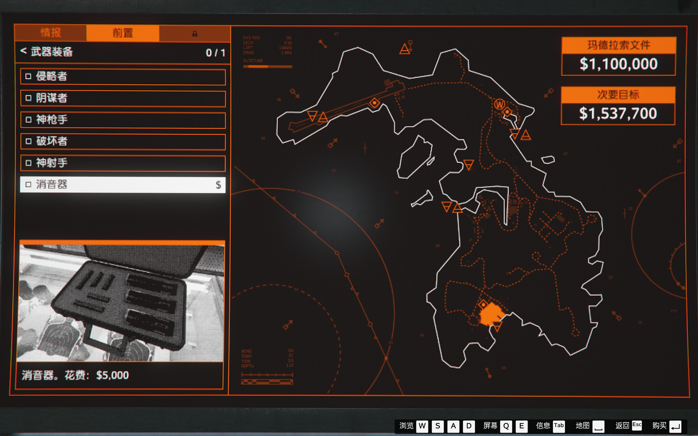

**（2026-03-28）** 界面为 **前置 → 武器装备**。列表中 **侵略者 / 神枪手 / 破坏者 / 神射手** 偏强攻、狙击或爆炸，**不适合**单人潜行速通的主思路；**阴谋者** 为典型的 **潜行向套装**（含利于室内安静清人与控制的配置，具体以游戏内该条目的武器说明为准）。底部 **消音器 · 花费 $5,000** 是 **附加购买**，不是「整包武器装备」本身：**必须先选定五种主套装之一**（潜行请选 **阴谋者**），再按需要决定是否加购该项；**不要**只盯着消音器而漏选上面的 **阴谋者** 作为主方案。若已选阴谋者且自带消音思路，是否再花 $5,000 以你当局面板提示为准，多数潜行流程以 **阴谋者** 为核心即可。

**现在该不该做「潜水艇：虎鲸」接近前置**（`img_010733.png`，与本文同目录）

**（2026-03-26）** 你已在 **「前置」** 栏、**接近载具** 下列出 **0/5**，高亮 **潜水艇：虎鲸**，且写明 **前置工作：必要任务**。**是的，应该去做这条**——终章必须选定并完成 **一种** 接近载具前置；你沿用虎鲸作为基地与上岛方式，就做 **虎鲸** 这一项即可（回车开始任务）。**不必**再清阿尔科诺斯特、梅杜莎、巡逻艇、长鳍，除非你临时改选别的接近。

**装备前置应该做哪些**（`img_012932.png`，与本文同目录）

**（2026-03-26）** **四项全部要做：** **爆破弹**、**保险箱密码**、**指纹复制器**、**割炬**。界面为 **0/4** 且均属 **必要任务** 时没有「选做」——少任一都可能在终章缺工具或卡进度。**割炬**对应 **排水隧道** 入侵；**指纹复制器 / 保险箱密码** 对应拿 **玛德拉索文件** 的金库流程；**爆破弹** 随当前计划生成（如相关墙体/入口）。追求速通仍须 **按列表清完**，无法靠少做装备省出可靠捷径。

**干扰 0/3：武器、防弹衣、空中支援还要不要做**（`img_202040.png`，与本文同目录）

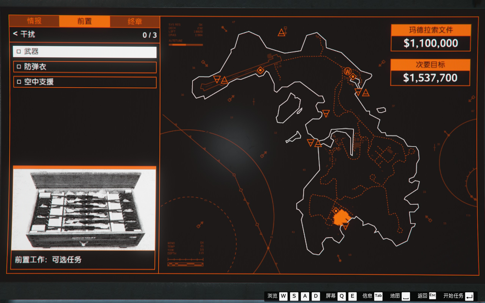

**（2026-03-28）** 截图中 **干扰** 为 **0/3**，分项为 **武器**、**防弹衣**、**空中支援**，说明写明 **前置工作：可选任务**——**不等同于**「接近载具」「装备」那种 **必要前置**，**不做也能进终章**。你采用 **单人潜行且追求尽快做完准备** 时：**三项都可以跳过**，少跑三段可选任务；**武器/防弹衣** 干扰在你 **必须接敌** 时仍会略降敌人强度，**空中支援** 主要在 **已拉警报** 后体现。**全程无声过关** 时这三项的 **性价比偏低**，故速通常 **0/3**。若 **首通** 或 **怕失手惊动全岛**，可 **三项全清** 当保险（与 §6 硬闯「尽量全做干扰」一致，潜行 **非强制**）。

### 8.3 终章计划界面（前置做完、解锁分红关后）

- **主要目标**：玛德拉索文件（首通）。
- **入侵点**：选 **排水隧道**（若已侦察并已完成切割炬前置）。
- **逃离点**：选已侦察到的 **船只 / 任意已解锁** 的稳妥撤离（以你地图上已解锁为准）。
- **时段**：**白天** 视野好，首通潜行更友好。
- **豪宅内**：沿墙、清摄像头、按顺序处理落单守卫，拿文件后按路线撤离；**双门黄金** 单人仍通常 **无法正规搬满**，优先主目标 + 能单拿的画/现金等。

**能否点「开始」开终章、还要不要为逃离点多跑情报**（`img_015938.png`，与本文同目录）

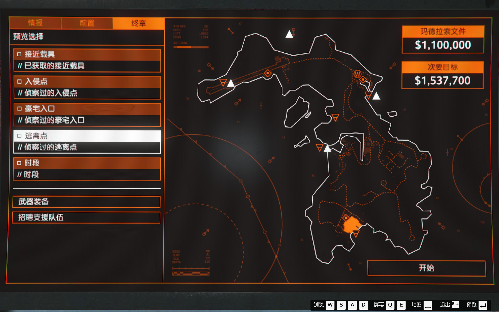

**（2026-03-28）** 界面已在 **「终章」** 标签；左侧 **接近载具**（已获取接近载具）、**入侵点**（已侦察入侵点）、**豪宅入口**（已侦察豪宅入口）、**逃离点**（已侦察逃离点）等副标题表示对应情报/前置已满足 **可选用** 状态。若 **「前置」** 栏必要项此前已全部完成，在此页对 **入侵点 / 豪宅入口 / 逃离点 / 时段** 各 **选定一种具体方案**（进入子项回车确认）后，**可以**点右下角 **「开始」** 进入终章分红任务。**逃离点** 与入侵点同理：终章 **只用了你选的那一个**；情报里 **已有至少一处** 可撤离点即可，**不必**为「速通首通」再去搜集情报刷满 **全部** 逃离点——多侦查只多 **备用撤离路线**，不增加本次分红上限。若进入 **逃离点** 子菜单发现 **列表为空** 或无法选定，才需要再上岛补侦察；截图呈现为「已侦察逃离点」时通常 **无需** 仅为逃离补跑。

### 8.4 「大地图」是不是情报页这张？排水隧道要不要去围墙边的三角标？

**「在大地图上看隧道」指的是哪张图**：就是 **虎鲸内计划板 →「情报」** 页 **中央** 那张 **佩里科岛总览图**，与左侧 **入侵点 / 逃离点 / 豪宅入口 / 兴趣点** 进度、已解锁列表一起看。**真正解锁**排水隧道仍须在 **「搜集情报」任务** 里上岛完成水下侦察；总览图有时不会把隧道画得像陆地点那么显眼，以左侧 **「豪宅入口」** 是否出现 **「排水隧道」**（以及 x/6 是否满）为准。

**排水隧道是否要去「红色箭头」那种围墙旁的三角标记**：**不需要。** 围墙上/围墙外的 **小三角** 一般是 **正门、北墙、北大门、南墙、南大门** 等 **陆地类豪宅入口**，与 **排水隧道** 无关。**排水隧道** 在豪宅 **朝开阔海面一侧** 的 **水下**，需 **潜水** 找到 **排水格栅 / 洞口** 并完成侦察，才会在情报里解锁 **「排水隧道」**（例如从豪宅入口 5/6 补到 6/6）。

### 8.5 「搜集情报」任务里：豪宅在哪？排水隧道在哪？（含示意截图）

**全岛小地图上「鲁维奥的豪宅大院」**：即佩里科岛地图 **最底部（南端）**、白色路网成 **环形/多边形**、建筑与黄金/现金等标记最密集的那一片（你曾在全岛图上用红框标出的区域）。**不是**左上角机场附近。

**任务内地图为何不显示隧道名**：排水隧道是 **水下入口**，未侦察前 **不会像陆地点那样标字**；必须在 **「搜集情报」** 中亲自潜水触发侦察。

**怎么找（文字）**：

1. 从机场可先 **驾车/摩托** 沿主路往南到豪宅外围，再到 **临海一侧**（大院 **背对岛内、面向外海** 的悬崖/海岸）。
2. **下水向外海游**，在 **悬崖根部** **潜水**，沿岩壁寻找 **金属排水格栅**，直到出现 **拍照/侦察** 提示。

**与围墙陆地入口的区别**：隧道 **不在** 围墙上的陆地三角标处；**在墙外、海面以下的格栅**。

**示意图片（在玩家提供的「豪宅局部」地图截图上标注）**：本图 **下方大片浅色是外海**，**不是**排水口所在处。排水隧道在 **豪宅灰色建筑群南缘、悬崖下的近岸水域**；在地图上应对准 **宅子南边刚离开陆地的第一条水色带**（像素上约在建筑群下缘略偏下），**不要**标到屏幕最底部远离宅子的远海。此前两版误把「向南」理解成「往截图下方外海移」，已改为按 **陆海交界（约建筑群南侧 y 方向紧挨岸线）** 标注。仍以 **方位参考** 为准，游戏内以 **侦察提示** 与 **崖根潜水** 为准。

- 源工程目录中另有一份同名副本便于版本管理：`d:\work\GTA5\cayo_compound_drainage_tunnel_approx.png`（与上图内容相同）。

### 8.6 搜集情报：主目标侦察完成了吗？能回去了吗？（对话列表能说明什么）

**主目标侦察完成了吗（结合你提供的「信息 → 对话」截图）**：**仅凭该列表不能认定已完成。** 常见流程里，**主目标**（首通为 **玛德拉索文件**）需在 **通讯塔** 骇入监控后，用 **摄像头** 对准豪宅 **地下室/金库** 内主战利品才会触发对应确认与帕维尔台词。你截图中的对话集中在 **主码头、次要目标、排水管道、切割炬** 等，**未见** 典型的 **主目标/金库内容已识别** 一类表述，因此 **更可能仍缺主目标侦察**——最终以 **虎鲸计划板「情报」页右侧主目标是否已显示且数值正确**、以及 **通知** 里是否出现过主目标侦察完成 为准。

**排水管道 / 排水隧道侦察**：若游戏中出现 **「您完成了对一个豪宅入口点的侦察：排水管道」**（或通知中的等价文案），且水下已对 **金属格栅** 完成拍照，则 **该豪宅入口项已完成**。

**完成了排水能不能马上收工离岛**：**不一定。** 「搜集情报」整轮通常还要求 **主目标** 等必做侦察。若 **主目标尚未通过通讯塔流程完成**，建议 **补拍后再** 按任务指引 **离岛**（如前往机场等），避免回洛圣都后发现计划板仍缺项、需要再上岛。

**为什么「人在红点附近」仍找不到格栅**：暂停地图上的点若在 **豪宅东侧** 水陆交界，与 **南/西南外海崖脚** 的格栅 **不是同一位置**；需 **绕到宅子南端外海**，**深潜** 沿 **崖壁根部** 搜索，直至出现侦察提示。

### 8.7 第二轮及以后：刚交 setup 费后，「搜集情报」还要注意什么？

适用于 **已完成过至少一次** 佩里科岛终章、再次从虎鲸计划板开始新轮、系统已收取 **$100,000**（价格以游戏内为准）后的 **搜集情报**（与你提供的 `img_cayo_intel_second_run.png` 界面一致：左侧 **入侵/逃离/豪宅入口** 多为历史进度，**次要目标** 可能本轮尚未列出）。

**与首通最大的不同**

- **主目标不再固定玛德拉索文件**，会进入 **随机主目标**（粉红钻、项链、龙舌兰酒、不记名债券等——以本轮骇入后计划板显示为准）。**每一新轮都要** 上岛 **通讯塔骇入 → 监控摄像头对准金库/主战利品**，直到 **情报页出现明确主目标与金额**；**不能** 以为首通关过一次就自动带主目标。
- **次要目标**（各库房现金/可可/大麻/黄金/画作等）通常 **每轮刷新**，左侧 **「次要目标」** 在本轮侦察前可能为空或需重拍。**打算吃次要** 就按黄点/任务指引 **重新拍照**；若走速通且只要有主目标也可在 **确认主目标+选定入侵够用** 后收手（与 §8.1 速通思路一致）。

**往往不用再整岛重跑的**

- **入侵点 / 逃离点 / 豪宅入口**（你截图里 **6/8、4/4、6/6** 类进度）多为 **已解锁继承**；若仍含 **排水管道** 等你惯用路线，**不必** 仅为凑满 **8/8 入侵** 再全图扫一遍，除非你想换新上岛方式。
- **兴趣点**（如 **1/6**）：仍只在你 **本轮打法需要** 时补（螺栓切割器、抓钩、卡车等）；**只走排水隧道** 时 **不必** 强行刷满 6/6，见 §8.1。

**流程清单（简）**

1. **必做**：通讯塔流程 → **确认本轮主目标**；计划板右侧主目标区域有 **正确品项与估值** 再视为情报主项完成。  
2. **按需**：次要库房 **拍照**；缺 **排水隧道** 则下水补格栅侦察（§8.4～8.5）。  
3. **离场**：以 **任务提示 / 帕维尔** 为准；**主目标未出** 不要当「这轮情报已经好了」就撤。  
4. **若主目标太惨**：部分玩家会选择 **取消这次抢劫/重开情报** 以换一批（涉及时间与再次付费，**非必须**，自行权衡）。

**与本节关联图片**（与本文同目录）

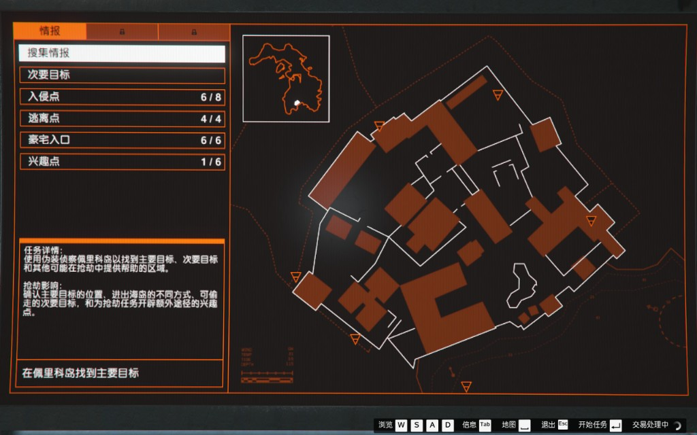

### 8.8 第二次及以后：「搜集情报」**只须**搞定哪些 **主要 / 次要**？（`img_000510.png`）

适用于 **已完成过至少一次终章**（含 **纯潜行**）、再次从虎鲸 **情报 → 搜集情报** 上岛的情形。**与 §8.7 一致**，本节用你提供的 **`img_000510.png`** 作界面锚点：左侧为 **入侵 6/8、逃离 4/4、豪宅入口 6/6、兴趣点 1/6**，左下角任务为 **「在佩里科岛找到主要目标」** —— 表示 **本轮主目标尚未通过通讯塔流程确认**。

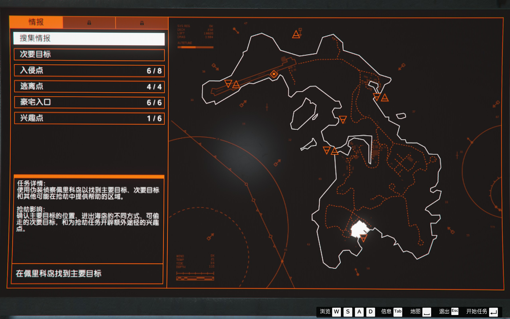

**主要目标（每轮必做）**

- **每一轮新抢劫**都要重新确认 **本轮主目标**（粉红钻、项链、龙舌兰酒、不记名债券等——以骇入后为准），**不会**沿用上一轮结果。
- **流程**：上岛后去 **通讯塔** 骇入监控 → 用 **摄像头** 对准 **豪宅金库/主战利品** 直至计划板 **右侧主目标区出现品项与金额**（或等价完成提示）。**未完成这一条**（如截图左下角仍提示找主目标）**不要**当情报已结束就离岛。

**次要目标（想做才拍）**

- 各 **库房** 的现金 / 可可 / 大麻 / 黄金 / 画作等 **通常每轮刷新**，要在本计划里吃到次要，就按地图 **黄点** 进点 **重新拍照** 侦察。
- **若你只想尽快结束情报、终章只打主目标**：在 **主目标已确认** 且 **前置计划里已能选惯用入侵/撤离**（例如仍保留 **排水管道**、逃离点已齐）的前提下，**次要可以少拍或不拍**（分红会少一块次要钱，与 §8.1 速通思路一致）。

**现在以及以后重复做情报时，通常不必每轮补满这些**

- **入侵点 8/8**、**兴趣点 6/6**：**不**是主/次目标的硬性要求；**纯潜行走排水管道** 时 **不必** 为速通刷满（§8.1）。你截图里 **6/8、1/6** 仍可开局，只要 **主目标已确认**、终章能选 **排水管道** 等即可。
- **逃离 4/4、豪宅入口 6/6** 等 **多为历史继承**：若列表里已有常用项，**不必**整岛重扫一遍。
- **兴趣点**（螺栓切割器、抓钩、卡车等）：**仅当**你本轮路线 **仍依赖** 某一项且地图未标时再补 1～2 次侦察；**只走隧道** 往往 **不必** 凑满 **6/6**。

**最短清单（背板用）**

1. **必做**：通讯塔 → **主目标** 出。  
2. **按需**：要次要钱 → 拍 **次要库房**；不要 → 可跳过。  
3. **按需**：缺 **排水隧道** 或 **某撤离** → 按 §8.4～8.5 补；否则沿用继承进度即可。

**次要是否「每轮都要两人」**（与 `img_000510` 等情报轮次无关的独立规则）

- **不是**所有次要都要双人：**豪宅内双门黄金** 需 **两名玩家同时** 在两侧互动才能开门搬满（与 §6 一致）。  
- **机场/码头等库房** 的现金、可卡因、大麻、**画作** 等，**单人** 通常可按点位拿取；是否拿满受 **背包容量** 与 **时间** 限制。  
- 每轮情报里 **拍照次要** 只为 **估值与地图标注**；**不**等于「拿了就必须双人」。

### 8.9 主/次目标已出，仍提示「在佩里科岛上搜集更多情报」—— 还要不要做情报？（`img_005438.png`）

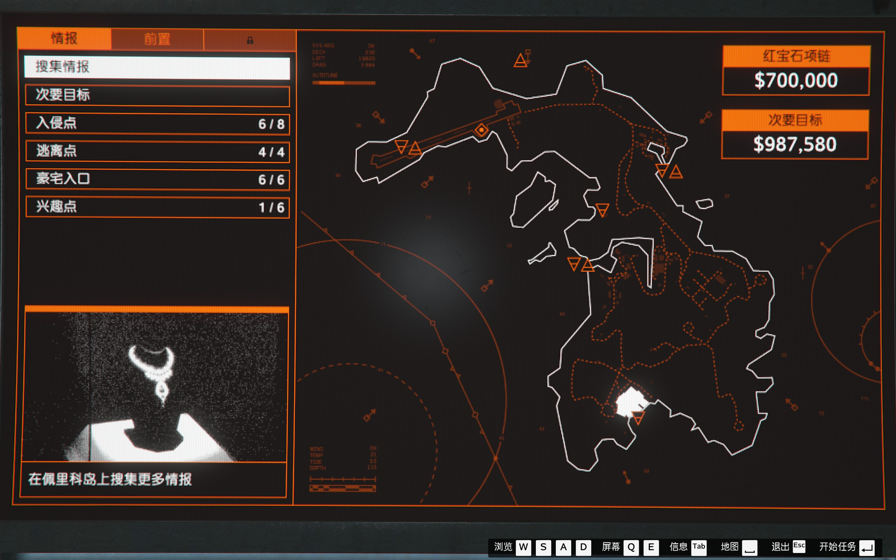

**结论（针对「本轮搜集情报是不是不用再做了」）**

- 如截图：**主要目标**（红宝石项链）与 **次要目标合计** 已在右侧列出，表示 **本轮核心情报已齐**，**足以** 切到 **「前置」** 开始做接近载具 / 装备 / 武器等（见 `img_005548`～`img_005629`）。
- 左下角 **「在佩里科岛上搜集更多情报」** 多为 **可选项提示**（继续补 **入侵点、兴趣点、次要库房** 等），**不是**「情报无效、必须重开」的意思。**不追求** 8/8 入侵、6/6 兴趣时，**不必**为这句话再全岛跑一圈。
- **仍在「搜集情报」任务进程内** 时：需按 **帕维尔 / 任务目标** **正常离岛**（如前往机场等）**结束本轮**；计划板上的提示 **不能** 代替 **任务内完成撤离**。

### 8.10 每一轮都要重做「接近载具、装备、武器装备」前置吗？（`img_005548.png`～`img_005629.png`）

适用于 **每支付一次佩里科岛 setup 费、开始新一轮抢劫** 的情形。下列截图为 **前置** 栏三项 **均未完成**（**0/5、0/4、0/1**）时的典型界面。

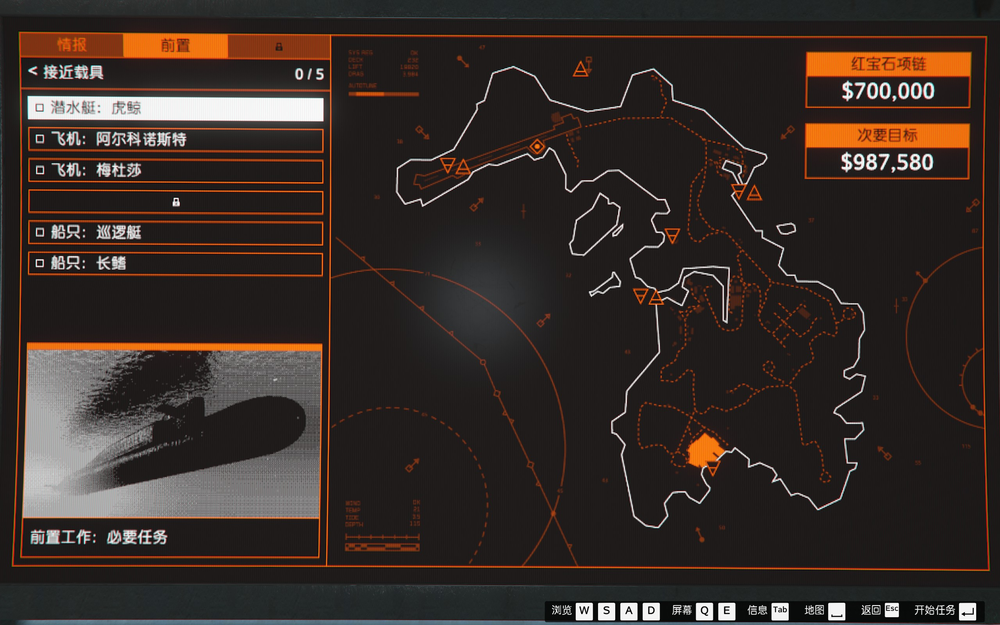

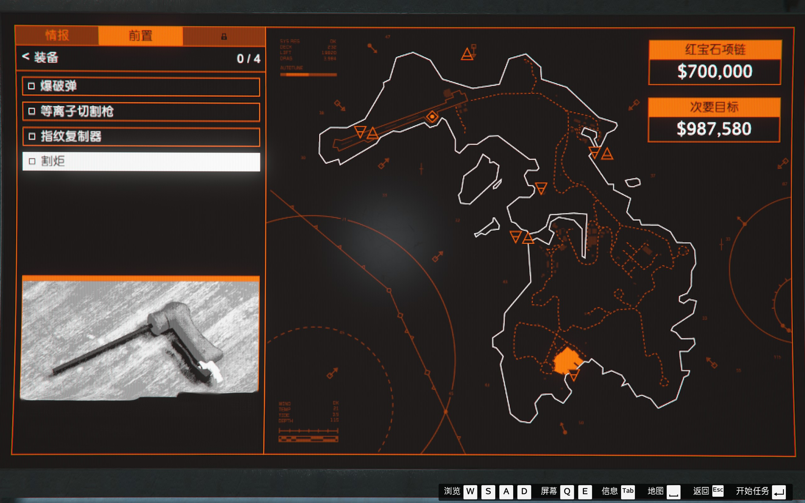

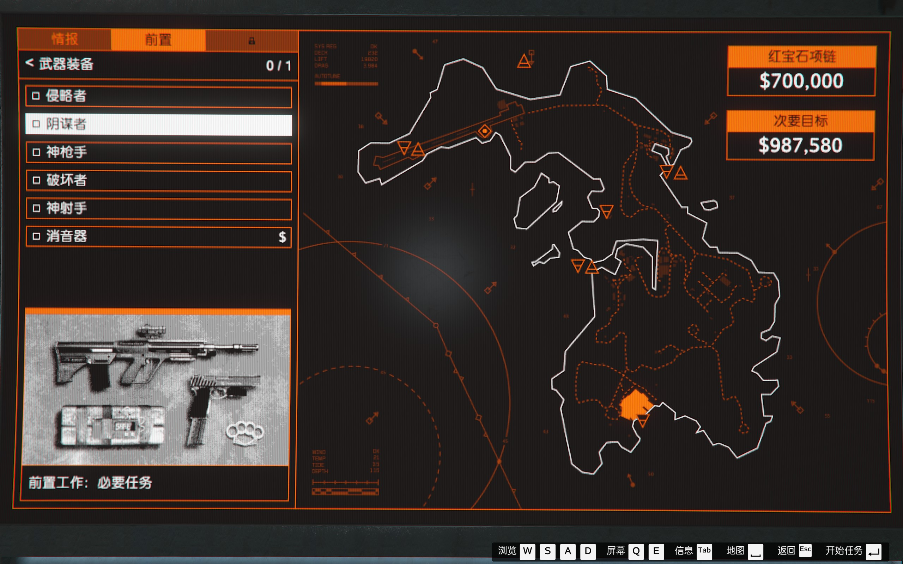

**是否每轮都要再做？**

- **是（就「新一轮抢劫」而言）**：每轮 **必要前置** 会 **重新计数**，你 **需要** 再完成 **接近载具（五选一）**、**装备（计划板列出的全部必要项）**、**武器装备（五选一）** 各自对应的 **任务**。上一轮的完成进度 **不会** 带到下一轮。
- **接近载具 0/5**：**只做你选定的一种**（如图 **虎鲸**），**不必** 五种全做。
- **装备 0/4**：列表随 **主目标与入侵方式** 变化；**红宝石项链** 等展柜类常含 **等离子切割枪**；**排水管道** 需 **割炬**。**凡标必要** 的都要做满（与 §8.2 一致）。
- **武器装备 0/1**：潜行常用 **阴谋者**；选一种后 **完成其前置任务**。
- **干扰（0/3）**：**可选**，每轮仍可 **0/3** 跳过（§8.2）。

**与情报的关系**：**情报**（§8.8）每轮也要 **重新侦察主目标**；**前置**（本节）在 **情报完成后** 另做一轮。**不是**「情报做一次就永久免前置」。

### 8.11 为何仍不能开始终章？**装备 2/4** 与 **干扰 0/3**（`img_015344.png`～`img_015436.png`）

下列四图为 **同一轮** 计划板 **前置** 栏不同子项；右侧主目标均为 **红宝石项链**、次要合计约 **$987,580**。

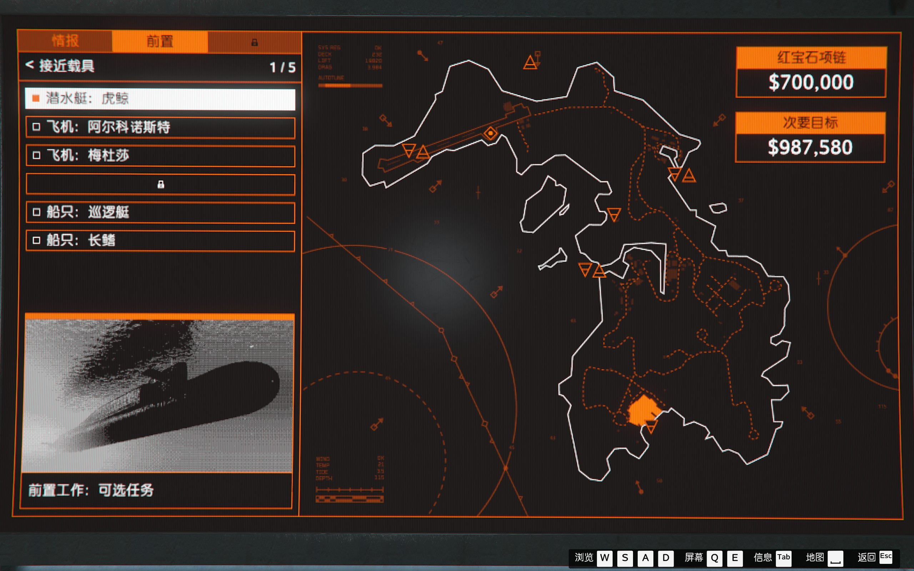

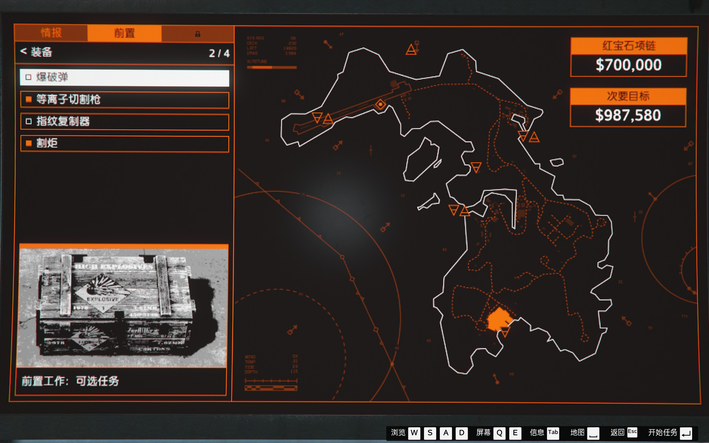

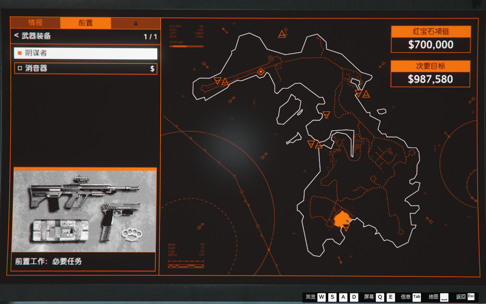

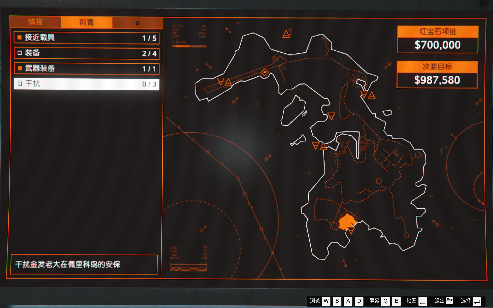

**结论：卡关原因不是「干扰」，而是「装备未齐」**

- **干扰 0/3**：与 §8.2、`img_202040` 一致，**前置工作：可选任务** —— **不做干扰也能进终章**；**不必**为解锁分红去清 **武器 / 防弹衣 / 空中支援** 中任意一条，除非你 **想要** 降低警报后难度。
- **装备 2/4**：计划板 **未打满**，说明仍有 **必要装备**（常见为 **指纹复制器** 等）**未完成**。进豪宅内 **骇入门禁 / 金库流程** 往往 **必须** 拿到 **指纹复制器**；**割炬**（排水管道）、**等离子切割枪**（红宝石项链展柜）你已勾上，**仍缺** 的项须 **各做一次前置任务** 直至 **4/4**（或你当代计划板显示 **全部完成**；具体四项名称以 **游戏内** 为准）。
- **接近载具 1/5**：表示 **五种接近里已完成你所选路线对应的一条**（如 **虎鲸**）；**不必** 为凑 **5/5** 把五种载具全做。
- **武器装备 1/1**：**阴谋者** 等已 **完成** 对应任务即可。

**你该做什么**：进入 **装备** 子栏，对 **未打勾** 且标注 **必要任务** 的条目 **回车开始任务** 并做完；**不要** 指望靠 **干扰** 解锁终章。若某项在 **你的** 界面上写 **可选**，且其余必要项已满，才可跳过（以 **Tab 情报说明** 为准）。

---

## 9. 地堡研究：两项「全息瞄准镜」与 MK2 特制卡宾步枪

简体中文里 **特制卡宾步枪 Mk2** 与说明文案 **Mk 2 卡宾步枪** 是同一把枪（对应英文 **Special Carbine Mk II**）。**突击步枪 Mk2**（**Mk 2 突击步枪**）是 **Assault Rifle Mk II**，另一把武器，配件与研究条目 **不共用**。

**对应你武器轮盘里的 `MK 2 特制卡宾步枪`（`img_013655.png`）的研究解锁是：**

- **`img_013533.png`**：**Mk 2 卡宾步枪** 全息瞄准镜 → 用于 **特制卡宾步枪 Mk2**。研究完成后到 **机动作战中心** 或 **复仇者** 内的 **武器工作室** 购买安装（提示文仅列举常见地点；**怪胎店** 等若具备 **Mk2 升级** 工作台且能打开同一把枪的改装，研究解锁后一般也会出现 **同一「全息瞄准镜」** 购买项，以实际菜单为准）。

**另一项不是你的卡宾枪：**

- **`img_013550.png`**：**Mk 2 突击步枪** 全息瞄准镜 → 仅适用于 **突击步枪 Mk2**，**不**适用于特制卡宾 Mk2。

**当前持枪参考（`img_013655.png`）**

你已装 **大型瞄准镜**；若要用上 **全息镜**，须在完成 **`img_013533.png`** 对应研究后，到武器工作室 **花钱购买** 该配件并替换瞄具栏位。

### 9.1 研究解锁后的「效果」是什么？

- **地堡研究本身**不会让枪自动变强，只是让 **Mk2 特制卡宾** 在武器工作室里 **多出一个可买的「全息瞄准镜」改装项**。
- **实际手感**：与当前的 **大型瞄准镜** 相比，全息一般是 **另一套准星/贴脸与倍率体验**（更偏快速瞄准、观感不同）；不以「直接加伤害」为主，具体以游戏内试用为准。
- 你已装的枪口、弹匣、握把等 **不受这项研究影响**；只增加 **瞄具类** 选择。

### 9.2 还要不要购买 `img_013950.png` 里的「武器工作室」？

- **道具提示**（`img_013533`）写得很清楚：全息镜要在 **机动作战中心** 或 **复仇者** 里的 **武器工作室** 购买。研究走完 ≠ 在军火店能买满 Mk2 高级件。
- **若你已经有**：MOC 某一隔间 **已是** 武器工作室，**或** 复仇者 **已装** 武器工作室，则 **不必** 再按截图单独买一套；**任选一处**进去改装即可。
- **若你还没有** 上述任意一个武器工作室：就需要购买——截图即在 **Warstock** 给 MOC 选 **隔间 2 → 武器工作室**（价格以页面为准，图为 **$245,000** 翻修示例）。**没有工作台则无法把研究成果装到枪上。**

### 9.3 怪胎店 / 军火店里的「全息瞄准镜」和地堡解锁的一样吗？（`img_014442.png`）

- **不一样（不是同一条解锁链上的同一把枪）。** 地堡研究 **`img_013533.png`** 解锁的是 **Mk 2 卡宾步枪（Mk2 特制卡宾）** 在 **机动作战中心 / 复仇者武器工作室** 里购买的全息镜。
- 上图界面（你记在「怪胎店」亦可能；**画面与武装国度改枪墙、价格结构一致**）当前是 **普通「特制卡宾步枪」**（**非 Mk2**）的 **瞄准镜** 分类：`全息瞄准镜` 约 **$19,600**、`小型瞄准镜` 等——这类属于 **常规军火店升级**，**不需要** 先完成上述地堡研究。
- **区分方法**：改枪前看准武器名是 **Mk2 / MK2 特制卡宾步枪** 还是 **无 Mk2 后缀的特制卡宾**；**只有前者**才与 **`img_013533`** 的研究 + MOC 工作室说明一致。

### 9.4 确认改的是 Mk2：怪胎店「Mk 2 特制卡宾步枪升级」界面（`img_014910.png`）

- 左侧标题为 **「Mk 2 特制卡宾步枪升级」**、并有 **弹药类型 / 瞄准镜 / 枪管** 等 Mk2 专属分类时，即为 **`img_013655`** 那把 **MK2 特制卡宾** 的工作台路线，**不是** `img_014442` 里的普通特制卡宾。
- 此界面下 **瞄准镜** 分类里，在 **`img_013533` 对应研究完成前**，**全息瞄准镜** 会保持锁定或不可购；**研究完成后** 方可购买——与地堡说明解锁的是 **同一改装件**；**购买地点** 除 MOC、复仇者外，**怪胎店武器工作室** 只要能进此同一 Mk2 菜单，通常 **等价**（以是否出现可购买全息为准）。
- **小结**：`img_014442` = **普通枪** 军火店全息；`img_014910` + 研究 = **Mk2 枪** 全息，**与地堡条目一致**。

### 9.5 从「瞄准镜」点进去看到的全息，是不是地堡那一项？（`img_015953` → `img_020026`）

- **`img_015953.png`**：左侧总标题为 **「Mk 2 特制卡宾步枪升级」**，当前选中 **瞄准镜** —— 说明你还在 **Mk2 这条改枪线** 上。
- **`img_020026.png`**：若实际显示为 **仅「瞄准镜」** 分类、**全息瞄准镜 $19,600**、**小型 / 大型** 等与 **武装国度改普通特制卡宾** 相同的价目与 **「购买」** 按钮，则此页与 **`img_014442`** **同类**，属于 **非 Mk2** 枪的商店逻辑，**不是** 地堡研究 **`img_013533`** 解锁的 Mk2 配件界面（名称都叫全息，**枪与解锁链不同**）。
- **如何判断地堡那条**：在 **Mk2 升级** 流程里进入瞄准镜后，子项应仍能通过 **Esc 返回上一级** 看到 **「Mk 2 特制卡宾步枪升级」**；全息项是否可选、价格/锁图标是否随 **地堡研究进度** 变化，应以 **Mk2 工坊** 表现为准。若你发现二级菜单「长得像军火店 $19,600」，多半是 **串到普通特制卡宾** 或另一武器，**不要**把它当成 **`img_013533`** 的完成态。
- **结论**：**「先点瞄准镜再看到全息」本身不能证明是地堡项**；**必须是 Mk2 升级菜单下的瞄准镜子项，且与 `img_013533` 研究状态一致** 时，该全息才对应地堡解锁。

---

## 10. 非公开好友战局：如何给同战局好友发短信

**场景**：你已加入 **非公开好友** 战局，战局里只有你与另一名好友（玩家列表见 `img_003719.png`）；打开手机 **短信** App 只见 **「无消息」**（`img_003831.png`），想知道怎么给对方发短信。

### 10.1 为什么短信里是空的？

- **「短信」界面**主要显示 **已有往来 / 系统与 NPC 类消息**；没有对话时会显示 **无消息**，**不代表**你不能主动联系玩家。
- **主动发给玩家**通常要先 **选定收件人**（玩家列表或联系人），而不是在空白短信页里「新建一封」。

### 10.2 推荐操作（优先）

**方法一：暂停菜单里的玩家列表（最稳、不依赖手机联系人是否显示）**

1. 按 **ESC**（键盘）打开 **暂停菜单**。  
2. 进入 **「在线」**（或顶部与 **GTA 在线模式** 相关的分页，具体以当前版本界面为准）。  
3. 打开 **「玩家」** / **当前战局玩家** 列表（名称可能随更新略有不同）。  
4. 在列表中 **选中你的好友**（与 `img_003719.png` 里另一位玩家同一用法）。  
5. 在 **右侧说明栏** 或 **互动键提示** 中找到 **「发送短信」** / **「发信息」** 等选项并确认。

发信后，对方会收到；之后你打开 **手机 → 短信**，也可能出现与对方的会话记录。

**方法二：手机联系人**

1. 打开手机，进入 **「联系人」**（不要停在只有收件箱的 **「短信」** 一页）。  
2. 在列表里查找 **该好友或在线玩家**（若列出）。  
3. 选中后选择 **发短信** / **发送信息** 类选项。

若 **联系人里没有** 该玩家，请仍用 **方法一**。

### 10.3 若看不到「发送短信」

- 到 **设置 → 在线 / 显示 / 沟通**（路径以游戏内为准）检查是否 **限制与玩家发消息** 或相关隐私选项。  
- PC 上若界面异常，可尝试通过 **Rockstar Games / Social Club 好友列表** 确认好友关系；极少数情况下存在客户端或会话显示问题，可换战局或重启游戏再试。

### 10.4 与本节关联图片（与本文同目录）

**战局仅两人、好友会话玩家列表示意**（`img_003719.png`）

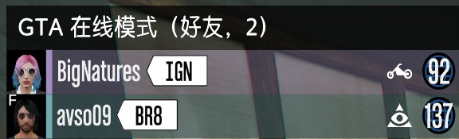

**手机短信 App：当前无历史消息**（`img_003831.png`）

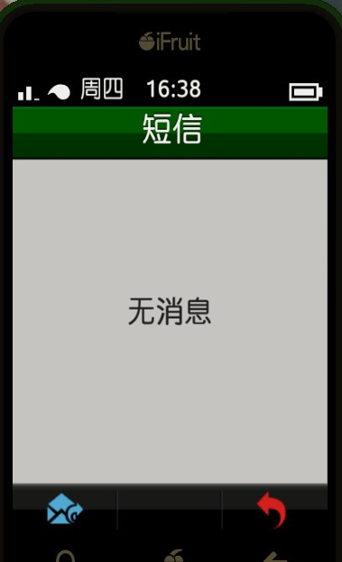

---

## 11. 「防爆」代步：夜鲨 还是 美德满改？

**结论先说**：两车都叫常用 **防弹/高抗爆** 选择，但侧重点不同——**夜鲨**更像 **装甲 SUV、硬扛爆炸与任务车**；**奥北 美德（Ocelot Virtue）满改** 在常见的「满改」语境里通常指 **事务所车库 + Imani Tech**（**导弹锁定干扰器** + **装甲** 等），更像 **防 Mk2 点名 + 超跑机动**。**能免费拿到美德且舍得事务所改装投入时，日常综合往往更偏美德**；**只图一辆耐揍、好买、好跑货的装甲车** 时 **夜鲨** 依然极强。

### 11.1 夜鲨（HVY Nightshark）

- **定位**：装甲越野车，窗缝小、生存向，长期被用作 **出货、跑路、战局摩擦** 的保守选择（你提供的 Warstock 页见 `img_warstock_nightshark.png`；价目随周活动变化，以游戏内为准）。
- **长处**：**朴素耐打**、越野通过性好、可载多人；对 **不会 / 不能** 依赖导弹锁定的火力仍很能扛。
- **短处**：**没有** Imani 那种 **防锁定**；面对 **会玩的固定武器 / 扫射补刀** 仍会翻；与超跑比 **速度和灵活性** 不占优。

### 11.2 美德 + 「满改」（一般 = Imani Tech）

- **获取**：完成 **最后一剂** 相关任务线后可 **免费获得** 载具本体（与评论区说法一致，以你存档进度为准）。
- **「满改」核心**：在 **事务所（事务所车库载具改装）** 为美德安装 **阿尼玛科技 / Imani Tech**（简体中文版菜单名 **伊玛尼技术**，见 §11.6 截图）——常见组合为 **导弹锁定干扰器**（在 **伊玛尼技术 → 遥控** 子菜单内；显著减弱 **Mk2 等锁人导弹** 威胁）与 **装甲板 / 防御类**（主改装列表中与伊玛尼条目并列，提升对抗爆炸与枪械的生存）。另有 **遥控单元** 同属伊玛尼线，偏 **远程遥控载具** 玩法，与「防锁」不同项。评论里把 **防锁 + 防爆装甲** 一并归在 Imani 下，**大体方向对**，但 **没有真正「绝对炸不坏」** 的车，仍要避免被原地集火或黏弹糊脸。
- **长处**：**机动强**、有 **防锁** 时在公开战局 **体验往往比夜鲨省心**；任务外 **赶路** 也更轻快。
- **短处**：需要 **事务所 + 改装花费**；车身低矮，部分人 **更习惯夜鲨的 SUV 视野与通过性**。

### 11.3 怎么选（简表）

| 你更在意…… | 倾向 |
|------------|------|
| **少被导弹锁定、超跑手感、已有美德** | **美德 + Imani 满套**（含防锁 + 装甲） |
| **一次买下就上手、耐揍 SUV、越野/送货心态** | **夜鲨** |
| **预算与时间都够** | **两车都留**：公开赶路 / 防锁用美德；特定任务或偏好夜鲨时再换 |

**视频与评论语境**（`img_virtue_bilibili_nightshark.png`）：画面与留言强调 **夜鲨** 仍是可靠装甲车，同时认为 **美德满改** 在 **防御与性能平衡** 上强、且本体可 **任务白嫖**——与上表一致；具体 **扛炸数字** 会随版本微调，以游戏内实测为准。

### 11.4 与本节关联图片（与本文同目录）

**Warstock · 夜鲨购买页（示例折价）**（`img_warstock_nightshark.png`）

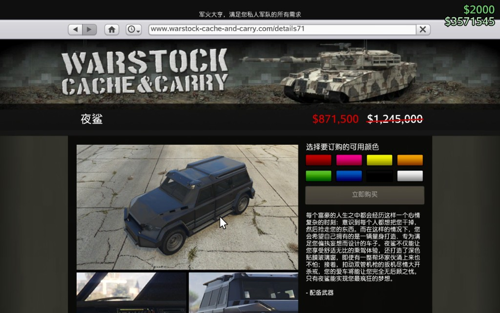

**B 站讨论：夜鲨 vs 美德、Imani 防锁与装甲**（`img_virtue_bilibili_nightshark.png`）

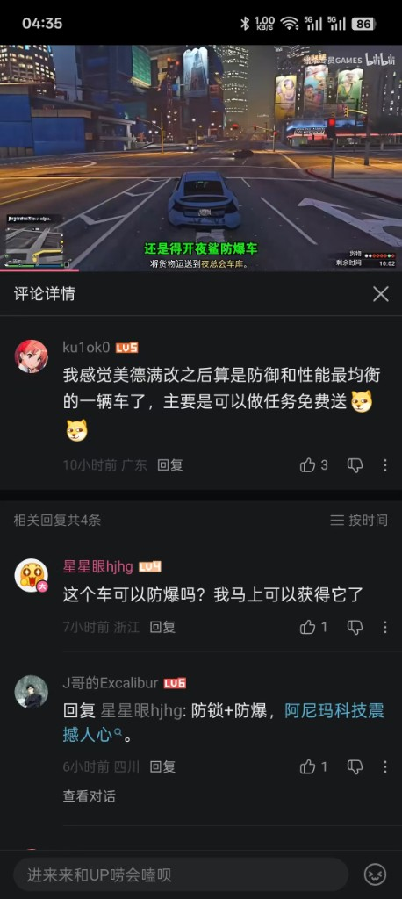

### 11.5 满改美德：要先买图里这种房吗？**办公室 ≠ 事务所**

**结论**：若你说的「满改」包括 **阿尼玛科技（Imani Tech）**——**导弹锁定干扰器**、**装甲** 等——**需要先有「事务所」产业**，并在 **事务所车库** 配备 **载具改装间（Vehicle Workshop，名称以游戏内为准）**，然后把 **美德** 开进去改装。**只买截图里的东西不够**，因为当前页面选的是 **另一类房产**。

- **你提供的截图**（`img_dynasty8_virtue_imani_prereq.png`）：网站为 **王朝 8 商业不动产**，URL 为办公室列表；界面选中的是 **「办公室」** 标签下的 **「小首尔」顶级办公室**（SecuroServ / CEO 办公室），价格示例 **$2,010,000**。右侧地图过滤里也能看到 **「事务所」** 为 **另一标签**。**办公室** 用来跑 **特种货物、VIP、恐霸** 等 CEO 玩法，**不提供** 富兰克林事务所那条线上的 **车库 Imani 改装**。

- **该买什么**：在同一站点切换到 **「事务所」** 分页，购买 **事务所**（F 克林顿与合伙人）；之后在 **事务所车库** 的升级选项里购买 **载具改装间**。美德 **支持** 的武器化/防御升级（防锁、装甲等）在 **此处** 解锁消费，**不是** 在 CEO 办公室完成。

- **若暂时不买事务所**：美德仍可在 **普通改装铺** 做 **性能类** 改装；但 **做不了** 本文与 §11.2 所说的 Imani **防导弹锁定** 等核心项，**不算** 战局语境里的「美德满改」。

**与本节关联图片**（与本文同目录）

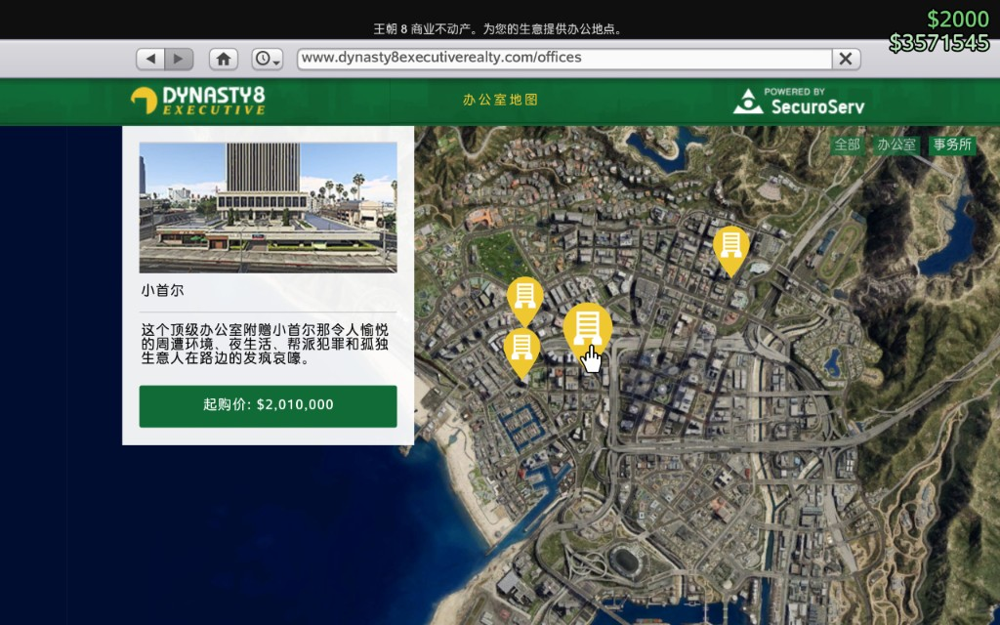

### 11.6 「伊玛尼技术」是不是正文里的 Imani Tech？和图 2 的「遥控」什么关系？

**结论**：**是。** 本文写的 **Imani Tech / 阿尼玛科技** 与游戏简体菜单 **「伊玛尼技术」** 指 **同一条改装树**（英译与官中用词不同）。

- **图 1**（`img_virtue_imani_tech_menu.png`）：**F 克林顿与合伙人** 载具改装间，左侧大类选中 **「伊玛尼技术」**，说明为「伊玛尼的自定义改装。」——即 §11.2 所述入口。同屏主列表里 **「装甲板」** 等通常在 **伊玛尼技术** 上下方单列，**抗爆 / 抗揍** 往往要 **装甲** 与 **伊玛尼** 分开点满（价目以游戏内为准）。  
- **图 2**（`img_virtue_imani_remote_jammer.png`）：进入 **伊玛尼技术** 后，子界面标题为 **「遥控」**。其中：  
  - **导弹锁定干扰器**：说明为防制导导弹锁定个人载具 —— 即正文 **「防 Mk2 一类锁定」** 的核心件；  
  - **遥控单元**：遥控驾驶用，**不是** 防锁本身，属同子类下的 **另一项** Imani 升级。

因此：**图 1 的「伊玛尼技术」= 文内的 Imani Tech；图 2 是其下一层「遥控」菜单，其中「导弹锁定干扰器」是「满改」里防锁那一项**（外加主列表里的 **装甲板** 等才算常见意义上的生存向「满改」）。

**与本节关联图片**（与本文同目录）

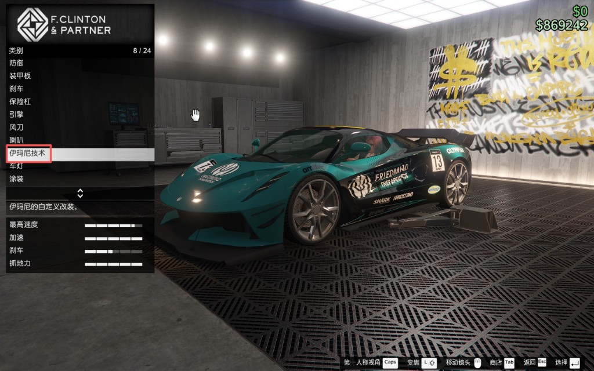

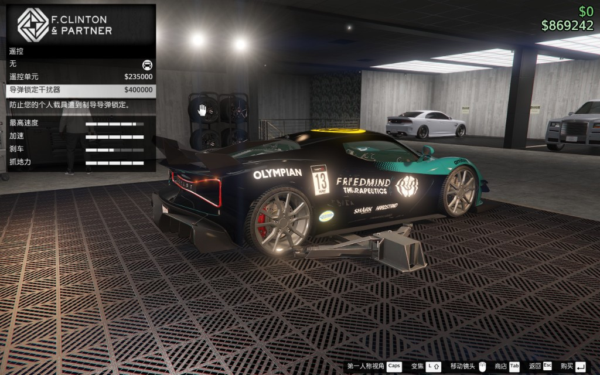

---

## 12. 除夜鲨 / 美德外：公开战局里还有哪些「更抗揍」的 PVP 向选择？

**先说清「抗揍」**：公开战局里死亡往往来自 **锁定导弹、机炮、黏弹集火、狙线拉窗** 等。**皮实耐炸** 与 **不让对手锁你** 是两条线——后者正是 §11 **美德** 一类 **Imani 防锁** 的强项；前者则是 **装甲皮卡、坦克、重卡车头** 等更占优势。下面列的是 **常与夜鲨 / 美德并列讨论**、在 **生存或反制** 上有一席之地的载具类别（**不以「绝对排名第一」排序**，实际看对手拿什么、你有没有队友）。

### 12.1 重装甲陆地载具（偏「硬吃伤害」）

- **HVY 叛乱分子皮卡·改装（Insurgent Pick-Up Custom）**  
  多人战局经典 **装甲皮卡 + 顶机枪**；**有炮手** 时压制力强，车体也 **极能扛**（具体耐受随版本，以实测为准）。缺点：**造价与解锁** 比夜鲨折腾，无炮手时更多靠车体硬顶。

- **HVY 威胁者（Menacer）**  
  与夜鲨同一大类的 **装甲 SUV + 炮塔**，玩法接近 **「更重火力的夜鲨替代品」**；是否值得买看个人预算与是否缺机枪位。

- **TM-02 可汗贾利（Khanjali 坦克）**  
  **陆上顶点级的「肉」之一**，主炮克载具；缺点是 **慢、贵、目标极大**，公开图里 **极易被飞机 / 固定翼 / 会玩的武直** 针对，且自身有 **任务/设施门槛**（夜总会设施等，以游戏当前要求为准）。

- **HVY 巴拉杰（APC）**  
  **两栖 + 装甲 + 山姆防空**；**生存与反飞机** 都有说法，但同样 **笨重、贵**，更适合 **明确要用 SAM 或水路** 的玩法，而非单纯「代步」。

- **半履战车（Half-track）**  
  **前装甲厚重 + 后座双机枪**；有队友时威慑大，**扛揍能力** 常被提及；缺点是 **转向与日常通勤** 不如 SUV 灵活。

- **机动作战中心 · 牵引车头（Phantom Custom / Hauler Custom 等）**  
  **车头本体** 在熟练玩家手里 **极难被快速蒸发**（常被当作移动掩体 / 冲撞武器）；缺点是 **为拖 MOC 而生**，不是通用跑车，公开图 **攻击性拉满** 也容易引来全图针对。

### 12.2 与美德同源的 Imani 科技线（偏「防锁 + 装甲」）

除 **美德** 外，凡在 **事务所** 相关改装中对该车开放 **阿尼玛科技（Imani Tech）** 的 **轿车 / SUV**（常见如 **冒险家 牛轧糖 STX**、**白金汉 迪提**、**埃努斯 禧碧**、**巨象 爱国者 Mil-Spec**、**贝飞特 迪布达 6×6**、**威皮 卡拉卡拉追逐版** 等，**以当前版本游戏内改装厂清单为准**）均可视情况装 **导弹锁定干扰器 + 装甲**。  
**共同点**：相对 **坦克/皮卡** 更 **低调、好钻巷**；**有效生存** 往往不亚于「更肉但更显眼」的车。**与 §11 对比的两车关系**：它们是 **美德同款思路的换壳**，不是魔法无敌，**集火与无锁定爆炸** 仍会要命。

### 12.3 「邪教」级硬度（投入大、玩法窄）

- **竞技场之战** 里把 **斜面魔宝、大脚怪 SL、死亡尾翼** 等 **防御拉满** 的改法，在地面互捶时 **往往异常能顶**，但 **日常通勤、任务兼容、维修与获取成本** 通常不如夜鲨 / Imani 车省心——适合 **本来就玩竞技场** 的人顺手用。

### 12.4 和夜鲨 / 美德怎么配队选车？

| 倾向 | 可考虑 |
|------|--------|
| 继续 **SUV + 机枪 / 多人车**、要 **比夜鲨更凶的炮** | **叛乱分子皮卡·改装**、**威胁者** |
| 要 **陆上最硬 + 主炮**、接受 **笨重** | **可汗贾利** |
| 要 **防锁 + 城市车**、与美德同逻辑 | **其它 Imani 可改装载具** |
| 要 **极致掩体车头**、整活或针对性打法 | **MOC 牵引车头** |

**没有标准答案** 说哪辆「全面强于」夜鲨或美德；**多数玩家** 仍是 **Imani 车日常 + 夜鲨或皮卡任务** 的搭配。

### 12.5 与上文对照的图片（接续 §11，与本 md 同目录）

**下列两图即 §11 中夜鲨 Warstock 页与 B 站夜鲨/美德讨论**——本节问题以「在它们之外还有哪些选择」为延伸，故 **仍关联同一批截图** 作为上下文锚点。

- `img_warstock_nightshark.png` —— 夜鲨购入页示例（§11.1 / §11.4）。

- `img_virtue_bilibili_nightshark.png` —— 夜鲨 vs 美德 / Imani 讨论（§11.2 / §11.4）。

---

## 13. 公开战局 PVP：「防弹 + 防炸 + 防导弹锁定」—— 哪些载具算？

**本问题未单独附带新截图**；与 §11、§12 共用下列图示作 **对照锚点**（同一目录）：

- **`img_warstock_nightshark.png`**：夜鲨偏 **抗爆 / 窗缝小**，**没有** 伊玛尼 **导弹锁定干扰器**，故 **不满足** 题述里的 **防导弹锁定** 这一条（与 §11.1 一致）。
- **`img_virtue_bilibili_nightshark.png`**：美德 **满改** 语境 = **防锁 + 装甲** 的典型讨论起点。
- **`img_virtue_imani_remote_jammer.png`**：**伊玛尼技术 → 遥控 → 导弹锁定干扰器**，即 **防制导锁定** 的改装入口（与 §11.6 一致）。
- 若需回忆 **事务所在哪买**、办公室≠事务所，可参见 **`img_dynasty8_virtue_imani_prereq.png`**（§11.5）。

### 13.1 先把话说死：没有「三项绝对免疫」

线上 **没有** 官方定义的、对 **所有子弹 / 所有爆炸 / 所有锁定方式** 同时 **永久无敌** 的个人载具。**骷髅马（装甲版）** 防弹突出但 **怕炸**；**夜鲨 / 坦克 / APC** 等再硬也 **不能** 靠原厂配置 **关掉** 制导导弹的 **锁定**（需 **伊玛尼导弹锁定干扰器** 或其它机制）。题述「三防」在玩家语境里一般指：**显著防弹窗或难拉窗 + 高抗爆 + 不能被制导弹锁**。

### 13.2 最接近「三向都要」的配置：伊玛尼 **装甲板 + 导弹锁定干扰器** + **100% 装甲**

在 **F 克林顿与合伙人 · 事务所 · 载具改装间**（前提见 §11.5）中，对 **当前版本支持该两项伊玛尼改装** 的载具：

1. **导弹锁定干扰器**（`img_virtue_imani_remote_jammer`）：使 **制导发射器、Mk2、多数武直/喷气机载具的制导导弹** 等 **无法对你个人载具建立锁定**（仍以游戏内说明为准）。
2. **装甲板**（伊玛尼）：在 **100% 车身装甲** 且 **车内有人** 时，社区与维基常见表述为可 **多扛** **跟踪导弹 / RPG** 一类伤害（量级随 DLC 微调，**以你当前增强版实测为准**）。
3. **防弹**：多数为 **防弹玻璃 / 装甲外观件 + 窗线**，**不是** 全向无敌；高窗 SUV（如 **埃努斯 金钻耀星** 等）与低趴轿跑在 **被扫窗、黏弹贴脸** 时体验差很多。

**结论**：满足题述 **三项在「实用 PVP」意义上同时成立** 的，是 **这一类拉满的伊玛尼车**，而不是 **仅夜鲨 / 仅骷髅马 / 仅坦克** 中的任一辆单解。

### 13.3 哪些车能同时装「装甲板 + 干扰器」？（名单随 DLC 扩充）

**具体清单以你游戏内事务所改装厂菜单为准**；下列为 **The Contract 起** 常见、且维基/社区长期列为 **同时具备装甲板与导弹锁定干扰器选项** 的代表（**增强版** 后续更新会 **增删可改装车型**，新购前务必 **进改装间看菜单**）：

- **冒险家** 牛轧糖 STX（Buffalo STX）  
- **浪子** 冠军（Champion，Dewbauchee）  
- **埃努斯** 神灵（Deity）、**金钻耀星**（Jubilee）  
- **经典** 格兰杰 3600LX（Granger 3600LX，Declasse）  
- **巨象** 爱国者 Mil-Spec（Patriot Mil-Spec）  
- **威拉德** 宗派（Greenwood）  
- **奥北** 欧米斯 e-GT（Omnis e-GT）  
- **爱尼仕** 300R  
- **奥北** 美德（Virtue）  
- **冒险家** 牛轧糖 EVX（Buffalo EVX）  
- **古罗帝** 义塔力 GTO 史汀格 TT（Stinger TT）  
- **威皮** 阿留申（Aleutian）  
- **贝飞特** 列兵（Terminus）  
- **埃努斯** 帕拉冈 S（Paragon S）  
- 以及 **Agents of Sabotage / Money Fronts / A Safehouse in the Hills** 等更新中 **新开放伊玛尼** 的若干载具（**是否含装甲板** 以菜单为准）。

**不能**从这条回答里抄一辆「永远赢」：**未装干扰器** 的装甲车 **不算** 完成 **防导弹锁定**；**未装装甲板 + 满装甲** 只装干扰器则 **防炸** 偏弱。

### 13.4 和 §12「更抗揍」名录怎么衔接？

- **§12** 里的 **夜鲨、叛乱分子、坦克、APC** 等：偏 **裸抗伤害 / 火力**，**多数没有** 题述的 **防导弹锁定**（除非另有特殊机制）。  
- **本节**：强调 **「防锁」必须与伊玛尼干扰器绑定** 时，**优先从 §13.3 类载具里选**，并与 §11 **美德** 的配装思路 **同一套逻辑**。

---

## 14. 已有事务所 + 虎鲸：还要买哪些资产赚钱？

**本问题未附带新截图。** 若需把「事务所」与 **伊玛尼改装间**、办公室分页区分，可对照 **`img_dynasty8_virtue_imani_prereq.png`**（§11.5）、**`img_virtue_imani_tech_menu.png`**（§11.6）。赚钱总览仍与 **§3** 一致；此处只回答 **在已持「F 克林顿与合伙人」+「虎鲸」前提下**，还值得考虑 **补哪些产业**。

### 14.1 先定心：这两样已经覆盖什么？

- **虎鲸**：**佩里科岛抢劫** —— 长期 **单人现金效率** 的顶流之一；会跑岛则 **不必**为「再赚快钱」强买另一条同质主线。
- **事务所**：**安保合约**、**电话暗杀**、**别惹德瑞**（及流程解锁条件）、**合约档案** 等 —— **中短差事 + 大型合约** 现金与经验都稳。

**结论**：没有「必须再买 X 才能赚钱」的硬门槛；下文是 **扩宽收入来源 / 挂机 / 玩法向** 的 **可选项**。

### 14.2 优先考虑的「现金向」补充（按常见性价比，缺啥买啥）

1. **夜总会 +（可选）摩托帮制造厂 + 地堡**  
   - **夜总会**：人气收入 + **仓库挂机**（需与 **摩托帮五类厂 / 地堡** 等挂钩才「仓库有货可囤」——具体以你当前存档为准）。  
   - **地堡**：制造或研究；纯赚钱常开 **制造** 并 **补原材料 + 出货**。  
   - **摩托帮厂**（假钞、证件、大麻、冰毒、可卡因等）：每类 **同时只能一处**（§1）；不必同类型买两间。  
   - **与 §1～§2 一致**：夜总会、地堡 **各一间升满** 通常足够，**不要**为多赚钱再买第二间同产业。

2. **致幻剂实验室（酸厂 / Freakshop 线）**  
   - 解锁并升级后，作为 **补充产线** 与出货轮次穿插（§3）。

3. **改装铺（汽车店）**  
   - **合约任务** + 联合抢劫类内容；适合想 **换口味、solo/小队皆可** 的玩家。

4. **回收站（Salvage Yard / 拆车）**  
   - **策划与交付** 类玩法，现金与流程固定度因周活动而异；适合作为 **另一条主动收入**。

5. **办公室（CEO）+ 载具仓库** 或 **特种货物仓库**  
   - **进出口**、**拉货** 偏 **传统肝钱**，需学习出货与战局风险；**不是**人人都有时间跑，但 **资产本身** 可解锁 **暴君 Mk2 折扣** 等（以当前版本为准）。

6. **游戏厅 / 设施**  
   - **名钻赌场抢劫**、**末日豪劫** —— **偏组队、流程长**；有固定队友时 **单次分红** 可观，**不比** 上岛 **更适合单人碎片时间**。

7. **机库、游艇等**  
   - **机库** 空货、**游艇** 任务 —— 多数玩家 **不作为** 主现金线；除非你喜欢玩法或当周 **三倍**。

### 14.3 不建议的「重复购买」

- **第二艘虎鲸、第二间事务所、第二间夜总会、第二间地堡** —— 对多数账号 **性价比极低**（§2）。  
- **同类型摩托帮厂买两处** —— 只会 **换址**，不会叠两间同类型产出（§1）。

### 14.4 实操顺序（简）

| 你更想…… | 可优先补 |
|----------|----------|
| **挂机 + 周期性出货** | 夜总会、地堡、摩托帮厂（若尚未持有或未满级） |
| **再多一条 solo 差事线** | 酸厂、改装铺、回收站 |
| **组队大抢劫** | 游戏厅（赌场）、设施（末日） |
| **传统 CEO 肝货** | 办公室 + 特种货 / 载具仓 |

**每周**看 Rockstar **Newswire** 的 **双倍/三倍**：哪条线加成高，就 **短期内优先** 哪条线，往往比「再买一栋房」更涨收入。

---

## 15. 摩托帮五厂出货：能否用飞机装摩托、拖车拉大车？

**§15.1～§15.3** 无附图；**§15.4** 含 **`img_154815.png`～`img_155402.png`**（证件伪造换址）；**§15.5** 含 **`img_mc_trade_lose_stock.png`**（换购清空提示）。与佩里科岛相关的图示仍以 **`img_000510.png`～`img_005629.png`**（情报与前置）、**`img_015344.png`～`img_015436.png`**（终章卡关与干扰）为准，见 **§8.8～§8.11**。

### 15.1 更快的飞机能否把「送货摩托车」装进去？

- **没有**面向 MC 出货的、像「打开舱门把任务摩托开进运输机」这类 **稳定合法流程**。**复仇者** 机库、**邦布须克** 等载具货舱玩法 **不用于** 摩托帮出货任务链；任务开始后系统刷出的 **送货载具** 与 **个人飞行载具** 是两套逻辑。
- **运兵直升机 / 吊挂型直升机（如 Cargobob 类）**：自由模式里可对 **部分** 普通载具使用吊钩，但 **摩托帮/地堡等生意出货** 生成的车辆 **多为任务专用**，**无法**作为常规手段依赖——常见结果是 **钩不上、任务不计进度、直接失败或随版本被限制**，**不应**当作省时间的攻略前提。
- **暴君 Mk2 等**：只能当 **自己赶路或清 NPC** 的随行载具，**不能**替代「把货摩托装进飞机」。

**结论**：想靠「飞机运摩托」把 MC 出货变短 —— **基本不成立**；路远问题要从 **厂址、货量、战局** 上想（见下）。

### 15.2 拖车能否牵引「送货大卡车」更快赶路？

- **不能**指望。出货任务里的大卡 / 厢型 / 垃圾车等是 **任务实体**，路线与停靠点由任务脚本约束；**另找一辆拖车去牵引任务车** **不是** 设计内的加速方式，多数情况下 **不可行或会搞砸任务**。
- 自由模式里卡车与拖车的部分挂钩玩法 **不迁移** 到这类出货差事上。

### 15.3 实际能缩短痛苦、降低翻车率的手段

1. **换厂址（§1）**：摩托帮 **同一类型只能持有一处**，若当前厂在 **沙漠/北缘**、出货总往洛圣都跑，可考虑 **卖掉换到更靠南、靠路网的地点**（一次性成本 + 适应新偷货/出货习惯）。  
2. **非公开好友 / 单人战局出货**：不缩短公里数，但 **少被玩家截胡**，心理与时间损耗小很多。  
3. **控制库存分批卖**：库存 **未满** 时单次出货 **车辆更少**、部分随机类型更友好（牺牲单次最高收益换稳定）。  
4. **夜总会仓 + 统一出货**：若走挂机链，由夜总会 **攒够再出** 是另一条节奏，与「单厂急出」不同，可按玩法选择。

### 15.4 证件伪造换址：葡萄籽卖洛圣都远，三选一选哪？（`img_154815.png`～`img_155402.png`）

**现状（`img_154815.png`）**  
- 证件伪造办公室在 **葡萄籽**；库存/原材料条为 **挂机链** 常见状态。

**为何卖洛圣都觉得远（`img_155132.png`）**  
- 出货可选 **布莱恩郡**（价低，例 **$105,000**）或 **洛圣都**（价高，例 **$157,500**）。  
- 厂在 **布莱恩郡北部** 时，选 **洛圣都** 买家 = 送货终点多在 **洛圣都市区**，公路距离长，体感「每次满仓都要跑很远」——属 **地图几何** 问题，不是载具技巧能根治（§15.1～15.2）。

**购买列表三选一（`img_155402.png`，排序由低到高）**  

| 地点 | 大致定位 | 若你主要卖 **洛圣都** |
|------|----------|------------------------|
| **佩立托湾**（$732,000） | 地图 **最北** 海滨 | **不推荐**为缩短洛圣都路程而换：**比葡萄籽更北**，去洛圣都通常 **更远**。 |
| **天堂岛**（$975,000） | **洛圣都** 南侧港区 | **推荐**：已在城内/近港，卖洛圣都时 **平均路程明显短于** 布莱恩郡厂房。 |
| **纺织城**（$1,235,000） | **洛圣都** 市中心一带 | **最省事**（通常）：城心出发，接多数洛圣都落点 **绕路更少**；**购入价最高**。 |

**结论（针对「选哪个以后出货距离更近」）**  
- 目标是 **继续选洛圣都买家拿高价、且少跑路**：在 **天堂岛** 与 **纺织城** 里二选一即可；**不要**为省路去 **佩立托湾**。  
- **预算够、想最省心**：**纺织城**。  
- **想平衡价与成本**：**天堂岛**。  
- 若你 **经常卖布莱恩郡** 而不是洛圣都，则 **北部厂** 有时更近——但你已明确痛点在 **洛圣都** 线，故优先 **城内两址**。

**与佩里科图示的交叉引用**（本 skill 路径约定）：情报与前置仍见 **`img_000510.png`～`img_005629.png`**；终章卡关与干扰见 **`img_015344.png`～`img_015436.png`**（§8.11）。

**图示（与本文同目录）**

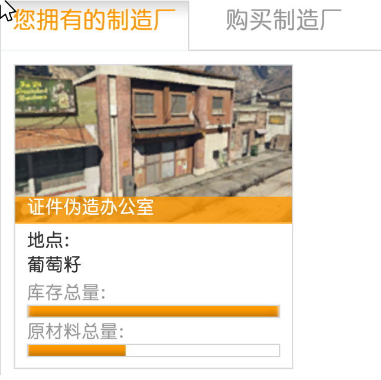

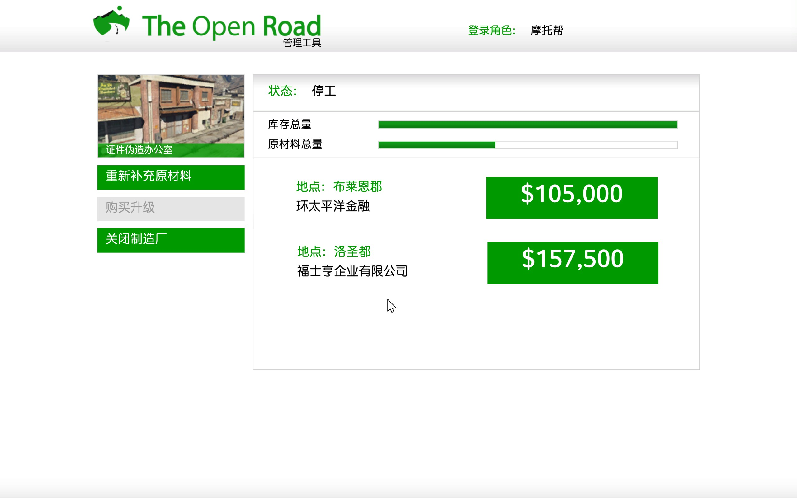

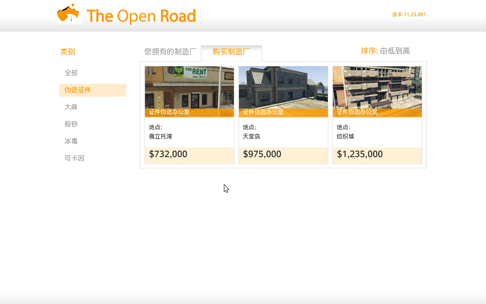

### 15.5 换购制造厂时，满仓会不会没了？（`img_mc_trade_lose_stock.png`）

**是，会没。** Open Road 换购新厂时的确认框写明：**「交易时将会失去所有产品、原材料和升级」** —— 与当前库存是否满仓无关；**确认换购后**，旧厂的 **成品库存、原材料、已购升级** 均按提示 **清空**，新厂需 **重新补货/生产** 并在该厂界面 **再买升级**（具体 UI 以游戏为准）。

**实操建议**

- 想保住满仓价值：**先完成一次出货**（或至少卖掉大部分库存）再换址。  
- 若宁可不要这批货、只想立刻搬家：可 **确认换购**，接受 **从零开始**。

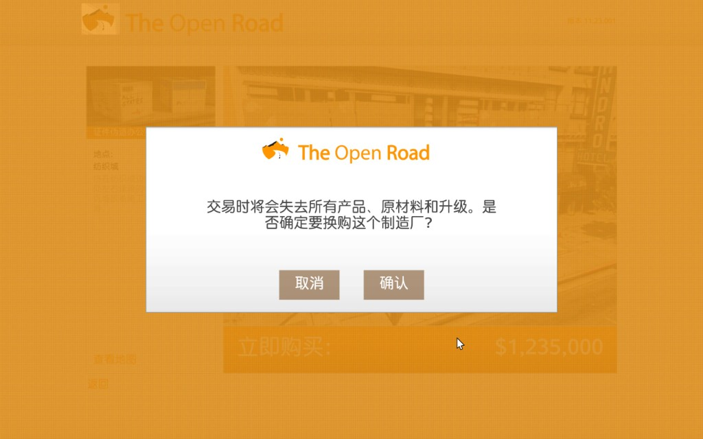

---

## 16. 地堡补货「送零件到武装国度」：哪个地堡最快？

**图示（`img_232830.png`）** 为 **Maze Bank 法拍网 · 资产地图**，可筛选 **地堡** 查看全图蓝点；**未在截图中逐个点名** 各地堡，以下按 **地图位置 + 社区常用结论** 说明。

### 16.1 任务与随机性

- 地堡 **偷取原材料** 会随机到多种差事，其中一类为 **把零件送到武装国度**（多处在 **洛圣都市区及周边**）。  
- **同一地堡** 每次的 **具体武装国度分店**、顺序也会变，因此 **不存在**「换某一座就保证每一把都全图最短」——只能谈 **平均路程** 与 **上高速进城的便利性**。

### 16.2 选址建议（面向「少跑洛圣都」）

| 倾向 | 说明 |
|------|------|
| **优先（常推荐）** | **丘马什（Chumash）** 地堡：位于 **大西海岸公路** 旁，经 **大公路进洛圣都** 的直线距离短，多数玩家认为 **往武装国度线平均最省时间**。购入价在游戏内属 **偏高档**。 |
| **折中** | **农舍（Farmhouse）**、**桑库多（Zancudo）** 一带：偏 **地图西侧 / 中南部**，走 **高速公路网** 进 LS 通常 **优于** 最北端。 |
| **沙漠中部** | **68 号公路**、**大塞诺拉沙漠**、**烟树路** 等：中规中矩，**未必**比丘马什更快，但 **强于** 北布莱恩郡。 |
| **不推荐（若痛点是远）** | **佩立托森林** 等 **最北** 地堡：去多数洛圣都武装国度 **公路最长**，这类补货往往 **最累**。 |

### 16.3 与 §2 的关系

- 地堡 **仍只须持有一处**；为补货 **换址** 会涉及 **换购** 与 **库存/原材料/升级** 规则（与摩托帮厂类似，以游戏内换购提示为准）。  
- 若你 **已升满研究/制造**，换地堡前请 **看清** 确认框，避免误清空。

**与本节关联图片（与本文同目录）**

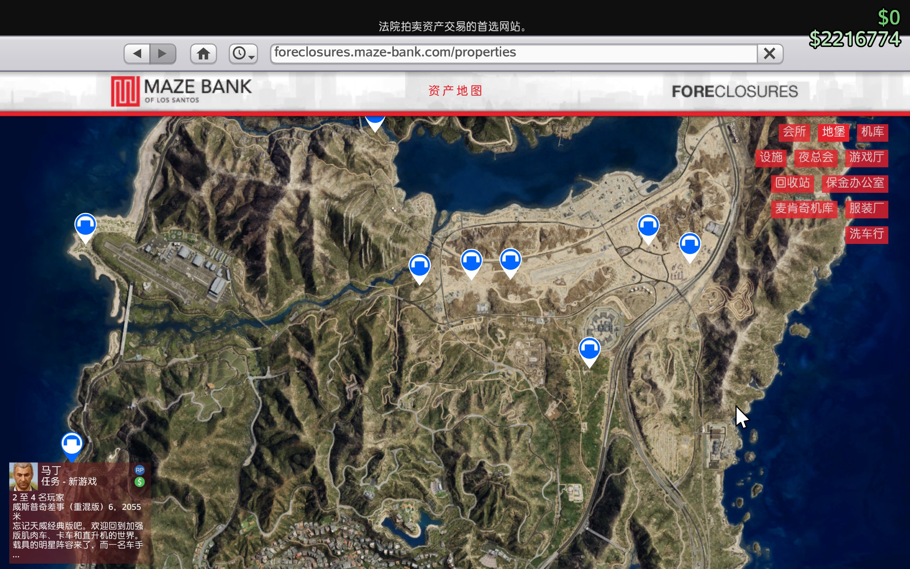

---

## 17. 游戏厅：游戏机买满了为什么保险箱还是很穷？

本问题 **未附带截图**。以下为 **Diamond Casino Heist「游戏厅」产业**（办公室保险箱）机制说明，与前文佩里科 **计划板卡住**（`img_015344.png`～`img_015436.png`，§8.11）为 **完全不同系统**，勿混为一谈。

### 17.1 设计如此：封顶就很低

- 维基与长期社区口径一致：**所有专用游戏机位上都摆了游戏机**（机位加满）时，被动收入 **最多约 `$5,000`／「游戏日内」**（常被说成约 **48 分钟** 现实时间与「在线上自由模式挂机」相关联，**以当前增强版实测为准**）。  
- 因此就算你 **花几百万把机台配齐**，保险箱 **也不会变成夜总会或地堡同级别**——游戏厅主要靠 **赌场抢劫计划板**，被动只是 **小钱**。

### 17.2 保险箱有上限 —— 满了就「不涨」

- 保险箱储量 **有封顶**；《合约》等大更新后有资料称上限约 **`$100,000`**（旧版曾常见 **`$50,000`** 说法）。  
- **满额后不再往里堆钱**，看起来像「收入很少」，其实是 **需要去办公室互动把钱拿走**，否则浪费了后续 `$5k`/日的堆叠窗口。

### 17.3 买满≠一定「机位加满」的检查项

- 封顶条件一般是：**游戏厅层楼里每一个可放置游戏的插槽都有一台主机** ——用的是 **占位数量**，不是你在外网买了多少 **最贵** 的机种。维基写明：**游戏机品种/单价不影响顶格被动**，只要把 **位子填满**。  
- 若仍明显低于封顶：进游戏厅看 **地板上是否仍有空桩位**；在 **办公室的 Pixel Emporium 笔记本** 里确认采购是否与实际摆放一致。

### 17.4 和什么比会像「很少」？

- **夜总会** 人气挂机、**地堡/MC 出货**、**佩里科** 单次分红，量级都远大于游戏厅被动；体感「买满还很穷」多数是 **期望值设错**。  
- 真想靠产业躺钱：**夜总会挂机链 / 事务所 / 上岛**，游戏厅保险箱当 **顺带领零花**。

---

*说明：游戏会随更新调整收益与活动，具体金额与当周加成请以游戏内与官方 Newswire 为准。*
