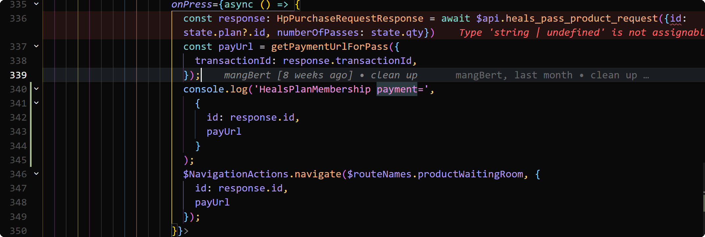
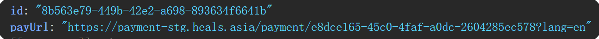
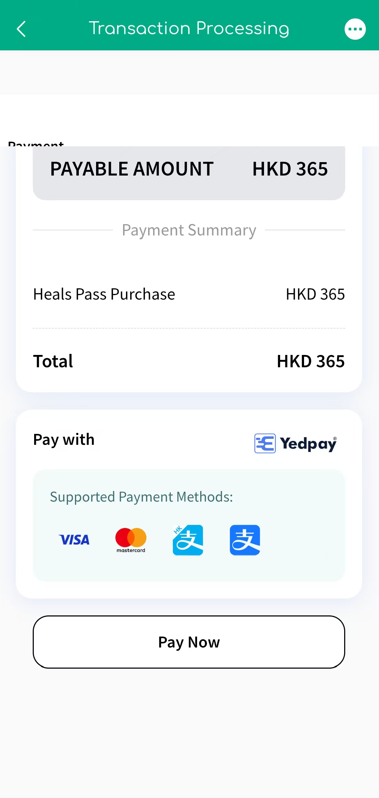
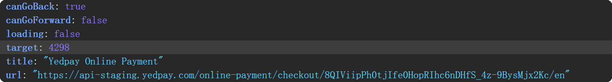
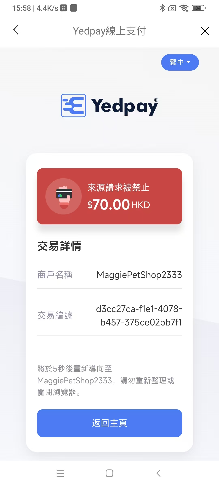
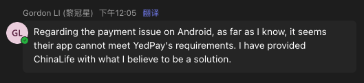

# ask-heals-app-rn

## 目的

本技能是 **`heals-app-rn`（Heals React Native）** 的默认分析入口，用于：

- 用最少上下文恢复项目事实与约束（技术栈、目录、构建、架构）
- 区分「产品/需求澄清」与「实现/排障」，避免一上来堆代码
- 将任务路由到合适的专项 skill 或项目内规则，减少无效全文搜索

## 何时使用

- 新会话开头需要快速对齐 Heals 工程背景时，可显式带上本 skill 或输入 `/ask-heals-app-rn`
- 需求涉及多模块（导航、Auth、API、i18n、原生构建）且需先定范围时
- 用户未指定文件，但明显在 **本仓库** 内工作时，优先按本 skill 加载顺序取上下文

## 工作区路径

| 平台 | 路径 |
|------|------|
| Windows | `D:\work\RN\heals-app-rn` |
| Mac | `~/work/RN/heals-app-rn`（若实际路径不同，以用户本机为准） |

## 推荐主入口（本文件）

| 平台 | 路径 |
|------|------|
| Windows | `C:\Users\Stark8964911\.cursor\skills\ask-heals-app-rn\SKILL.md` |
| Mac | `~/.cursor/skills/ask-heals-app-rn/SKILL.md` |

## 稳定背景（项目事实优先读仓库规则）

以下摘要仅为触发记忆；**详情以仓库内规则为准**，避免在本 skill 中复制易过期版本号列表：

- **业务**：健康护照、远程医疗、预约、用药、健康计划等；多区域（HK、中国大陆、SEA 等）
- **技术**：React Native + TypeScript；React Navigation；全局状态以 AppContext / Auth 为主；API 经 `src/api`；多语言 `src/i18n/locale`
- **事实源**：项目根目录 `.cursor/rules/project-context.mdc`（`alwaysApply` 时应已加载；若缺失则用 `init-project` 重建）

涉及 **合规与表述**：面向用户的医疗健康文案需避免确诊式、替代医嘱式措辞；保持与产品/法务一致。

## 上下文来源（按需、最小读取）

| 优先级 | 来源 | 用途 |
|--------|------|------|
| 1 | `{workspace}/.cursor/rules/project-context.mdc` | 技术栈、脚本、目录、架构、构建 |
| 2 | `{workspace}/CLAUDE.md` | 命令别名、架构补充、常见全局对象约定 |
| 3 | `{workspace}/README_stark.md` | 个人/团队增强说明（若存在） |
| 4 | `{workspace}/package.json` | scripts、engines、依赖核对 |
| 5 | `{workspace}/src/constants/`、`navigation/`、`api/` | 路由名、接口与导航变更 |

不要默认通读 `src/` 全文；先根据用户问题定位 1–3 个文件再读。

## 路由规则（关联 skills）

按任务类型选用专项能力（名称与 `~/.cursor/skills` 下文件夹一致）：

### 1. 初始化或规则缺失

- 需要生成/刷新 `.cursor/rules/project-context.mdc`：`init-project`

### 2. React Native 实现与体验

- Hooks、跨端差异、列表性能、键盘与图片：`react-native-patterns`

### 3. 类型与接口

- 收紧类型、减少 `any`、API/DTO 类型边界：`typescript-strict`

### 4. 代码审查

- PR/变更质量与安全：`code-review` 或 `bmad-code-review`（需更对抗性审查时）

### 5. 国际化与中英文案

- 文案翻译、术语、变量命名旁注：`chinese-english-translation`  
- **代码要求**：新增文案需同步各 locale 文件（以 `project-context.mdc` 中语言列表为准）

### 6. 设计还原（Figma → RN）

- 工具链与流程：`ask-figma-to-rn-toolkit`  
- 按设计实现 UI：`figma-implement-design`（插件 skills）；写入 Figma 需配合 `figma-use`

### 7. 快速交付Story/需求实现

- 已清楚规格、偏执行：`bmad-quick-dev` 或 `bmad-dev-story`（有现成 story 文件时）

### 8. 架构级讨论

- 模块边界与演进：`architecture-review` 或 `bmad-agent-architect`

**默认优先级**：事实澄清 → 小步读代码 → 再改；产品范围未清时，不要盲目 `bmad-quick-dev`。

## 执行工作流

1. 确认工作区是否为 `heals-app-rn`（或用户指定的 fork 路径）
2. 用上一节「上下文来源」取最小集合，核对 `project-context.mdc` 是否与当前 `package.json` 一致
3. 分类任务：需求/架构/实现/排障/i18n/构建
4. 给出可执行下一步（含推荐 skill）；实现类任务注明要动的目录或文件类型
5. 持久化结论：优先更新仓库内已有文档或规则，避免只在 chat 里冗余长文

## 输出约定

- 对用户说明：**简体中文**（除非用户要求其他语言）
- **代码与代码注释**：英文
- 引用仓库代码时使用带起止行号与路径的代码引用块（与工作区对话规范一致）
- 涉及 env、keystore、签名、API 密钥：禁止写入 skill 或聊天中的真实秘密；使用占位符并指向安全配置

## 边界

- 不把医学建议写成确诊或处方替代
- 不擅自扩大需求范围（无关重构、额外文档）
- 默认不替用户运行应用/真机测试，除非用户明确要求
- 不把其他项目（如 MyStartup、figma-to-rn-toolkit）的假设混入本仓库

## 当前活跃需求
- 当前电脑已经在 `D:\work\RN\heals-app-rn` 目录执行 `npm run android:dev:win` 把当前项目的debug模式的app运行到了如图型号的真机上,真机所在的时区是 `东八区`
  - 在 `D:\work\RN\heals-app-rn\src\screens\heals-plan-membership\heals-plan-membership.tsx`执行时, 340行输出 ;然后进入 `D:\work\RN\heals-app-rn\src\screens\product-waiting-room\product-waiting-room.tsx`页面,一开始页面加载的URL是 `D:\work\RN\heals-app-rn\src\components\webView-comp\webView-comp.tsx`的34行输出的`https://payment-stg.heals.asia/payment/cf7fa1b9-b036-4ef4-8198-0ab5c8866fc7?lang=en`,页面显示 ;然后点击 `Pay Now`按钮后,页面跳转到`D:\work\RN\heals-app-rn\src\components\webView-comp\webView-comp.tsx`的22行输出的 ,这个流程没问题;
  - 但是 在另外一个公司用 原生kotlin写的app里, 也在`https://payment-stg.heals.asia/payment/cf7fa1b9-b036-4ef4-8198-0ab5c8866fc7?lang=en`页面点击`Pay Now`按钮后,则跳转到了这个报错的H5页面,为什么?我们公司的同事说可以添加如下代码解决:
    - add this in AndroidManifest.xml: <uses-permission android:name="android.permission.INTERNET" />
    - 他的`sample kotlin code`在`C:\Users\Stark8964911\Downloads\MainActivity.kt`
    - 你觉得他的这套代码可以解决这个问题吗?
  - 如图  是之前他们讨论的上下文
  - 你怎么解决这个问题, 是不是 他们的原生安卓app的webview的`http header`没有传referrer, user-agent?还是其它原因?
  - 