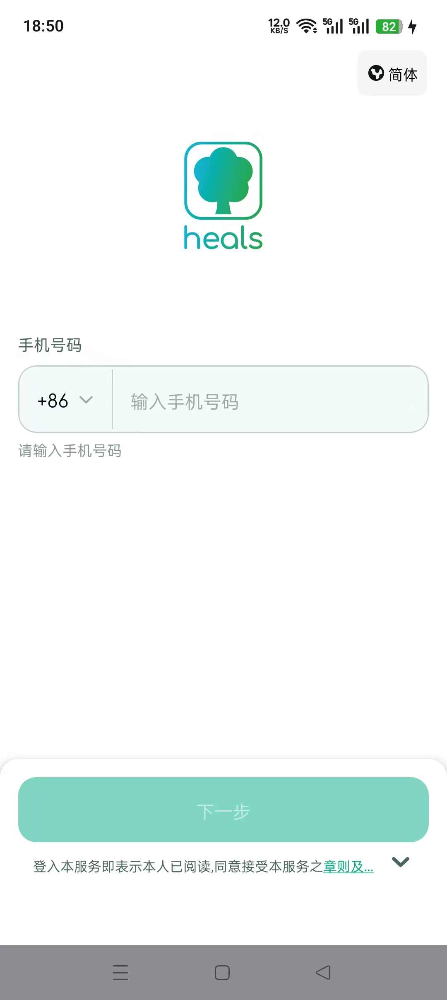
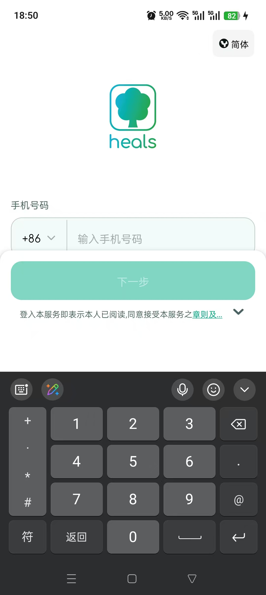
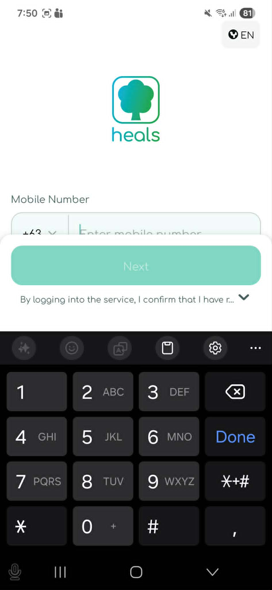

# ask-heals-app-rn（Cursor）

## 与 Codex 入口的区别（分别维护）

| 客户端           | `SKILL.md`                                                                                                                                      | `name`             | 口令                |
| ---------------- | ----------------------------------------------------------------------------------------------------------------------------------------------- | ------------------ | ------------------- |
| Cursor（本文件） | **Windows** `%USERPROFILE%\.cursor\skills\ask-heals-app-rn\SKILL.md` / **macOS** `/Users/<你的用户名>/.cursor/skills/ask-heals-app-rn/SKILL.md` | `ask-heals-app-rn` | `/ask-heals-app-rn` |
| Codex（OpenAI）  | **Windows** `%USERPROFILE%\.codex\skills\heals-app-rn\SKILL.md` / **macOS** `/Users/<你的用户名>/.codex/skills/heals-app-rn/SKILL.md`           | `heals-app-rn`     | `/heals-app-rn`     |

两处不要求逐句同步；但围绕 **`heals-app-rn`** 工作区的任务入口、必读顺序、上下文门禁、路由规则与输出约定必须保持一致。在 Cursor 的 Codex 插件中输入 **`/heals-app-rn`**，应与 Cursor 输入框中执行 **`/ask-heals-app-rn`** 达到同一任务推进效果。

## 目的

本 skill 是 **`heals-app-rn`（Heals React Native）** 的默认分析入口，用于在新会话或跨工具切换时，把任务拉回到项目事实与最小必要上下文上。

- **恢复项目事实**：先读项目规则、依赖与直接相关源码，避免只凭历史记忆或旧摘要行动。
- **收敛任务范围**：区分「需求澄清 / 架构讨论 / 实现 / 排障 / 审查 / i18n / 原生构建」，按任务读取最小文件集合。
- **路由专项能力**：将 React Native、TypeScript、API、导航、Figma、BMAD、代码审查等任务指向对应 skills 或项目规则。
- **保证上下文完整**：若入口 skill 又指向其它 skill、ask、command、BMAD 工作流或同目录资源，先补读其依赖文件，再执行。
- **沉淀项目结论**：需要长期保留的项目事实优先更新仓库内规则或既有文档，不把阶段性结论塞进通用 skill。

**非目标**：不在本文件维护易过期的版本号清单、接口字段清单、临时 TODO 或一次性需求结论；这些内容以仓库文件、接口定义、官方文档和当次用户材料为准。

## 何时使用

- 用户显式 `@ask-heals-app-rn`、`/ask-heals-app-rn` 或自然语言提及 `ask-heals-app-rn`。
- 用户提到 `heals-app-rn`、Heals App、Heals React Native、健康护照、远程医疗、预约、用药、健康计划等本仓库相关任务。
- 当前工作区根目录为 **Windows** `D:\work\RN\heals-app-rn` 或 **macOS** `/Users/<你的用户名>/Desktop/work/RN/heals-app-rn`（当前 Mac：`/Users/stark/Desktop/work/RN/heals-app-rn`），且需要项目级引导。
- 需求涉及多模块（导航、Auth、API、i18n、原生构建、推送、健康数据、Figma 还原）且需先定范围。
- 用户未指定文件，但明显在本仓库内工作时，优先按本 skill 的加载顺序取上下文。

## 工作区与本 skill 路径

| 用途                                           | Windows                                                                                                                                | macOS                                                                                                                               |
| ---------------------------------------------- | -------------------------------------------------------------------------------------------------------------------------------------- | ----------------------------------------------------------------------------------------------------------------------------------- |
| 工作区根                                       | `D:\work\RN\heals-app-rn`                                                                                                              | `/Users/<你的用户名>/Desktop/work/RN/heals-app-rn`（当前 Mac：`/Users/stark/Desktop/work/RN/heals-app-rn`）                         |
| 本 skill 文件                                  | `%USERPROFILE%\.cursor\skills\ask-heals-app-rn\SKILL.md`（本机示例：`C:\Users\Stark8964911\.cursor\skills\ask-heals-app-rn\SKILL.md`） | `/Users/<你的用户名>/.cursor/skills/ask-heals-app-rn/SKILL.md`（当前 Mac：`/Users/stark/.cursor/skills/ask-heals-app-rn/SKILL.md`） |
| Codex 对口 skill（`name: heals-app-rn`）       | `%USERPROFILE%\.codex\skills\heals-app-rn\SKILL.md`（本机示例：`C:\Users\Stark8964911\.codex\skills\heals-app-rn\SKILL.md`）           | `/Users/<你的用户名>/.codex/skills/heals-app-rn/SKILL.md`（当前 Mac：`/Users/stark/.codex/skills/heals-app-rn/SKILL.md`）           |
| Cursor skills 根                               | `%USERPROFILE%\.cursor\skills`                                                                                                         | `/Users/<你的用户名>/.cursor/skills`（当前 Mac：`/Users/stark/.cursor/skills`）                                                     |
| Cursor 应用配置与用户数据                      | `%APPDATA%\Cursor`                                                                                                                     | `~/Library/Application Support/Cursor`                                                                                              |
| Codex 全局规则（Codex / Cursor 内 Codex 插件） | `%USERPROFILE%\.codex\AGENTS.md`                                                                                                       | `/Users/<你的用户名>/.codex/AGENTS.md`（当前 Mac：`/Users/stark/.codex/AGENTS.md`）                                                 |
| Codex 配置、规则、skills、归档                 | `%USERPROFILE%\.codex`                                                                                                                 | `/Users/<你的用户名>/.codex`（当前 Mac：`/Users/stark/.codex`）                                                                     |

若用户明确给出 fork、分支工作区或临时路径，以用户指定路径为准；否则按上表定位。

在正文、项目规则或任务文档中需要表达项目根时，统一写成双平台形式：

- **Windows** `D:\work\RN\heals-app-rn`
- **macOS** `/Users/<你的用户名>/Desktop/work/RN/heals-app-rn`（当前 Mac：`/Users/stark/Desktop/work/RN/heals-app-rn`）

后续步骤中的 `{workspace}` 均指当前实际工作区根；不要把用户目录下的 skill 路径误当成业务仓库根。

## 新会话必读顺序（恢复上下文）

新 chat 或首次进入本仓库任务时，按以下顺序读取；已有上下文中已实际加载的文件可不重复读，但不能只凭文件名或历史摘要假设已加载。

1. **本 skill 文件**：确认入口目标、路径规则、路由规则与当前活跃需求。
2. **项目规则文件**（按实际存在读取）
   - `{workspace}/AGENTS.md`
   - `{workspace}/.cursor/rules/project-context.mdc`
   - `{workspace}/.cursor/rules/*` 中与当前任务直接相关的规则
3. **项目锚点文件**（按实际存在读取）
   - `{workspace}/README.md`
   - `{workspace}/README_stark.md`
   - `{workspace}/CLAUDE.md`
   - `{workspace}/package.json`
4. **任务直接相关文件**
   - 导航：`src/navigation/`、路由常量、screen 注册处
   - API：`src/api/`、DTO/type、请求封装、错误处理
   - i18n：`src/i18n/locale/` 及相关文案调用处
   - Auth / 全局状态：AppContext、Auth、storage、启动流程
   - 原生构建：`ios/`、`android/`、Podfile、Gradle、Info.plist、Manifest、权限配置

| 优先级 | 来源                                        | 用途                                  |
| ------ | ------------------------------------------- | ------------------------------------- |
| 1      | 本 skill + 项目规则                         | 入口、长期项目事实、约束与加载门禁    |
| 2      | `package.json`、README、CLAUDE/README_stark | 脚本、依赖、环境与团队约定            |
| 3      | 任务直接相关源码/配置                       | 实现、排障、审查、验证                |
| 4      | 官方文档或第三方类型定义                    | 核对易变 API、平台差异、弃用/实验标记 |

不要默认通读 `src/` 全文；先根据用户问题定位 1-3 个高价值文件，再决定是否扩大范围。

## 稳定背景（项目事实优先读仓库规则）

以下摘要仅为触发记忆；**详情以仓库内规则为准**，避免在本 skill 中复制易过期版本号列表：

- **业务**：健康护照、远程医疗、预约、用药、健康计划等；多区域（HK、中国大陆、SEA 等）
- **技术**：React Native + TypeScript；React Navigation；全局状态以 AppContext / Auth 为主；API 经 `src/api`；多语言 `src/i18n/locale`
- **事实源**：项目根目录 `.cursor/rules/project-context.mdc`（`alwaysApply` 时应已加载；若缺失则用 `init-project` 重建）

涉及 **合规与表述**：面向用户的医疗健康文案需避免确诊式、替代医嘱式措辞；保持与产品/法务一致。

## 子 skill / 子任务上下文完整性门禁

当本入口、用户请求、项目规则或「当前活跃需求」指向其它 skill、ask、command、BMAD 工作流或专项子任务时，必须先完成以下检查，再开始实现、审查、改代码、改文档或按模板产出。

1. **建立加载账本**：先列出当前 chat 已经实际读取的入口 skill、项目规则、项目锚点、当前任务文件、相关截图/图片、以及已路由的子 skill 文件；未实际读取的文件不能视为已加载。
2. **识别触发源**：同时检查用户输入框、本文件「当前活跃需求」、`/Users/stark/.codex/skills/heals-app-rn/SKILL.md` 对口入口、仓库项目规则与任务直接相关文件；任一来源点名其它 skill、ask、command、BMAD、模板、checklist、reference 或图片，都纳入必读范围。
3. **确认是否已读**：当前 chat 中必须已经实际读取对应 `SKILL.md`、`workflow.md`、`checklist.md`、`reference.md`、项目文档、同目录图片或其它明确依赖文件；不能只凭文件名、历史摘要、上轮结论或用户转述继续。
4. **缺什么补什么**：缺失时按当前 OS 的精确路径读取；已知路径直接读取，不先搜索。读取失败时说明精确路径读取失败，再按需搜索或请用户附上文件。
5. **按平台取路径**：Cursor skills 统一写作 **Windows** `%USERPROFILE%\.cursor\skills` / **macOS** `/Users/<你的用户名>/.cursor/skills`；Codex skills 统一写作 **Windows** `%USERPROFILE%\.codex\skills` / **macOS** `/Users/<你的用户名>/.codex/skills`。当前 Mac 示例分别为 `/Users/stark/.cursor/skills` 与 `/Users/stark/.codex/skills`。
6. **BMAD 硬门禁**：若将执行任意 `bmad-*`，先读取 **Windows** `%USERPROFILE%\.cursor\skills\<bmad-identifier>\SKILL.md` / **macOS** `/Users/<你的用户名>/.cursor/skills/<bmad-identifier>/SKILL.md`；若该 skill 要求或同目录存在任务所需的 `workflow.md`、`checklist.md`、`reference.md`，继续读取后再执行。
7. **图片门禁**：若本 skill、项目规则、ask/command/skill 或用户材料引用同目录图片，先按引用源 `.md` 所在目录拼接图片名精确读取；读取失败再搜索，不得跳过。
8. **执行前复核**：在开始主任务实现前，用一句话确认已加载的关键上下文是否足够；若不足，先补读，不要进入实现。
9. **记录加载事实**：最终回复列出「当前 chat 已加载的关键文件」与「本轮新增读取/加载的文件」，只列对判断、修改或验证有实际影响的文件。

## 路由规则（关联 skills）

按任务类型选用专项能力（名称与 **Windows** `%USERPROFILE%\.cursor\skills` / **macOS** `/Users/<你的用户名>/.cursor/skills` 下文件夹一致）。路由到某个 skill 后，必须按上一节门禁读取其文件与依赖。

### 1. 初始化或规则缺失

- 需要生成/刷新 `.cursor/rules/project-context.mdc`：`init-project`

### 2. React Native 实现与体验

- Hooks、跨端差异、列表性能、键盘与图片：`react-native-patterns`

### 3. 类型与接口

- 收紧类型、减少 `any`、API/DTO 类型边界：`typescript-strict`

### 4. 代码审查

- PR/变更质量与安全：`code-review` 或 `bmad-code-review`（需更对抗性审查时）

### 5. 国际化与中英文案

- 文案翻译、术语、变量命名旁注：`chinese-english-translation`  
- **代码要求**：新增文案需同步各 locale 文件（以 `project-context.mdc` 中语言列表为准）

### 6. 设计还原（Figma → RN）

- 工具链与流程：`ask-figma-to-rn-toolkit`  
- 按设计实现 UI：`figma-implement-design`（插件 skills）；写入 Figma 需配合 `figma-use`

### 7. 快速交付Story/需求实现

- 已清楚规格、偏执行：`bmad-quick-dev` 或 `bmad-dev-story`（有现成 story 文件时）

### 8. 架构级讨论

- 模块边界与演进：`architecture-review` 或 `bmad-agent-architect`

### 9. Codex 插件 / 全局规则 / MCP 配置

- 若任务讨论 Cursor 内 Codex 插件、Codex 全局规则、MCP 配置或 slash 入口对齐，需同时参考 **Windows** `%USERPROFILE%\.codex\AGENTS.md` / **macOS** `/Users/<你的用户名>/.codex/AGENTS.md`、相关 Codex skill，以及用户明确指定的配置文件。

**默认优先级**：事实澄清 -> 小步读代码 -> 再改；产品范围未清时，不要盲目进入 `bmad-quick-dev`。

## 执行工作流（默认）

1. 确认工作区是否为 `heals-app-rn`（默认 **Windows** `D:\work\RN\heals-app-rn` / **macOS** `/Users/<你的用户名>/Desktop/work/RN/heals-app-rn`；当前 Mac：`/Users/stark/Desktop/work/RN/heals-app-rn`），或用户指定的 fork 路径
2. 按「新会话必读顺序」读取最小上下文；若 `project-context.mdc` 与 `package.json` 冲突，以当前仓库文件为准，并在答复中说明
3. 分类任务：需求/架构/实现/排障/i18n/构建
4. 若需要专项 skill 或 BMAD，先完成「子 skill / 子任务上下文完整性门禁」
5. 实现类任务先定位直接相关文件；修改前说明要编辑的文件与意图
6. 完成后给出验证方式；若未运行测试或应用，明确说明
7. 需要长期保存的结论，优先更新仓库内已有规则或文档；不新建无关 `.md` 或脚本

## 任务类型补充

- **React Native 跨平台**：使用公共字段与平台分支；第三方库若标记 `iOS ONLY` / `ANDROID ONLY` / deprecated / experimental，先核对类型定义或官方文档。
- **API / DTO**：优先使用项目既有请求封装与类型；避免在 screen 中散落临时拼接逻辑。
- **i18n**：新增用户可见文案时，同步所有项目约定 locale；语言列表以 `project-context.mdc` 或当前 locale 目录为准。
- **导航**：改路由前确认 screen 注册、参数类型、深链/回退行为及调用点。
- **医疗健康文案**：避免确诊式、保证疗效式、替代医生建议式表达。
- **依赖变更**：先检查项目已有依赖与原生影响；非必要不新增依赖。

## 输出约定

- 对用户说明：**简体中文**（除非用户要求其他语言）
- **代码与代码注释**：英文
- 引用仓库代码时使用路径与行号；路径、命令、标识符保持原文
- 涉及 env、keystore、签名、API 密钥：禁止写入 skill 或聊天中的真实秘密；使用占位符并指向安全配置
- 完成任务后必须说明：
  - 当前 chat 已加载的关键文件
  - 本轮新增读取/加载的文件

## 边界

- 不把医学建议写成确诊或处方替代
- 不擅自扩大需求范围（无关重构、额外文档）
- 默认不替用户运行应用/真机测试；涉及代码变更时可运行轻量静态检查或用户要求的验证，并说明结果
- 不把其他项目（如 MyStartup、figma-to-rn-toolkit）的假设混入本仓库
- 不把临时会话结论、旧任务记录或易过期外部信息固化进本 skill
- 不在本 skill 中保存 token、密码、Cookie、私钥、keystore 密码等敏感信息

## 当前活跃需求(不要修改这部分的子内容)
- WIN:
  <!-- - 当前电脑已经在 Windows 项目根 目录`D:\work\RN\heals-app-rn`执行了 `npm run android:dev:win` 把当前项目的debug模式的app运行到了如图型号的真机上,真机所在的时区是 `东八区` -->
  <!-- - 在 `D:\work\RN\heals-app-rn\src\screens\login\login-screen\login-screen.tsx`页面,一开始显示,点击`renderMobileNumber`函数绘制的输入框后, 键盘弹起, 如图 , 输入框的下半部分内容被遮挡了, 测试用屏幕更小的机型也发现了更明显的这个问题,并且提了BUG: `Problem Statement -->
