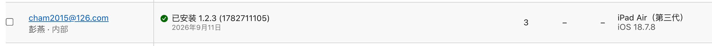
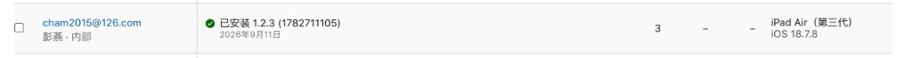

# ask-heals-app-rn（Cursor）

## 调用策略

- 激活本 Skill 后，先完整读取本 `SKILL.md`，再立即完整读取 `$HOME/.codex/skills/heals-app-rn/AGENTS.md`（Windows：`%USERPROFILE%\.codex\skills\heals-app-rn\AGENTS.md`）；读取失败时停止项目实现并报告精确路径，不得跳过。
- 每个新 chat 先显式调用本入口，再从共享 `AGENTS.md` 与当前源码开始普通实现、排障、审查和测试；项目根不维护第二份 `AGENTS.md`。
- 本 chat 首次激活时，在主任务前执行共享 `AGENTS.md` 的 “First-chat structural drift gate”；发现重大冲突时立即完整读取并执行 macOS `$HOME/.cursor/skills/init-project/SKILL.md` / Windows `%USERPROFILE%\.cursor\skills\init-project\SKILL.md`，刷新后重新读取共享 `AGENTS.md` 并继续原任务，不要求用户再次输入 `/init-project`。
- 本 Skill 只处理私有恢复状态、受保护待办、专项路由和外部构建/发布上下文。
- 用户给出具体任务时，该任务优先；只有仅调用入口或明确要求“继续”时，才解析未注释待办。

## 路径与事实源

- 项目根：Windows `D:\work\RN\heals-app-rn`；macOS `/Users/<你的用户名>/Desktop/work/RN/heals-app-rn`，当前 Mac 为 `/Users/stark/Desktop/work/RN/heals-app-rn`。
- Cursor 入口：Windows `%USERPROFILE%\.cursor\skills\ask-heals-app-rn\SKILL.md`；macOS `/Users/<你的用户名>/.cursor/skills/ask-heals-app-rn/SKILL.md`。
- Codex 对照入口：Windows `%USERPROFILE%\.codex\skills\heals-app-rn\SKILL.md`；macOS `/Users/<你的用户名>/.codex/skills/heals-app-rn/SKILL.md`。
- 业务逻辑、API 映射、导航、i18n、UI 行为和错误处理：以当前 `src/`、`ios/`、`android/` 和测试为准。
- 稳定工程约束只维护在 Codex 对口目录的 `AGENTS.md`；不创建仓库根 `AGENTS.md` 或 `.cursor/rules/project-context.mdc`。
- 技术栈、脚本、依赖、环境、构建和发布方式：以 `package.json`、项目配置和 `README*` 为准。
- 当前任务、外部状态和最小下一步：以用户本轮消息、受保护的“当前活跃需求”和实时证据为准，不在入口正文复制状态流水。
- `README_stark.md` 可能含敏感信息；只按任务读取相关段落，不复述或新增账号、密码、token、Cookie、私钥、keystore 密码和生产密钥。

发生冲突时，当前源码、Git、ADB/Xcode/Gradle/Metro、真实页面和外部系统实时结果优先于历史摘要；产品范围、医疗合规和外部 contract 以负责人最新确认优先。

## 与 Codex 入口对齐

- 两份入口分别维护，但事实源优先级、最小读取顺序、上下文门禁、授权边界、实施流程和输出约定保持一致。
- 在 Cursor 的 Codex 插件中输入 `/heals-app-rn`，应与 Cursor 输入框中执行 `/ask-heals-app-rn` 对同一明确任务达到相同推进效果。
- 两份“当前活跃需求”由用户分别维护，不自动同步或改写；用户本轮明确任务始终优先。

## 启用与最小读取顺序

1. 完整读取本 `SKILL.md`；已在当前 chat 实际加载且未变化的文件不重复读取。
2. 确认 Codex 对口 Skill 同目录 `AGENTS.md` 已读取，再按任务读取相关 `.cursor/rules/*`；不要读取或创建 `project-context.mdc`。
3. 读取任务直接相关的源码、测试和原生配置；需要脚本、依赖或环境事实时，再读取 `package.json`、`README.md`、`README_stark.md`、`CLAUDE.md` 中实际存在者。
4. 普通实现、排障和审查不默认读取 Codex 对照入口；仅在用户调用 `/heals-app-rn`、两份入口需要对齐，或任务事实只存在于对照入口时读取。
5. 用户只有入口口令而没有新任务时，执行本文件“当前活跃需求”中第一个未注释且可行动的事项；已有明确新任务时，不自动展开无关活跃项。
6. 路由到其它 Skill、ask、command 或 `bmad-*` 前，先完整读取对应 `SKILL.md` 及其明确要求的 `workflow.md`、`checklist.md`、`reference.md`。
7. 当前任务涉及 Markdown 图片引用时，先按引用文件同目录精确读取全部相关图片；读取失败后再搜索，不得用文字摘要代替图片事实。

不要默认通读仓库、全部 README 或另一客户端入口，也不要把历史摘要当成已加载的当前事实。

## 实施工作流

1. 确认实际工作区、Git 分支、工作树和任务授权边界；保留用户已有改动，不扩大到无关重构、提交、push、部署或外部系统写操作。
2. 按实现、排障、API、i18n、导航、原生构建、真机、审查或设计还原分类，只读取能决定下一步的高价值文件。
3. 代码任务依次完成真实业务实现、同项目内测试/验证；确认无需继续改代码后，再更新项目文档或项目外入口资料。
4. API contract 可由真实页面触发时，先读取实际请求与响应；受登录、权限或页面状态阻塞后，再查源码、Swagger 或 OpenAPI。
5. Figma URL、节点或设计还原任务必须先通过 Figma MCP 读取节点事实；截图和浏览器 DOM 只能补充验证。
6. 开发阶段优先单文件、单用例、单平台或单设备验证；阶段收尾再按风险扩大矩阵。未运行的测试、应用或真机流程必须明确说明。
7. 不因普通代码改动更新本 Skill；只有入口、事实源、跨客户端对齐、长期门禁或受保护活跃需求由用户授权变更时才更新。

## 项目工程约束

- React Native、React、TypeScript、React Navigation、依赖版本、scripts 和 locale 清单的精确值以当前仓库为准。
- API 复用 `src/api` 既有 client、endpoint 和 DTO/type；导航改动同步 screen 注册、参数类型、深链和回退行为。
- 新增用户可见文案时同步项目当前约定的全部 locale；不从历史 Skill 猜测语言清单。
- 跨平台逻辑优先使用公共字段；第三方 API 标记 `iOS ONLY`、`ANDROID ONLY`、deprecated 或 experimental 时，先核对类型定义或官方文档，并显式处理另一平台。
- 医疗健康文案避免确诊式、保证疗效式或替代医生建议式表达。
- 非必要不新增依赖；不写入或输出 token、Cookie、密码、私钥、证书、keystore 密码、生产密钥和测试账号明文。

## 用户已有日志保护硬门禁

- 当前源码中的 `console.log`、`console.info`、`console.warn`、`console.error`、自定义 logger、debugger、trace 和诊断 Hook 均视为用户已有代码。除非用户在本轮明确要求删除、注释、降级、脱敏、替换或重构某一条具体日志，否则必须逐条保留；“解决警告或报错”、真机检查、日志清洁、安全/隐私诊断、lint 或测试失败都不构成修改日志的授权。
- 日志记录到 warning/error 时优先修复实际根因，不得通过删除、屏蔽、改写或降低日志级别制造“无错误”结果。若根因属于外部服务、账号、云配置、依赖或环境，只报告边界和必要下一步，保留原日志。
- 发现日志可能包含敏感数据、输出过多、影响性能或与现有测试冲突时，只收集最小必要证据且不在回复复述敏感值；报告精确文件/行、风险和可选方案并等待用户授权。不得自行修改源码或测试来消除该日志，也不得以历史改动、记忆、测试断言、lint、code review 或前一代理行为推定授权。
- 用户明确授权日志改动后，只修改点名范围；收尾时单独复核 `console.*`、logger、debugger、trace 和诊断 Hook 的 diff，并逐项报告实际变化及原因。

## 运行、发布与外部系统门禁

- Android 真机任务：先从 `package.json` 核对脚本和 flavor/env，再用 `adb devices -l` 锁定设备；只处理属于本项目且阻塞本次运行的旧进程。成功至少需要构建/安装/启动结果、目标包进程和前台 Activity 证据，不能只看端口或 Gradle 成功。
- iOS/TestFlight 任务：先核对 scheme、configuration、Bundle ID、Team、version/build、Xcode/SDK、签名，以及 New Arch 与当前仓库意图一致（Heals 为 ON：`ios/Heals/Info.plist` 的 `RCTNewArchEnabled` 为 `true`，Gradle `newArchEnabled=true`；不得按 CircleApp 关掉）。上传、测试群组、出口合规和 App Store 发布分别授权。外部页面上的 build、tester、group 和处理状态必须实时复核。
- Git/release 任务：先检查远端 refs、完整拓扑、工作树、提交差异和最终树；“方向看起来安全”或只询问是否应合并，不等于授权 merge、删分支、push 或发布。
- 浏览器和外部代码平台任务：使用当前已授权的真实会话并验证完整数据，不把可见列表或编辑器 viewport 当作完整源码；外部 Web 项目与本地 React Native checkout 分开判断。

## 文档维护规则

- 若本次任务改变稳定架构、命令工作流或仓库边界，在代码与定向验证稳定后自动最小更新 Codex 对口目录 `AGENTS.md`；否则不全仓扫描。外部合并造成的大规模变化使用 `/init-project` 刷新。
- `README.md` 保存通用工程说明；`README_stark.md` 只保存无秘密、可复用且不能从源码直接恢复的环境、构建、发布和验证方法。
- 不把字段清单、业务规则、默认值、单次分支/commit/PID、构建结果、测试数量、当前阻塞或聊天流水写入入口 Skill 或 README。
- 有新的可复用事实时，先完成项目代码和测试，再更新现有对应章节；直接修正过期内容并去重，不按日期追加。
- “当前活跃需求（不要修改这部分的子内容）”由用户维护；除非用户明确授权，否则保持其子内容原文。
- 最终回复默认只报告产出、验证、风险和必要下一步；仅在用户要求、审查/排障、上下文缺失或慢任务复盘时列出关键加载文件。

## 输出与边界

- 对用户使用简体中文；代码与代码注释使用英文；引用真实文件时给出路径和必要行号。
- 诚实区分已验证、部分验证、外部阻塞和未执行；不把构建成功写成真机功能验收完成。
- 不把医学建议写成确诊或处方替代，不混入其它项目假设，不创建无关文档或脚本。

## 当前活跃需求(不要修改这部分的子内容)
<!-- - /code-review :  对当前项目未 commit 的文件进行 code review , 目标 `1.2.3`, 直接解决发现的问题, 直到没有问题;再帮我用英文尽可能详细的总结下当前项目里所有未 commit 文件的 git commit message , 然后帮我 commit+push  -->
<!-- - /code-review 目标 `1.2.3`, PR ``, commit `` -->
<!-- - 我已经把 `1.0.3` 分支合并到了当前分支,你检查下有没有问题,能否push -->
<!-- - 你重新执行 '/Users/stark/.cursor/skills/ask-heals-app-rn/SKILL.md'里的 130 行的任务 -->
<!-- - 我以后如果在 cursor 侧执行 `heals-app-rn`项目的相关任务, 是不是只需要把通用和可重复的任务写到`/Users/stark/.cursor/skills/ask-heals-app-rn/SKILL.md`的 `当前活跃需求`这部分里,然后在 cursor 的 新 chat 里一开始执行一次 `/ask-heals-app-rn`,然后等第一个任务执行完后,如果有新任务,则直接在 chat 里输入具体任务; 目前这是不是最完美最高效最正确的使用 cursor 工作流来执行某个项目任务的最优流程? -->
<!-- - `xx` 页面的列表使用我自定义的 "react-native-advanced-flatlist"库的最新版本来布局,仓库源码在 `/Users/stark/Desktop/work/RN/react-native-advanced-flatlist` -->
<!-- - 我已经打开了 `/Users/stark/Desktop/work/RN/heals-app-rn/src/constants/index.ts` 的 `$fake: true` -->
<!-- - 继续之前的任务,完成后,再 执行以下任务:  -->
<!-- - 我已经手动完成了在安卓真机上的操作流程检查, 所以你不用再检查安卓真机的UI显示和操作流程了,只需要继续检查其它方面的内容和功能 -->
<!-- - 对 ``页面 使用 '/Users/stark/Desktop/work/RN/heals-app-rn/src/style/theme/theme-common.ts'里定义的 新主题色 'APP_THEME_COLOR'进行 UI改版, 其中页面的背景色改成 `APP_PAGE_BACKGROUND_COLOR`, 如果页面里使用了 FlatList 组件,则其的背景色改成 `APP_PAGE_BACKGROUND_COLOR`,如果页面里有使用了'#00AC86'或其它绿色的UI元素,比如某个`TouchableOpacity` 的背景色或者某个`Text`的字体颜色等都改成'APP_THEME_COLOR'; -->
<!-- - pls conduct a code review of this PR ' ' as soon as possible ,and addressing the 'Requested changes' I provided in your PR ' ' as soon as possible.  -->
<!-- - 按 `https://ais-pre-hce4mtkty7p4aewqsgaizl-663605729382.us-west2.run.app/` 网页当前 DOM/可访问性节点和计算样式为事实源，读取`图x`红框里的尺寸、间距、圆角、阴影、图标容器、字号/颜色和点击区域等UI元素节点数据并把'图 x'红框处的UI布局到 ' '页面对应的位置,还要记得把这些节点值映射到项目现有的样式系统,不要只凭截图目测; 暂时只需要实现 UI 布局,不需要实现交互逻辑; -->
<!-- - Reload 没有加载到最新 bundle，仍显示旧 JS -->
<!-- - pls conduct a code review of this PR 'https://bitbucket.org/healshealthcare/heals-app-rn/pull-requests/539/diff' as soon as possible ,and addressing the 'Requested changes' I provided in your PR 'https://bitbucket.org/healshealthcare/heals-app-rn/pull-requests/538' as soon as possible. -->
- TECH-8757
  <!-- - 你读取 `https://ais-pre-hce4mtkty7p4aewqsgaizl-663605729382.us-west2.run.app/`页面的UI节点数据,借鉴 `https://aistudio.google.com/apps/c068b31c-3b5b-42e7-b660-02eea479db8a?showAssistant=true&showCode=true`页面里`code`区域的项目源码;帮我实现`heals-app-rn`项目的其它需求; -->
- IOS:
  - 为当前 checkout 构建 `dev` 环境的 `xxx`版本的 Release 模式 的 IPA,使用前把 `xxx` 换成 `1.2.3`, 作为真实的 `version`，并真实上传到 Heals (Dev) 的 TestFlight：`https://appstoreconnect.apple.com/teams/1f49f429-f33a-4c15-b357-7025b5e32451/apps/6740129703/testflight/ios`（Apple ID `6740129703`，套装 ID `com.healshealthcare.healspass.dev`）。上传前仍须在当前登录态打开该页，确认 App 名称是 `Heals (Dev)` 且套装 ID 仍匹配；禁止沿用 CircleApp Dev `6781207370`、CircleApp Prod `6748490218`，也禁止把 `com.healshealthcare.circlemedical` / `com.healshealthcare.circlemedical.dev` 或其它项目 `google-services.json` 的 `app_store_id` 当作本项目 App Store ID。本仓库 `android/app/src/dev/google-services.json` 与 `android/app/src/prod/google-services.json` 没有 `app_store_id`。本任务明确授权构建和上传，但不授权自动提交 Git、push、分配测试群组、回答出口合规问题或发布到 App Store。
    0. Release IPA 与 New Architecture 一致性硬门禁（未全部通过不得 archive / 导出 / 上传）。本仓库当前意图是 New Architecture ON：`android/gradle.properties` 为 `newArchEnabled=true`、`hermesEnabled=true`，`ios/Heals/Info.plist` 为 `<key>RCTNewArchEnabled</key><true/>`，`react-native-reanimated` `4.2.1` 依赖 New Arch 与 `react-native-worklets` `^0.7.1`。禁止把 CircleApp 的 New Arch OFF、Hermes OFF 或 Reanimated `3.16.3` 门禁抄到本项目。只关一端、删掉 plist key，或让 reanimated / worklets / screens / date-picker 漂到未验证版本，会打出启动即闪退的 Release IPA。归档前必须同时满足：
       - `ios/Podfile` 的 `use_react_native!` 不得写成 `:new_arch_enabled => false`，也不得设置 `ENV['RCT_NEW_ARCH_ENABLED'] = '0'`。`pod install` 不得把 `Info.plist` 改成 `RCTNewArchEnabled=false`。
       - `ios/Heals/Info.plist` 必须显式存在 `<key>RCTNewArchEnabled</key><true/>`，禁止删除该 key 或改成 `false`。
       - `ios/Heals/AppDelegate.swift` 不得 override `newArchEnabled` 并返回 `false` / `NO`。
       - `android/gradle.properties` 保持 `newArchEnabled=true` 与 `hermesEnabled=true`，不得只改一端。
       - Node 满足 `package.json` `engines.node`（`>=20`）。
       - 已安装版本必须与当前 `package.json` 已声明版本一致；未经用户明确授权不得升级或降级。当前已知组合：`react-native` `0.81.5`、`react-native-reanimated` `4.2.1`、`react-native-worklets` `^0.7.1`、`react-native-date-picker` `5.0.12`、`react-native-screens` `^4.19.0`。禁止降到 Reanimated 3.x。若 `ios/Podfile.lock` 仍把 worklets 锁在 `0.8.x`，先按 `README_stark.md` 处理后再归档。
    1. 先确认项目根、当前分支、HEAD 和工作树；保留已有未提交改动，不执行 clean/reset，不覆盖无关文件。读取 `ios/Heals.xcworkspace`、scheme `Dev`、`ios/Heals.xcodeproj` 的 Heals target build settings、`ios/Heals/Info.plist`、`ios/Heals/AppDelegate.swift`、`ios/Podfile`、`android/gradle.properties`、`package.json`、`ios/Podfile.lock` 和相关发布说明，以源码和真实构建结果为准。第 0 步未通过时停止在归档前。
    2. 目标营销版本优先使用用户本轮明确指定的 version；用户未指定时，读取 Heals target 的 `Dev` configuration 当前 `MARKETING_VERSION` 并保持不变，不擅自升级版本。目标必须是 scheme `Dev` + configuration `Dev`（该 scheme 的 `ArchiveAction` 才是 `Dev`，`ProfileAction` 仍指向 `Release`，`LaunchAction` 是 `Dev Debug`；本任务只走 `archive`），产物 `Heals.app`，Bundle ID 必须为 `com.healshealthcare.healspass.dev`，显示名 `Heals (Dev)`，Team ID 必须为 `HS8K5BGDV7`；不得误改或误上传 scheme `Heals`（Prod `Release`）或 `Dev Debug` / `Debug`，也不得使用 CircleApp 的 `com.healshealthcare.circlemedical` / `com.healshealthcare.circlemedical.dev`。
    3. 构建前通过当前登录态打开 Dev App `6740129703` 的 iOS TestFlight 页，核对名称 `Heals (Dev)` 与套装 ID `com.healshealthcare.healspass.dev` 后读取 iOS TestFlight 构建列表和详情；核对目标 version 下以及历史列表中已使用的 build number，选择未使用、严格递增且符合 Apple 当前 `CFBundleVersion` 格式的 build number。优先使用比已确认最大值大 1 的纯十进制正整数；不得只根据本地工程、截图日期或历史摘要猜测，也不得使用未经验证的 CircleApp App ID。若登录、权限、App 名称/套装 ID 不匹配、或页面读取失败，停止在上传前并明确报告阻塞。
    4. 只更新 Heals target 的 `Dev` configuration 对应的 `MARKETING_VERSION` 和 `CURRENT_PROJECT_VERSION`，然后通过 `xcodebuild -workspace ios/Heals.xcworkspace -scheme Dev -configuration Dev -showBuildSettings` 再次核对 version、build、Bundle ID、显示名、configuration、Team，以及 New Arch / Hermes 未与第 0 步冲突；不要连带修改 `Release` / `Debug` / `Dev Debug`。当前 `Dev Debug` 的 `MARKETING_VERSION` 与 `Dev` 并不相同，不得为了“对齐”去改它。
    5. 归档前执行 `xcode-select -p`、`xcodebuild -version`、`xcrun --sdk iphoneos --show-sdk-version`，确认默认 Xcode/SDK 满足 Apple 当前上传门禁。本机应优先使用 `/Applications/Xcode.app/Contents/Developer`；若默认仍指向旧 Xcode，在获得系统管理员授权后切换并复核。不得继续上传由不满足当前门禁的旧 SDK 生成的 Archive/IPA。
    6. 检查是否已有其它 `xcodebuild` 正在使用相同 DerivedData、Archive 或 `build.db`；只保留一个归档任务，并为本次 version/build 使用唯一、可追溯的 DerivedData 和 Archive 路径，避免并发构建互相锁库或污染产物。
    7. 仅在第 0 步硬门禁通过后，从项目根使用 `.env.development`、workspace `ios/Heals.xcworkspace`、scheme `Dev`、configuration `Dev`、generic iOS destination、automatic signing 和正确 Team 归档；禁用 Sentry 自动上传，保留符号上传警告供结果判断。不要把 `.env.development` copy 成 `.env` 再归档；scheme `Dev` 的 PreAction 会复制环境文件，不要提交 `.env`。归档命令必须显式带上 `RCT_NEW_ARCH_ENABLED=1`，避免壳层残留的 `0` 把本仓库打成旧架构。推荐命令骨架：`ENVFILE=.env.development SENTRY_DISABLE_AUTO_UPLOAD=true RCT_NEW_ARCH_ENABLED=1 xcodebuild -workspace ios/Heals.xcworkspace -scheme Dev -configuration Dev -destination 'generic/platform=iOS' -derivedDataPath <unique-derived-data> -archivePath <unique-archive>.xcarchive CODE_SIGN_STYLE=Automatic DEVELOPMENT_TEAM=HS8K5BGDV7 -allowProvisioningUpdates archive`。
    8. Archive 成功后先独立核验归档内 App 的 `CFBundleIdentifier`、`CFBundleDisplayName`、`CFBundleShortVersionString`、`CFBundleVersion`、`RCTNewArchEnabled`、`DTSDKName`、`DTXcode`、TeamIdentifier 和 `codesign --verify --deep --strict`；任一值不符时不得导出或上传。`CFBundleIdentifier` 必须是 `com.healshealthcare.healspass.dev`，显示名必须是 `Heals (Dev)`。`RCTNewArchEnabled` 必须为 `true`；key 缺失或为 `false` 视为失败。
    9. 使用 `method=app-store-connect`、automatic signing、正确 Team、`manageAppVersionAndBuildNumber=false` 的 ExportOptions 导出本地 IPA。再次解包核对 Bundle ID、显示名、version/build、`RCTNewArchEnabled=true`、SDK、Apple Distribution 证书、Store provisioning profile、`get-task-allow=false`、`beta-reports-active=true` 和深度签名，并记录 IPA 绝对路径、字节数和 SHA-256；不得用未经验证的旧 IPA 代替本次产物，也不得上传 New Arch 被关掉或 key 缺失的 IPA。
    10. 仅在 IPA 校验通过后，通过 Xcode/App Store Connect 正式上传到 Dev App `6740129703`。成功标准必须同时满足：上传工具明确返回 `Upload succeeded`，并且该 App 的 App Store Connect “构建版本上传”或目标 version 列表真实出现本次 version/build。等待 Apple 处理到可辨识的最终状态；若显示“缺少出口合规证明”，只报告并交回用户决定，不代替用户作合规声明。Agora/Hermes 等 dSYM 缺失警告与上传失败分开报告，不得把有警告的成功上传写成失败，也不得隐瞒其对原生崩溃符号化的影响。
    11. 上传或网络异常时，先判断 Apple 是否已收到该 version/build，再决定是否重试；Apple 已接收或正在处理时不得重复上传相同构建。网络超时按当前 Mac 的 VPN/代理规则排查；Apple 明确拒绝时保留错误原文和 request/response ID，修复根因后重新归档并使用未占用的 build number。
    12. 最终报告目标 App（含实时读到的 App Store Connect App ID）、version/build、Xcode/SDK、New Arch / 依赖校验（`RCTNewArchEnabled=true`、Reanimated / worklets / date-picker / screens 与 `package.json` 一致）、Archive 和 IPA 路径、IPA 大小/SHA-256、签名与 provisioning 校验、上传回执、App Store Connect 实际状态、dSYM/合规风险和未覆盖范围。除非用户明确要求，不提交或 push；完成项目产物和验证后，仅把新增或变化的通用工程/环境/发布事实更新到项目 `README_stark.md`，不写单次状态流水或秘密。
  - 为当前 checkout 构建 `prod` 环境的 `xxx` 版本的 Release 模式 IPA,使用前把 `xxx` 换成 `1.2.1.5`, 作为真实的 `version`，并真实上传到 Heals 的 TestFlight：`https://appstoreconnect.apple.com/teams/1f49f429-f33a-4c15-b357-7025b5e32451/apps/6544800416/testflight/ios`（Apple ID `6544800416`，套装 ID `com.healshealthcare.healspass`）。上传前仍须在当前登录态打开该页，确认 App 名称是 `Heals` 且套装 ID 仍匹配；禁止沿用 Heals Dev `6740129703`、CircleApp Dev `6781207370`、CircleApp Prod `6748490218`，也禁止把 `com.healshealthcare.circlemedical` / `com.healshealthcare.healspass.dev` 或其它项目 `google-services.json` 的 `app_store_id` 当作本项目 App Store ID。上传后必须保证该页测试用户列表包含如图  的内部测试员及其设备：`cham2015@126.com` / 彭燕 / 内部 / iPad Air（第三代）/ iOS 18.7.8。本任务明确授权构建、上传，以及为保证该内部测试员/设备出现在测试用户列表而进行的核对、补齐内部测试员、把该测试员加入已有内部测试群组；但不授权自动提交 Git、push、邀请截图以外的新测试员、创建新 Apple ID、回答出口合规问题或发布到 App Store。
    0. Release IPA 与 New Architecture 一致性硬门禁（未全部通过不得 archive / 导出 / 上传）。本仓库当前意图是 New Architecture ON：`android/gradle.properties` 为 `newArchEnabled=true`、`hermesEnabled=true`，`ios/Heals/Info.plist` 为 `<key>RCTNewArchEnabled</key><true/>`，`react-native-reanimated` `4.2.1` 依赖 New Arch 与 `react-native-worklets` `^0.7.1`。禁止把 CircleApp 的 New Arch OFF、Hermes OFF 或 Reanimated `3.16.3` 门禁抄到本项目。只关一端、删掉 plist key，或让 reanimated / worklets / screens / date-picker 漂到未验证版本，会打出启动即闪退的 Release IPA。归档前必须同时满足：
       - `ios/Podfile` 的 `use_react_native!` 不得写成 `:new_arch_enabled => false`，也不得设置 `ENV['RCT_NEW_ARCH_ENABLED'] = '0'`。`pod install` 不得把 `Info.plist` 改成 `RCTNewArchEnabled=false`。
       - `ios/Heals/Info.plist` 必须显式存在 `<key>RCTNewArchEnabled</key><true/>`，禁止删除该 key 或改成 `false`。
       - `ios/Heals/AppDelegate.swift` 不得 override `newArchEnabled` 并返回 `false` / `NO`。
       - `android/gradle.properties` 保持 `newArchEnabled=true` 与 `hermesEnabled=true`，不得只改一端。
       - Node 满足 `package.json` `engines.node`（`>=20`）。
       - 已安装版本必须与当前 `package.json` 已声明版本一致；未经用户明确授权不得升级或降级。当前已知组合：`react-native` `0.81.5`、`react-native-reanimated` `4.2.1`、`react-native-worklets` `^0.7.1`、`react-native-date-picker` `5.0.12`、`react-native-screens` `^4.19.0`。禁止降到 Reanimated 3.x。若 `ios/Podfile.lock` 仍把 worklets 锁在 `0.8.x`，先按 `README_stark.md` 处理后再归档。
    1. 先确认项目根、当前分支、HEAD 和工作树；保留已有未提交改动，不执行 clean/reset，不覆盖无关文件。读取 `ios/Heals.xcworkspace`、scheme `Heals`、`ios/Heals.xcodeproj` 的 Heals target build settings、`ios/Heals/Info.plist`、`ios/Heals/AppDelegate.swift`、`ios/Podfile`、`android/gradle.properties`、`package.json`、`ios/Podfile.lock` 和相关发布说明，以源码和真实构建结果为准。第 0 步未通过时停止在归档前。
    2. 目标营销版本优先使用用户本轮明确指定的 version；否则使用本条标题里已替换的 `xxx`；若标题仍是占位符 `xxx` 且本轮未指定，读取 Heals target 的 `Release` configuration 当前 `MARKETING_VERSION` 并保持不变，不擅自升级版本。目标必须是 scheme `Heals` + configuration `Release`（该 scheme 的 `ArchiveAction` 为 `Release`），产物 `Heals.app`，Bundle ID 必须为 `com.healshealthcare.healspass`，显示名 `Heals`，Team ID 必须为 `HS8K5BGDV7`；不得误改或误上传 scheme `Dev` / configuration `Dev` / `Dev Debug`，也不得使用 CircleApp 套装 ID。当前工程里 `Debug` 的 `MARKETING_VERSION` 与 `Release` 并不相同，不得为了“对齐”去改 `Debug`。
    3. 构建前通过当前登录态打开 Prod App `6544800416` 的 iOS TestFlight 页，核对名称 `Heals` 与套装 ID `com.healshealthcare.healspass` 后读取 iOS TestFlight 构建列表和详情；核对目标 version 下以及历史列表中已使用的 build number，选择未使用、严格递增且符合 Apple 当前 `CFBundleVersion` 格式的 build number。优先使用比已确认最大值大 1 的纯十进制正整数；不得只根据本地工程、截图日期或历史摘要猜测，也不得使用未经验证的 Heals Dev 或 CircleApp App ID。若登录、权限、App 名称/套装 ID 不匹配、或页面读取失败，停止在上传前并明确报告阻塞。
    4. 只更新 Heals target 的 `Release` configuration 对应的 `MARKETING_VERSION` 和 `CURRENT_PROJECT_VERSION`；不要连带修改 `Dev` / `Dev Debug` / `Debug`。然后通过 `xcodebuild -workspace ios/Heals.xcworkspace -scheme Heals -configuration Release -showBuildSettings` 再次核对 version、build、Bundle ID、显示名、configuration、Team，以及 New Arch / Hermes 未与第 0 步冲突。
    5. 归档前执行 `xcode-select -p`、`xcodebuild -version`、`xcrun --sdk iphoneos --show-sdk-version`，确认默认 Xcode/SDK 满足 Apple 当前上传门禁。本机应优先使用 `/Applications/Xcode.app/Contents/Developer`；若默认仍指向旧 Xcode，在获得系统管理员授权后切换并复核。不得继续上传由不满足当前门禁的旧 SDK 生成的 Archive/IPA。
    6. 检查是否已有其它 `xcodebuild` 正在使用相同 DerivedData、Archive 或 `build.db`；只保留一个归档任务，并为本次 version/build 使用唯一、可追溯的 DerivedData 和 Archive 路径，避免并发构建互相锁库或污染产物。
    7. 仅在第 0 步硬门禁通过后，从项目根使用 `.env.production`、workspace `ios/Heals.xcworkspace`、scheme `Heals`、configuration `Release`、generic iOS destination、automatic signing 和正确 Team 归档；禁用 Sentry 自动上传，保留符号上传警告供结果判断。不要把 `.env.production` copy 成 `.env`。归档命令必须显式带上 `RCT_NEW_ARCH_ENABLED=1`。推荐命令骨架：`ENVFILE=.env.production SENTRY_DISABLE_AUTO_UPLOAD=true RCT_NEW_ARCH_ENABLED=1 xcodebuild -workspace ios/Heals.xcworkspace -scheme Heals -configuration Release -destination 'generic/platform=iOS' -derivedDataPath <unique-derived-data> -archivePath <unique-archive>.xcarchive CODE_SIGN_STYLE=Automatic DEVELOPMENT_TEAM=HS8K5BGDV7 -allowProvisioningUpdates archive`。
    8. Archive 成功后先独立核验归档内 App 的 `CFBundleIdentifier`、`CFBundleDisplayName`、`CFBundleShortVersionString`、`CFBundleVersion`、`RCTNewArchEnabled`、`DTSDKName`、`DTXcode`、TeamIdentifier 和 `codesign --verify --deep --strict`；任一值不符时不得导出或上传。`CFBundleIdentifier` 必须是 `com.healshealthcare.healspass`，不得是 `.dev`；显示名必须是 `Heals`。`RCTNewArchEnabled` 必须为 `true`；key 缺失或为 `false` 视为失败。
    9. 使用 `method=app-store-connect`、automatic signing、正确 Team、`manageAppVersionAndBuildNumber=false` 的 ExportOptions 导出本地 IPA。再次解包核对 Bundle ID、显示名、version/build、`RCTNewArchEnabled=true`、SDK、Apple Distribution 证书、Store provisioning profile、`get-task-allow=false`、`beta-reports-active=true` 和深度签名，并记录 IPA 绝对路径、字节数和 SHA-256；不得用未经验证的旧 IPA 代替本次产物，也不得上传 New Arch 被关掉或 key 缺失的 IPA。
    10. 仅在 IPA 校验通过后，通过 Xcode/App Store Connect 正式上传到 Prod App `6544800416`。成功标准必须同时满足：上传工具明确返回 `Upload succeeded`，并且 App Store Connect “构建版本上传”或目标 version 列表真实出现本次 version/build。等待 Apple 处理到可辨识的最终状态；若显示“缺少出口合规证明”，只报告并交回用户决定，不代替用户作合规声明。Agora/Hermes 等 dSYM 缺失警告与上传失败分开报告，不得把有警告的成功上传写成失败，也不得隐瞒其对原生崩溃符号化的影响。
    11. 上传或网络异常时，先判断 Apple 是否已收到该 version/build，再决定是否重试；Apple 已接收或正在处理时不得重复上传相同构建。网络超时按当前 Mac 的 VPN/代理规则排查；Apple 明确拒绝时保留错误原文和 request/response ID，修复根因后重新归档并使用未占用的 build number。
    12. 上传后通过当前登录态打开 `https://appstoreconnect.apple.com/teams/1f49f429-f33a-4c15-b357-7025b5e32451/apps/6544800416/testflight/ios` 的测试用户列表（禁止打开 Heals Dev `6740129703` 或 CircleApp `6748490218` / `6781207370`），实时核对是否包含如图的内部测试员：邮箱 `cham2015@126.com`、名称彭燕、类型内部，且设备列含 iPad Air（第三代）。若测试员不在列表中，仅补齐该已有内部测试员并加入已有内部测试群组，使其能访问本次构建；不得邀请截图以外的新测试员，不得创建新 Apple ID。TestFlight 设备列在对方安装后才会刷新；不要求远程把新 IPA 装进该 iPad，也不要把其“已安装”仍显示旧 version/build 当成测试员缺失。若登录、权限或页面读取失败，明确报告阻塞和已完成项。
    13. 最终报告目标 App（含实时读到的 App Store Connect App ID）、version/build、Xcode/SDK、New Arch / 依赖校验（`RCTNewArchEnabled=true`、Reanimated / worklets / date-picker / screens 与 `package.json` 一致）、Archive 和 IPA 路径、IPA 大小/SHA-256、签名与 provisioning 校验、上传回执、App Store Connect 实际状态、测试用户核对结果（是否含彭燕 / `cham2015@126.com` / iPad Air（第三代））、dSYM/合规风险和未覆盖范围。除非用户明确要求，不提交或 push；完成项目产物和验证后，仅把新增或变化的通用工程/环境/发布事实更新到项目 `README_stark.md`，不写单次状态流水或秘密。
    <!-- - 运行到如图型号的真机上,真机所在的时区是 `东八区` -->
- android:
  -  你执行`npm run android:dev`,把当前项目的`1.2.3`版本的 `dev `环境的debug模式的apk运行到如图 型号的真机上,直到你用 adb 截取真机当前画面(比如遇到LogBox红条报错(不用管黄条警告),直接解决),检查完毕真机上运行的 APP 没问题为止,否则不要自动停止任务; 真机所在的时区是 `东八区`
  - 为当前 checkout 构建 `dev` 环境的 `xxx` 版本 Release 模式 APK。使用前把 `xxx` 换成 `1.2.3`, 作为真实的 `versionName`，或在本轮消息里明确写出 version。本任务明确授权构建，但不授权自动安装到真机、提交 Git、push、上传 Google Play / 蒲公英 / 任何商店或发布。
    1. 先确认项目根、当前分支、HEAD 和工作树；保留已有未提交改动，不执行 clean/reset，不覆盖无关文件。读取 `package.json` 脚本、`android/app/build.gradle` 的 flavor / `applicationId` / `applicationIdSuffix` / `versionName` / `versionCode` / signingConfigs、`android/gradle.properties` 的 `newArchEnabled` / `hermesEnabled`，以及 `.env.development` 是否存在，以源码和真实构建结果为准。
    2. 目标 `versionName` 优先使用用户本轮明确指定的 version；否则使用本条标题里已替换的 `xxx`；若标题仍是占位符 `xxx` 且本轮未指定，读取当前 `defaultConfig.versionName` 并保持不变。目标必须是 `dev` flavor + `release` buildType（`assembleDevRelease`），最终包名必须为 `com.healshealthcare.healspass.dev`（`applicationId` `com.healshealthcare.healspass` + `applicationIdSuffix` `.dev`）；不得误改或误构建 `prod` / `debug`，也不得使用 CircleApp 包名 `com.circleapp.cdv` / `com.circleapp.cdv.dev`。
    3. 目标 `versionCode` 在构建前改成当前秒级 Unix 时间戳（`date +%s`），禁止毫秒，且必须为正整数并小于 `2100000000`。同一秒重复出包时用该时间戳 + 1，并保证大于文件中的当前 `versionCode`。用户本轮明确指定了其它 `versionCode` 时用指定值。不再使用 `versionCode + 1`，也不使用“`versionName` 不变就保持 `versionCode`”。
    4. 只更新本次 Dev Release 需要的 `versionName` / `versionCode`。这两项目前写在共用 `defaultConfig`，只改这两处，并在结果中说明 `prod` flavor 会读到同一组值，但本任务不得执行 `assembleProdRelease` 或 `bundleProdRelease`，也不得改 prod flavor、iOS、`applicationId`、`applicationIdSuffix`、`newArchEnabled` 或 signing。不要把 keystore 路径以外的签名秘密（密码、alias、密钥内容）写入回复、Skill 或 README。
    5. 构建前确认本机 JDK、Android SDK / `ANDROID_HOME`、Gradle wrapper 可用；macOS 使用 `./gradlew`，Windows 使用 `gradlew.bat`。确认 `newArchEnabled=true` 与 `hermesEnabled=true` 仍在。检查是否已有其它 Gradle 正在使用同一 `android/` 目录或 `build` 输出；只保留一个本次构建。
    6. 从项目根使用 `.env.development`、`dev` flavor、`release` buildType，并禁用 Sentry 自动上传。不要把 `.env.development` copy 成 `.env`。推荐命令骨架：`cd android && ENVFILE=.env.development SENTRY_DISABLE_AUTO_UPLOAD=true ./gradlew assembleDevRelease`。不要用 `npm run android:dev`（那是 `devDebug` 真机安装）。不要 `gradlew clean`，除非本次构建因缓存损坏失败且已说明原因。
    7. 构建成功后独立核验产物 `android/app/build/outputs/apk/dev/release/app-dev-release.apk`：包名必须为 `com.healshealthcare.healspass.dev`、`versionName`、`versionCode`、签名（`apksigner verify --verbose --print-certs` 或等价命令，至少含 APK Signature Scheme v2）、文件绝对路径、字节数和 SHA-256。任一值不符时不得把旧 APK 当作本次产物。
    8. 本任务默认不自动安装到任何 Android 设备。最终回复必须明确写“未安装到设备”。只有用户在本轮消息里另外明确要求安装时，才用 `adb devices` 确认已授权真机后执行 `adb install -r <apk>`，启动 `com.healshealthcare.healspass.dev/.MainActivity`，并报告设备序列号、安装和启动结果。
    9. 最终报告目标包名、改前/改后 versionName / versionCode、Gradle 任务、APK 路径 / 大小 / SHA-256、签名校验、是否改了共用 `defaultConfig`、versionCode 取秒级 Unix 时间戳，以及未覆盖范围（默认未安装、未上传）。除非用户明确要求，不安装、不提交、不 push；完成产物和验证后，仅把新增或变化的通用工程 / 环境 / 发布事实更新到项目 `README_stark.md`，不写单次状态流水或秘密。
  - 为当前 checkout 构建 `prod` 环境的 `xxx` 版本 Release 模式 APK。使用前把 `xxx` 换成 `1.2.1.5`, 作为真实的 `versionName`，或在本轮消息里明确写出 version。本任务明确授权构建，但不授权自动安装到真机、提交 Git、push、上传 Google Play / 蒲公英 / 任何商店或发布。
    1. 先确认项目根、当前分支、HEAD 和工作树；保留已有未提交改动，不执行 clean/reset，不覆盖无关文件。读取 `package.json` 脚本、`android/app/build.gradle` 的 flavor / `applicationId` / `applicationIdSuffix` / `versionName` / `versionCode` / signingConfigs、`android/gradle.properties` 的 `newArchEnabled` / `hermesEnabled`，以及 `.env.production` 是否存在，以源码和真实构建结果为准。
    2. 目标 `versionName` 优先使用用户本轮明确指定的 version；否则使用本条标题里已替换的 `xxx`；若标题仍是占位符 `xxx` 且本轮未指定，读取当前 `defaultConfig.versionName` 并保持不变。目标必须是 `prod` flavor + `release` buildType（`assembleProdRelease`），最终包名必须为 `com.healshealthcare.healspass`（无 `.dev` suffix）；不得误改或误构建 `dev` / `debug`，也不得使用 CircleApp 包名或 iOS 套装 ID。
    3. 目标 `versionCode` 在构建前改成当前秒级 Unix 时间戳（`date +%s`），禁止毫秒，且必须为正整数并小于 `2100000000`。同一秒重复出包时用该时间戳 + 1，并保证大于文件中的当前 `versionCode`。用户本轮明确指定了其它 `versionCode` 时用指定值。不再为选取 `versionCode` 读取 Google Play 占用，也不使用 `versionCode + 1` 或“`versionName` 不变就保持 `versionCode`”。Play 已用 versionCode 仅在用户本轮明确要求对照时读取，读取失败不阻塞构建。
    4. 只更新本次 Prod Release 需要的 `versionName` / `versionCode`。这两项目前写在共用 `defaultConfig`，只改这两处，并在结果中说明 `dev` flavor 会读到同一组值，但本任务不得执行 `assembleDevRelease` 或 `bundleProdRelease`，也不得改 dev flavor、iOS、`applicationId`、`applicationIdSuffix`、`newArchEnabled` 或 signing。不要把 keystore 路径以外的签名秘密（密码、alias、密钥内容）写入回复、Skill 或 README。
    5. 构建前确认本机 JDK、Android SDK / `ANDROID_HOME`、Gradle wrapper 可用；macOS 使用 `./gradlew`，Windows 使用 `gradlew.bat`。确认 `newArchEnabled=true` 与 `hermesEnabled=true` 仍在。检查是否已有其它 Gradle 正在使用同一 `android/` 目录或 `build` 输出；只保留一个本次构建。
    6. 从项目根使用 `.env.production`、`prod` flavor、`release` buildType，并禁用 Sentry 自动上传。不要把 `.env.production` copy 成 `.env`。推荐命令骨架：`cd android && ENVFILE=.env.production SENTRY_DISABLE_AUTO_UPLOAD=true ./gradlew assembleProdRelease`。不要用 `npm run android:prod`（那是 `prodRelease` 真机安装）。不要 `gradlew clean`，除非本次构建因缓存损坏失败且已说明原因。
    7. 构建成功后独立核验产物 `android/app/build/outputs/apk/prod/release/app-prod-release.apk`：包名必须为 `com.healshealthcare.healspass`（不得带 `.dev`）、`versionName`、`versionCode`、签名（`apksigner verify --verbose --print-certs` 或等价命令，至少含 APK Signature Scheme v2）、文件绝对路径、字节数和 SHA-256。任一值不符时不得把旧 APK 当作本次产物。
    8. 本任务默认不自动安装到任何 Android 设备。最终回复必须明确写“未安装到设备”。只有用户在本轮消息里另外明确要求安装时，才用 `adb devices` 确认已授权真机后执行 `adb install -r <apk>`，启动 `com.healshealthcare.healspass/.MainActivity`，并报告设备序列号、安装和启动结果。
    9. 最终报告目标包名、改前/改后 versionName / versionCode、Gradle 任务、APK 路径 / 大小 / SHA-256、签名校验、是否改了共用 `defaultConfig`、versionCode 取秒级 Unix 时间戳，以及未覆盖范围（默认未安装、未上传）。除非用户明确要求，不安装、不提交、不 push；完成产物和验证后，仅把新增或变化的通用工程 / 环境 / 发布事实更新到项目 `README_stark.md`，不写单次状态流水或秘密。
  - 为当前 checkout 构建 `prod` 环境的 `xxx` 版本 Release 模式 AAB。使用前把 `xxx` 换成 `1.2.1.5`, 作为真实的 `versionName`，或在本轮消息里明确写出 version。本任务明确授权构建签过名的 `prod` Release AAB。不要先把 `.env.production` copy 成 `.env`；必须用 `ENVFILE=.env.production` 直接执行 `bundleProdRelease`。不授权自动安装到真机、提交 Git、push、上传蒲公英 / Google Play / 其它商店，也不把本包当成已提审或已发布。
    1. 先确认项目根、当前分支、HEAD 和工作树；保留已有未提交改动，不执行 clean/reset，不覆盖无关文件。读取 `package.json` 脚本、`android/app/build.gradle` 的 flavor / `applicationId` / `applicationIdSuffix` / `versionName` / `versionCode` / signingConfigs、`android/gradle.properties` 的 `newArchEnabled` / `hermesEnabled`，以及 `.env.production` 是否存在，以源码和真实构建结果为准。
    2. 目标必须是 `prod` flavor + `release` buildType（`bundleProdRelease`），产物必须是 AAB，最终包名必须为 `com.healshealthcare.healspass`（无 `.dev` suffix）；不得误改或误构建 `dev` / `debug`，不得执行 `assembleProdRelease` / `assembleDevRelease` / `bundleDevRelease` / 无 flavor 的 `bundleRelease`，也不得使用 CircleApp 包名 `com.circleapp.cdv`。
    3. 目标 `versionName` 优先使用用户本轮明确指定的 version；否则使用本条标题里已替换的 `xxx`；若标题仍是占位符 `xxx` 且本轮未指定，读取当前 `defaultConfig.versionName` 并保持不变。目标 `versionCode` 在构建前改成当前秒级 Unix 时间戳（`date +%s`），禁止毫秒，且必须为正整数并小于 `2100000000`。同一秒重复出包时用该时间戳 + 1，并保证大于文件中的当前 `versionCode`。用户本轮明确指定了其它 `versionCode` 时用指定值。不再为选取 `versionCode` 读取 Google Play 占用，也不使用 `versionCode + 1` 或“`versionName` 不变就保持 `versionCode`”。
    4. 只更新本次 Prod Release AAB 需要的 `versionName` / `versionCode`。这两项目前写在共用 `defaultConfig`，只改这两处，并在结果中说明 `dev` flavor 会读到同一组值，但本任务不得执行任何 `assemble*`，也不得改 dev flavor、iOS、`applicationId`、`applicationIdSuffix`、`newArchEnabled` 或 signing。不要把 keystore 路径以外的签名秘密（密码、alias、密钥内容）写入回复、Skill 或 README。
    5. 构建前确认本机 JDK、Android SDK / `ANDROID_HOME`、Gradle wrapper 可用；macOS 使用 `./gradlew`，Windows 使用 `gradlew.bat`。确认 `newArchEnabled=true` 与 `hermesEnabled=true` 仍在。本仓库目前没有 `android.bundle.pageAlignment`，不要为了这次出包擅自添加 16KB 对齐配置。检查是否已有其它 Gradle 正在使用同一 `android/` 目录或 `build` 输出；只保留一个本次构建。
    6. 从项目根使用 `.env.production`、`prod` flavor、`release` buildType，并禁用 Sentry 自动上传。推荐命令骨架：`cd android && ENVFILE=.env.production SENTRY_DISABLE_AUTO_UPLOAD=true ./gradlew bundleProdRelease`。不要 copy `.env.production` 到 `.env`。不要用 `npm run android:prod`。不要 `gradlew clean`，除非本次构建因缓存损坏失败且已说明原因。
    7. 构建成功后独立核验产物 `android/app/build/outputs/bundle/prodRelease/app-prod-release.aab`：包名必须为 `com.healshealthcare.healspass`（不得带 `.dev`）、`versionName`、`versionCode`、签名（`jarsigner -verify -verbose -certs` 或等价命令）、文件绝对路径、字节数和 SHA-256。优先用 `bundletool dump manifest --bundle=<aab>` 读包名 / version；没有 bundletool 时用等价命令，不得只看文件名。任一值不符时不得把旧 AAB 当作本次产物。
    8. 本仓库没有 CircleApp 的 `16KB_PAGE_SIZE_SOLUTION_GUIDE.md`。不要把未做 16KB 改造写成 Play「Memory page size」已通过，也不要上传 Google Play、蒲公英或其它商店。
    9. 本任务默认不安装到任何 Android 设备。最终回复必须明确写“未安装到设备”。不得用 `adb install` 安装 AAB。只有用户在本轮消息里另外明确要求安装时，才用 bundletool 从本次已校验 AAB 生成 APKs 后安装 `com.healshealthcare.healspass`，并报告设备序列号、安装和启动结果。
    10. 最终报告目标包名、改前/改后 versionName / versionCode、Gradle 任务（必须是 `bundleProdRelease`）、AAB 路径 / 大小 / SHA-256、签名校验、是否改了共用 `defaultConfig`、versionCode 取秒级 Unix 时间戳、New Arch 仍为 ON，以及未覆盖范围（默认未安装、未上 Google Play / 未提审、未做 16KB 改造）。除非用户明确要求，不安装、不提交、不 push、不提审；完成产物和验证后，仅把新增或变化的通用工程 / 环境 / 发布事实更新到项目 `README_stark.md`，不写单次状态流水或秘密。

