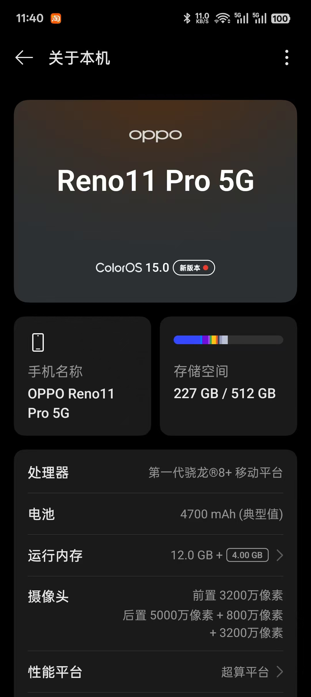
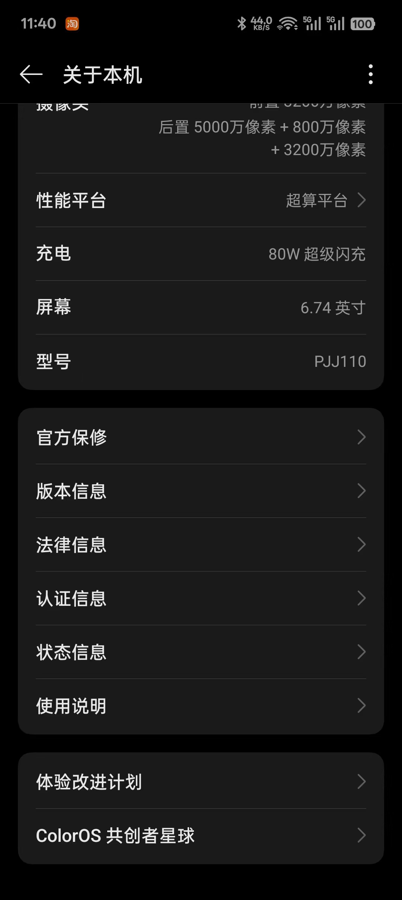
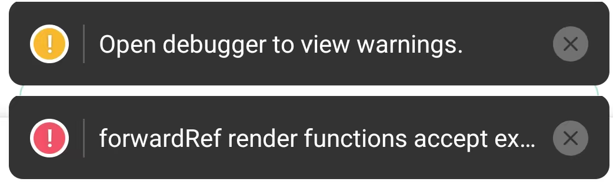

# ask-heals-app-rn（Cursor）

## 调用策略

- 激活本 Skill 后，先完整读取本 `SKILL.md`，再立即完整读取 `$HOME/.codex/skills/heals-app-rn/AGENTS.md`（Windows：`%USERPROFILE%\.codex\skills\heals-app-rn\AGENTS.md`）；读取失败时停止项目实现并报告精确路径，不得跳过。
- 每个新 chat 先显式调用本入口，再从共享 `AGENTS.md` 与当前源码开始普通实现、排障、审查和测试；项目根不维护第二份 `AGENTS.md`。
- 本 chat 首次激活时，在主任务前执行共享 `AGENTS.md` 的 “First-chat structural drift gate”；发现重大冲突时立即完整读取并执行 macOS `$HOME/.cursor/skills/init-project/SKILL.md` / Windows `%USERPROFILE%\.cursor\skills\init-project\SKILL.md`，刷新后重新读取共享 `AGENTS.md` 并继续原任务，不要求用户再次输入 `/init-project`。
- 本 Skill 只处理私有恢复状态、受保护待办、专项路由和外部构建/发布上下文。
- 用户给出具体任务时，该任务优先；只有仅调用入口或明确要求“继续”时，才解析未注释待办。

## 路径与事实源

- 项目根：Windows `D:\work\RN\heals-app-rn`；macOS `/Users/<你的用户名>/Desktop/work/RN/heals-app-rn`，当前 Mac 为 `/Users/stark/Desktop/work/RN/heals-app-rn`。
- Cursor 入口：Windows `%USERPROFILE%\.cursor\skills\ask-heals-app-rn\SKILL.md`；macOS `/Users/<你的用户名>/.cursor/skills/ask-heals-app-rn/SKILL.md`。
- Codex 对照入口：Windows `%USERPROFILE%\.codex\skills\heals-app-rn\SKILL.md`；macOS `/Users/<你的用户名>/.codex/skills/heals-app-rn/SKILL.md`。
- 业务逻辑、API 映射、导航、i18n、UI 行为和错误处理：以当前 `src/`、`ios/`、`android/` 和测试为准。
- 稳定工程约束只维护在 Codex 对口目录的 `AGENTS.md`；不创建仓库根 `AGENTS.md` 或 `.cursor/rules/project-context.mdc`。
- 技术栈、脚本、依赖、环境、构建和发布方式：以 `package.json`、项目配置和 `README*` 为准。
- 当前任务、外部状态和最小下一步：以用户本轮消息、受保护的“当前活跃需求”和实时证据为准，不在入口正文复制状态流水。
- `README_stark.md` 可能含敏感信息；只按任务读取相关段落，不复述或新增账号、密码、token、Cookie、私钥、keystore 密码和生产密钥。

发生冲突时，当前源码、Git、ADB/Xcode/Gradle/Metro、真实页面和外部系统实时结果优先于历史摘要；产品范围、医疗合规和外部 contract 以负责人最新确认优先。

## 与 Codex 入口对齐

- 两份入口分别维护，但事实源优先级、最小读取顺序、上下文门禁、授权边界、实施流程和输出约定保持一致。
- 在 Cursor 的 Codex 插件中输入 `/heals-app-rn`，应与 Cursor 输入框中执行 `/ask-heals-app-rn` 对同一明确任务达到相同推进效果。
- 两份“当前活跃需求”由用户分别维护，不自动同步或改写；用户本轮明确任务始终优先。

## 启用与最小读取顺序

1. 完整读取本 `SKILL.md`；已在当前 chat 实际加载且未变化的文件不重复读取。
2. 确认 Codex 对口 Skill 同目录 `AGENTS.md` 已读取，再按任务读取相关 `.cursor/rules/*`；不要读取或创建 `project-context.mdc`。
3. 读取任务直接相关的源码、测试和原生配置；需要脚本、依赖或环境事实时，再读取 `package.json`、`README.md`、`README_stark.md`、`CLAUDE.md` 中实际存在者。
4. 普通实现、排障和审查不默认读取 Codex 对照入口；仅在用户调用 `/heals-app-rn`、两份入口需要对齐，或任务事实只存在于对照入口时读取。
5. 用户只有入口口令而没有新任务时，执行本文件“当前活跃需求”中第一个未注释且可行动的事项；已有明确新任务时，不自动展开无关活跃项。
6. 路由到其它 Skill、ask、command 或 `bmad-*` 前，先完整读取对应 `SKILL.md` 及其明确要求的 `workflow.md`、`checklist.md`、`reference.md`。
7. 当前任务涉及 Markdown 图片引用时，先按引用文件同目录精确读取全部相关图片；读取失败后再搜索，不得用文字摘要代替图片事实。

不要默认通读仓库、全部 README 或另一客户端入口，也不要把历史摘要当成已加载的当前事实。

## 实施工作流

1. 确认实际工作区、Git 分支、工作树和任务授权边界；保留用户已有改动，不扩大到无关重构、提交、push、部署或外部系统写操作。
2. 按实现、排障、API、i18n、导航、原生构建、真机、审查或设计还原分类，只读取能决定下一步的高价值文件。
3. 代码任务依次完成真实业务实现、同项目内测试/验证；确认无需继续改代码后，再更新项目文档或项目外入口资料。
4. API contract 可由真实页面触发时，先读取实际请求与响应；受登录、权限或页面状态阻塞后，再查源码、Swagger 或 OpenAPI。
5. Figma URL、节点或设计还原任务必须先通过 Figma MCP 读取节点事实；截图和浏览器 DOM 只能补充验证。
6. 开发阶段优先单文件、单用例、单平台或单设备验证；阶段收尾再按风险扩大矩阵。未运行的测试、应用或真机流程必须明确说明。
7. 不因普通代码改动更新本 Skill；只有入口、事实源、跨客户端对齐、长期门禁或受保护活跃需求由用户授权变更时才更新。

## 项目工程约束

- React Native、React、TypeScript、React Navigation、依赖版本、scripts 和 locale 清单的精确值以当前仓库为准。
- API 复用 `src/api` 既有 client、endpoint 和 DTO/type；导航改动同步 screen 注册、参数类型、深链和回退行为。
- 新增用户可见文案时同步项目当前约定的全部 locale；不从历史 Skill 猜测语言清单。
- 跨平台逻辑优先使用公共字段；第三方 API 标记 `iOS ONLY`、`ANDROID ONLY`、deprecated 或 experimental 时，先核对类型定义或官方文档，并显式处理另一平台。
- 医疗健康文案避免确诊式、保证疗效式或替代医生建议式表达。
- 非必要不新增依赖；不写入或输出 token、Cookie、密码、私钥、证书、keystore 密码、生产密钥和测试账号明文。

## 运行、发布与外部系统门禁

- Android 真机任务：先从 `package.json` 核对脚本和 flavor/env，再用 `adb devices -l` 锁定设备；只处理属于本项目且阻塞本次运行的旧进程。成功至少需要构建/安装/启动结果、目标包进程和前台 Activity 证据，不能只看端口或 Gradle 成功。
- iOS/TestFlight 任务：先核对 scheme、configuration、Bundle ID、Team、version/build、Xcode/SDK 和签名；上传、测试群组、出口合规和 App Store 发布分别授权。外部页面上的 build、tester、group 和处理状态必须实时复核。
- Git/release 任务：先检查远端 refs、完整拓扑、工作树、提交差异和最终树；“方向看起来安全”或只询问是否应合并，不等于授权 merge、删分支、push 或发布。
- 浏览器和外部代码平台任务：使用当前已授权的真实会话并验证完整数据，不把可见列表或编辑器 viewport 当作完整源码；外部 Web 项目与本地 React Native checkout 分开判断。

## 文档维护规则

- 若本次任务改变稳定架构、命令工作流或仓库边界，在代码与定向验证稳定后自动最小更新 Codex 对口目录 `AGENTS.md`；否则不全仓扫描。外部合并造成的大规模变化使用 `/init-project` 刷新。
- `README.md` 保存通用工程说明；`README_stark.md` 只保存无秘密、可复用且不能从源码直接恢复的环境、构建、发布和验证方法。
- 不把字段清单、业务规则、默认值、单次分支/commit/PID、构建结果、测试数量、当前阻塞或聊天流水写入入口 Skill 或 README。
- 有新的可复用事实时，先完成项目代码和测试，再更新现有对应章节；直接修正过期内容并去重，不按日期追加。
- “当前活跃需求（不要修改这部分的子内容）”由用户维护；除非用户明确授权，否则保持其子内容原文。
- 最终回复默认只报告产出、验证、风险和必要下一步；仅在用户要求、审查/排障、上下文缺失或慢任务复盘时列出关键加载文件。

## 输出与边界

- 对用户使用简体中文；代码与代码注释使用英文；引用真实文件时给出路径和必要行号。
- 诚实区分已验证、部分验证、外部阻塞和未执行；不把构建成功写成真机功能验收完成。
- 不把医学建议写成确诊或处方替代，不混入其它项目假设，不创建无关文档或脚本。

## 当前活跃需求(不要修改这部分的子内容)
<!-- - 帮我英文总结下 `heals-app-rn` 项目的 git commit message ,然后帮我 commit+push  -->
<!-- - 我以后如果在 cursor 侧执行 `heals-app-rn`项目的相关任务, 是不是只需要把具体任务写到`/Users/stark/.cursor/skills/ask-heals-app-rn/SKILL.md`的 `当前活跃需求`这部分里,然后在 cursor 的 新 chat 里执行 `/ask-heals-app-rn`,目前这是不是最完美的使用 cursor 工作流来执行 某个项目的任务? -->

- IOS:
  <!-- - 为当前 checkout 构建 `dev` 环境的 Release 模式 IPA，并真实上传到 Heals (Dev) 的 TestFlight：`https://appstoreconnect.apple.com/teams/1f49f429-f33a-4c15-b357-7025b5e32451/apps/6740129703/testflight/ios`。本任务明确授权构建和上传，但不授权自动提交 Git、push、分配测试群组、回答出口合规问题或发布到 App Store。
    1. 先确认项目根、当前分支、HEAD 和工作树；保留已有未提交改动，不执行 clean/reset，不覆盖无关文件。读取当前 Dev scheme、iOS build settings、`Info.plist`、`Podfile` 和相关发布说明，以源码和真实构建结果为准。
    2. 目标营销版本优先使用用户本轮明确指定的 version；用户未指定时，读取 Dev Release target 当前 `MARKETING_VERSION` 并保持不变，不擅自升级版本。目标必须是 Dev scheme/configuration，Bundle ID 必须为 `com.healshealthcare.healspass.dev`，Team ID 必须为 `HS8K5BGDV7`；不得误改或误上传 Prod/Debug target。
    3. 构建前通过当前登录态的 App Store Connect 真实页面读取该 App 的 iOS TestFlight 构建列表和详情；核对目标 version 下以及历史列表中已使用的 build number，选择未使用、严格递增且符合 Apple 当前 `CFBundleVersion` 格式的 build number。优先使用比已确认最大值大 1 的纯十进制正整数；不得只根据本地工程、截图日期或历史摘要猜测。若登录、权限或页面读取失败，停止在上传前并明确报告阻塞。
    4. 只更新 Dev Release target 对应的 `MARKETING_VERSION` 和 `CURRENT_PROJECT_VERSION`，然后通过 `xcodebuild -showBuildSettings` 再次核对 version、build、Bundle ID、configuration 和 Team；不要连带修改 Prod 或无关 Debug 配置。
    5. 归档前执行 `xcode-select -p`、`xcodebuild -version`、`xcrun --sdk iphoneos --show-sdk-version`，确认默认 Xcode/SDK 满足 Apple 当前上传门禁。本机应优先使用 `/Applications/Xcode.app/Contents/Developer`；若默认仍指向旧 Xcode，在获得系统管理员授权后切换并复核。不得继续上传由不满足当前门禁的旧 SDK 生成的 Archive/IPA。
    6. 检查是否已有其它 `xcodebuild` 正在使用相同 DerivedData、Archive 或 `build.db`；只保留一个归档任务，并为本次 version/build 使用唯一、可追溯的 DerivedData 和 Archive 路径，避免并发构建互相锁库或污染产物。
    7. 从项目根使用 `.env.development`、Dev scheme、Dev Release configuration、generic iOS destination、automatic signing 和正确 Team 归档；禁用 Sentry 自动上传，保留符号上传警告供结果判断。推荐命令骨架：`ENVFILE=.env.development SENTRY_DISABLE_AUTO_UPLOAD=true xcodebuild -workspace ios/Heals.xcworkspace -scheme Dev -configuration Dev -destination 'generic/platform=iOS' -derivedDataPath <unique-derived-data> -archivePath <unique-archive>.xcarchive CODE_SIGN_STYLE=Automatic DEVELOPMENT_TEAM=HS8K5BGDV7 -allowProvisioningUpdates archive`。
    8. Archive 成功后先独立核验归档内 App 的 `CFBundleIdentifier`、`CFBundleShortVersionString`、`CFBundleVersion`、`DTSDKName`、`DTXcode`、TeamIdentifier 和 `codesign --verify --deep --strict`；任一值不符时不得导出或上传。
    9. 使用 `method=app-store-connect`、automatic signing、正确 Team、`manageAppVersionAndBuildNumber=false` 的 ExportOptions 导出本地 IPA。再次解包核对 Bundle ID、version/build、SDK、Apple Distribution 证书、Store provisioning profile、`get-task-allow=false`、`beta-reports-active=true` 和深度签名，并记录 IPA 绝对路径、字节数和 SHA-256；不得用未经验证的旧 IPA 代替本次产物。
    10. 仅在 IPA 校验通过后，通过 Xcode/App Store Connect 正式上传。成功标准必须同时满足：上传工具明确返回 `Upload succeeded`，并且 App Store Connect “构建版本上传”或目标 version 列表真实出现本次 version/build。等待 Apple 处理到可辨识的最终状态；若显示“缺少出口合规证明”，只报告并交回用户决定，不代替用户作合规声明。Agora/Hermes 等 dSYM 缺失警告与上传失败分开报告，不得把有警告的成功上传写成失败，也不得隐瞒其对原生崩溃符号化的影响。
    11. 上传或网络异常时，先判断 Apple 是否已收到该 version/build，再决定是否重试；Apple 已接收或正在处理时不得重复上传相同构建。网络超时按当前 Mac 的 VPN/代理规则排查；Apple 明确拒绝时保留错误原文和 request/response ID，修复根因后重新归档并使用未占用的 build number。
    12. 最终报告目标 App、version/build、Xcode/SDK、Archive 和 IPA 路径、IPA 大小/SHA-256、签名与 provisioning 校验、上传回执、App Store Connect 实际状态、dSYM/合规风险和未覆盖范围。除非用户明确要求，不提交或 push；完成项目产物和验证后，仅把新增或变化的通用工程/环境/发布事实更新到项目 `README_stark.md`，不写单次状态流水或秘密。 -->
    <!-- - 运行到如图型号的真机上,真机所在的时区是 `东八区` -->
- android:
  <!-- -  你执行`npm run android:dev`,把当前项目的dev环境的debug模式的apk运行到如图 型号的真机上,直到你用 adb 截取真机当前画面(遇到类似如图这种警告或者报错,直接解决),检查完毕真机上运行的 APP 没问题为止; 真机所在的时区是 `东八区` -->
  <!-- - 需要你在当前项目根目录执行一条命令(比如 `cd android && ENVFILE=.env.development SENTRY_DISABLE_AUTO_UPLOAD=true ./gradlew assembleDevRelease`),构建出当前项目在`1.2.2`版本的的`dev`环境的release模式的 apk; -->
- TECH-8757
  - 你读取 `https://ais-pre-hce4mtkty7p4aewqsgaizl-663605729382.us-west2.run.app/`页面的UI节点数据,借鉴 `https://aistudio.google.com/apps/c068b31c-3b5b-42e7-b660-02eea479db8a?showAssistant=true&showCode=true`页面里`code`区域的项目源码;帮我实现`heals-app-rn`项目的以下需求:
